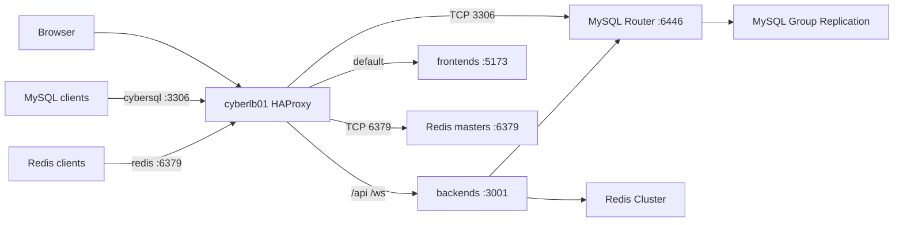

# Docker Deployment

Production deployment for D&D Tools on three Docker hosts behind HAProxy. Replaces the former Kubernetes manifests in `k8s/`.

## Overview

Three full-peer docks run the application and shared data services. `cyberlb01` terminates HTTP for `dndtools.local.cyberdeck.org` and continues to load-balance EMQX.

| Host | Address | Role |
|------|---------|------|
| cyberdock01 | 192.168.0.89 | MySQL GR member, Redis, EMQX, frontend, backend |
| cyberdock02 | 192.168.0.90 | Same |
| cyberdock03 | 192.168.0.93 | Same |
| cyberlb01 | 192.168.0.92 | HAProxy (`dndtools`, `cybersql`, `redis.local.cyberdeck.org`) |

Source: [`deploy/docker/`](../../../../deploy/docker/).

## Routine app deploy

Day-to-day: ship frontend and/or backend to the three docks. This does not restart Docker Engine, MySQL, Redis, or EMQX.

**Where:** cyberdev01, repository root.

**Before deploying:**

- If Zod types in `@shared/schema` changed, the operator must rebuild that package (`pnpm build` in `packages/shared/schema`). Agents must not run that build.
- If Prisma schema changed, the operator must migrate the database. Agents must not migrate or `db push`.
- The LAN registry must answer `http://192.168.0.83:5000/v2/`. If it does not, start it with [`init-registry.sh`](../../../../deploy/docker/scripts/init-registry.sh). Do not re-run [`configure-insecure-registry.sh`](../../../../deploy/docker/scripts/configure-insecure-registry.sh) for a normal deploy (it restarts dockerd on every host).

**Command:**

```bash
deploy/docker/scripts/deploy-app.sh [all|backend|frontend]
```

`all` is the default. [`build.sh`](../../../../build.sh) at the repo root (and the copies under `apps/backend` / `apps/frontend`) is a wrapper for `all` and does not pass a target.

The script builds from repository-root Dockerfiles, pushes `192.168.0.83:5000/dnd-tools-{backend,frontend}:local`, copies compose onto each dock under `/srv/dnd-tools/`, pulls, and runs `docker compose up -d`. It then checks `GET http://127.0.0.1:3001/health` on each dock and that app containers run as UID 912.

Override registry or tag with `DND_REGISTRY` and `APP_TAG`. On docks, use `sudo docker` / `sudo docker compose`. Compose and secrets live on local `/srv`; `/home` is NFS and SSH as `countzero` can fail when the NAS stalls — the scripts retry.

**Do not** use GitHub Actions, self-hosted runners, [`k8s/deploy.sh`](../../../../k8s/deploy.sh), `kubectl`, `docker save` / `docker load`, or `pnpm dev` / `pnpm build` as a substitute for image deploy.

## Process identity

Docker Engine stays a root systemd service. **Container processes are not root and not `countzero`.**

| Host user | UID | Data directory | Containers |
|-----------|-----|----------------|------------|
| `mysql` | 910 | `/var/lib/mysql` | MySQL, MySQL Router |
| `redis` | 911 | `/var/lib/redis` | Redis 6379 and 6380 |
| `dnd-tools` | 912 | `/var/lib/dnd-tools` | backend, frontend |
| `emqx` | 913 | `/var/lib/emqx` | EMQX (shared MQTT, not dnd-only) |

`mysql`, `redis`, and `emqx` are generic because those services may be used by other apps. Create them with [`deploy/docker/scripts/bootstrap-host-users.sh`](../../../../deploy/docker/scripts/bootstrap-host-users.sh).

Deploy as `countzero` using `sudo docker` / `sudo docker compose`. After start, `docker exec <name> id` must show 910, 911, 912, or 913.

## Topology



- **MySQL 8 Group Replication**, single-primary. App containers use `DATABASE_URL` against the local MySQL Router `127.0.0.1:6446`. Other hosts use `cybersql.local.cyberdeck.org:3306` (HAProxy on `cyberlb01` → any dock Router `:6446`, which follows the current PRIMARY).
- **Redis Cluster**: one master and one replica per host (`:6379` / `:6380`). Replica of each master lives on another dock. App sets `REDIS_CLUSTER_MODE=true` and `REDIS_CLUSTER_NODES`. Other hosts seed `redis.local.cyberdeck.org:6379` (HAProxy → the three masters). Cluster clients still follow `MOVED` to dock IPs.
- **EMQX 5.7** static cluster, one node per dock, host networking. Seeds are all three LAN IPs.
- **App**: backend `:3001` (`/health`, `/api`, `/ws`), frontend `:5173`. Host networking.

## Secrets and env files

Do not commit secrets. Host files (mode `0640`):

- `/srv/mysql/shared.env` — generated once by `init-shared-secrets.sh`, copied to every dock
- `/srv/mysql/.env` and `/srv/mysql/gr.cnf` — per host, from `init-host-env.sh`
- `/srv/redis/.env`
- `/srv/emqx/.env` — includes dashboard password (keep the existing EMQX password)
- `/srv/dnd-tools/.env` — `DATABASE_URL`, `JWT_SECRET`, `CORS_ORIGIN`, Redis cluster settings, plus `DND_REGISTRY` / `APP_TAG` for compose image names

Examples live next to each compose file as `.env.example`.

## Bring-up

Run from a machine that can SSH to the docks. `/home` on each dock is NFS (`cybernas01:/mnt/data_ssd/user_home`). SSH as `countzero` and compose paths under `/home/countzero/git` fail when that mount or Samba auth drops. Scripts retry SSH and install compose files under `/srv` (local disk) so `docker compose` does not need NFS after the copy.

1. `sudo deploy/docker/scripts/bootstrap-host-users.sh` on each dock
2. `deploy/docker/scripts/migrate-emqx-cluster.sh` — 3-node EMQX; add dock03 to HAProxy MQTT/dashboard
3. `init-shared-secrets.sh` on dock01, copy `shared.env` to 02/03, then `init-host-env.sh` on each dock
4. `bootstrap-mysql-gr.sh` then `restore-mysql.sh` (default dump: `apps/backend/backup/cyberdnd_bkp_01192026.sql`) then baseline/apply Prisma migrations
5. `init-mysql-router.sh` — adopts the GR group as InnoDB Cluster `mysql` (needed for Router metadata), then starts Router on each dock from `/srv/mysql/router-compose.yml`
6. `init-redis-cluster.sh`
7. `init-registry.sh` on cyberdev01, then one-time `configure-insecure-registry.sh` (restarts Docker on cyberdev01 and all docks), then `deploy-app.sh` (`frontend` or `backend` for a single image)
8. Merge [`deploy/docker/haproxy/dndtools.cfg`](../../../../deploy/docker/haproxy/dndtools.cfg) into `/etc/haproxy/haproxy.cfg` on cyberlb01 and reload

## Restore

Newest full dump is [`apps/backend/backup/cyberdnd_bkp_01192026.sql`](../../../../apps/backend/backup/cyberdnd_bkp_01192026.sql) (Jan 19, 2026, from `cybersql`). Restore onto the GR primary, then baseline any Prisma migrations already present in that dump. The older Aug 2025 dump in `tmp_backup/` is missing Feature/Monster/Deity tables.

That dump still has the pre-merge `Feature` + `FeatureProgression` schema. After restore, run [`deploy/docker/scripts/merge-feature-progression.sh`](../../../../deploy/docker/scripts/merge-feature-progression.sh) so `Feature.id` becomes the old progression id, `FeatureClassMap` / `FeatureRaceMap` replace the progression maps, and `FeatureEntity.featureId` replaces `progressionId`. The script stops backends first. Logic matches `apps/backend/scripts/import-feature-data.ts`. Without this step, class/race feature lists and the feats page query missing `Feature.sourceType` / `Feature.featId` / `FeatureRaceMap`.

## HAProxy

Existing MQTT `:1883` and dashboard `:18083` frontends stay. Add `192.168.0.93` as a third server.

HTTP `:80` for `dndtools.local.cyberdeck.org`:

- `/api` and `/ws` → backends `:3001` (health `GET /health`, WebSocket tunnel timeout)
- everything else → frontends `:5173`

TLS is not configured.

`cybersql.local.cyberdeck.org` is a DNS alias for `cyberlb01` (`192.168.0.92`). HAProxy TCP `:3306` forwards to MySQL Router `:6446` on each dock. Do not point clients at a dock `:3306` — secondaries are `super_read_only`.

Remote users (both `mysql_native_password` so GUI clients work without TLS):

- `'dndtools'@'%'` — `GRANT ALL` on `cyberdnd` only
- `'root'@'%'` — `WITH GRANT OPTION` on `*.*`

Passwords live in `/srv/mysql/.env` on each dock (`MYSQL_APP_PASSWORD`, `MYSQL_ROOT_PASSWORD`). Do not commit them.

`redis.local.cyberdeck.org` is a CNAME to `cyberlb01`. HAProxy TCP `:6379` forwards to the three Redis masters. Use cluster mode; `MOVED` replies name the dock addresses. Password is `REDIS_PASSWORD` in `/srv/redis/.env`. Do not use `:6380` on the VIP (replicas).

## Images

Dockerfiles at [`apps/backend/Dockerfile`](../../../../apps/backend/Dockerfile) and [`apps/frontend/Dockerfile`](../../../../apps/frontend/Dockerfile) use **repository-root** build context (pnpm workspace). Final stage runs as UID 912. Backend command is `tsx src/index.ts` (ESM directory imports are not runnable via `node dist/`; the image invokes the tsx binary directly so corepack is not used).

### LAN registry (one-time)

GitHub Actions is not used: the repo is public, and self-hosted runners on public repos are unsafe. Builds run on **cyberdev01** (`192.168.0.83`) and push to a LAN-only Docker Registry v2. After this is configured, use [Routine app deploy](#routine-app-deploy).

| Piece | Location |
|-------|----------|
| Registry compose | [`deploy/docker/registry/compose.yml`](../../../../deploy/docker/registry/compose.yml) |
| Data | `/srv/registry/data` on cyberdev01 |
| Listen | `192.168.0.83:5000` HTTP, no auth |
| Image names | `192.168.0.83:5000/dnd-tools-backend:local`, `…/dnd-tools-frontend:local` |
| Deploy script | [`deploy/docker/scripts/deploy-app.sh`](../../../../deploy/docker/scripts/deploy-app.sh) |

One-time bring-up:

1. [`init-registry.sh`](../../../../deploy/docker/scripts/init-registry.sh) on cyberdev01
2. [`configure-insecure-registry.sh`](../../../../deploy/docker/scripts/configure-insecure-registry.sh) **once** — writes `insecure-registries` into `/etc/docker/daemon.json` on cyberdev01 and all docks, then **restarts Docker Engine** (MySQL/Redis/EMQX/app bounce). Also sets `DND_REGISTRY` / `APP_TAG` in `/srv/dnd-tools/.env`

Override host with `DND_REGISTRY=host:5000` and tag with `APP_TAG=…`. Do not publish `:5000` off `192.168.0.0/22`. TLS is not configured.

## Related

- [Backend implementation](./backend-implementation.md)
- [Session state (Redis)](./session-state-management-backend.md)
- [WebSocket updates](./websocket-state-updates.md)
