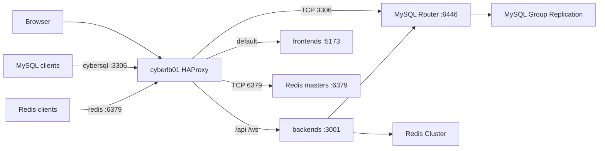

# Docker Deployment

Production deployment for D&D Tools on three Docker hosts behind HAProxy. Replaces the former Kubernetes manifests in `k8s/`.

## Overview

Three full-peer docks run the application and shared data services. `cyberlb01` terminates HTTP for `dndtools.local.cyberdeck.org` and continues to load-balance EMQX.

| Host | Address | Role |
|------|---------|------|
| cyberdock01 | 192.168.0.89 | MySQL GR member, Redis, EMQX, frontend, backend |
| cyberdock02 | 192.168.0.90 | Same |
| cyberdock03 | 192.168.0.93 | Same |
| cyberlb01 | 192.168.0.92 | HAProxy (`dndtools`, `cybersql`, `redis.local.cyberdeck.org`) |

Source: [`deploy/docker/`](../../../../deploy/docker/).

## Routine app deploy

Day-to-day: ship frontend and/or backend to the three docks. This does not restart Docker Engine, MySQL, Redis, or EMQX.

Deploy when a block of work is complete and would not leave the docks in a known-broken state (for example wait until backend, Zod rebuild, and frontend that depend on each other are all ready). Do not deploy an intermediate slice that is known to be incompatible.

**Where:** cyberdev01, repository root.

**Before deploying:**

- If Zod types in `@shared/schema` changed, the operator must rebuild that package (`pnpm build` in `packages/shared/schema`). Agents must not run that build.
- If Prisma schema changed, generate SQL on cyberdev01 with [`prisma-migrate-dev.sh`](../../../../deploy/docker/scripts/prisma-migrate-dev.sh), then promote with [`prisma-migrate-deploy.sh`](../../../../deploy/docker/scripts/prisma-migrate-deploy.sh). Agents must not migrate or `db push`.
- The LAN registry must answer `http://192.168.0.83:5000/v2/`. If it does not, start it with [`init-registry.sh`](../../../../deploy/docker/scripts/init-registry.sh). Do not re-run [`configure-insecure-registry.sh`](../../../../deploy/docker/scripts/configure-insecure-registry.sh) for a normal deploy.

**Command:**

```bash
deploy/docker/scripts/deploy-app.sh [all|backend|frontend]
```

`all` is the default. [`build.sh`](../../../../build.sh) at the repo root (and the copies under `apps/backend` / `apps/frontend`) is a wrapper for `all` and does not pass a target.

The script builds from repository-root Dockerfiles, pushes `192.168.0.83:5000/dnd-tools-{backend,frontend}:local`, copies compose onto each dock under `/srv/dnd-tools/`, pulls, and runs `docker compose up -d`. It then checks `GET http://127.0.0.1:3001/health` on each dock and that app containers run as UID 912.

Override registry or tag with `DND_REGISTRY` and `APP_TAG`. On docks, use `sudo docker` / `sudo docker compose`. Compose and secrets live on local `/srv`; `/home` is NFS and SSH as `countzero` can fail when the NAS stalls — the scripts retry.

**Do not** use GitHub Actions, self-hosted runners, [`k8s/deploy.sh`](../../../../k8s/deploy.sh), `kubectl`, `docker save` / `docker load`, or `pnpm dev` / `pnpm build` as a substitute for image deploy.

## Process identity

Docker Engine stays a root systemd service. **Container processes are not root and not `countzero`.**

| Host user | UID | Data directory | Containers |
|-----------|-----|----------------|------------|
| `mysql` | 910 | `/var/lib/mysql` | MySQL, MySQL Router |
| `redis` | 911 | `/var/lib/redis` | Redis 6379 and 6380 |
| `dnd-tools` | 912 | `/var/lib/dnd-tools` | backend, frontend |
| `emqx` | 913 | `/var/lib/emqx` | EMQX (shared MQTT, not dnd-only) |

`mysql`, `redis`, and `emqx` are generic because those services may be used by other apps. Create them with [`deploy/docker/scripts/bootstrap-host-users.sh`](../../../../deploy/docker/scripts/bootstrap-host-users.sh).

Deploy as `countzero` using `sudo docker` / `sudo docker compose`. After start, `docker exec <name> id` must show 910, 911, 912, or 913.

## Topology



- **MySQL 8 Group Replication**, single-primary. App containers use `DATABASE_URL` against the local MySQL Router `127.0.0.1:6446`. Other hosts use `cybersql.local.cyberdeck.org:3306` (HAProxy on `cyberlb01` → any dock Router `:6446`, which follows the current PRIMARY).
- Members set `group_replication_start_on_boot=ON` so a **single** dock/mysqld restart rejoins automatically. `group_replication_bootstrap_group` stays `OFF`. If **all three** members restart together, the group does not exist to rejoin — run [`recover-mysql-gr.sh`](../../../../deploy/docker/scripts/recover-mysql-gr.sh) from cyberdev01 (bootstraps the member whose `gtid_executed` contains the others, then `START GROUP_REPLICATION` on the rest). Do not bootstrap two members. Do not use `bootstrap-mysql-gr.sh` for this; that script is first-time bring-up and also recreates the `repl` user.
- MySQL Router on each dock waits for **one** ONLINE InnoDB Cluster member (`MYSQL_INNODB_CLUSTER_MEMBERS=1`) and persists config under `/var/lib/mysql/router`. [`init-mysql-router.sh`](../../../../deploy/docker/scripts/init-mysql-router.sh) does not wipe that directory unless `FORCE_ROUTER_BOOTSTRAP=1`. Requiring three ONLINE members made Router crash-loop whenever GR was down or a dock was offline, which took out `127.0.0.1:6446` and `cybersql:3306`.
- Never restart Docker Engine on all docks at once. [`configure-insecure-registry.sh`](../../../../deploy/docker/scripts/configure-insecure-registry.sh) skips the restart when `daemon.json` already lists the registry, and otherwise restarts **one dock at a time**, waiting for that host's GR member to be `ONLINE` before the next. `FORCE_DOCKER_RESTART=1` overrides the skip. Do not re-run this script for a normal app deploy.
- Cluster recovery accounts (`mysql_innodb_cluster_*`) use `mysql_native_password`. GUI/app accounts (`root@%`, `dndtools`, `cyberro`) do as well, because this LAN path has no TLS. `caching_sha2_password` without TLS fails distributed recovery with error 2061.
- **Redis Cluster**: one master and one replica per host (`:6379` / `:6380`). Replica of each master lives on another dock. App sets `REDIS_CLUSTER_MODE=true` and `REDIS_CLUSTER_NODES`. Other hosts seed `redis.local.cyberdeck.org:6379` (HAProxy → the three masters). Cluster clients still follow `MOVED` to dock IPs.
- **EMQX 5.7** static cluster, one node per dock, host networking. Seeds are all three LAN IPs.
- **App**: backend `:3001` (`/health`, `/api`, `/ws`), frontend `:5173`. Host networking.

## Secrets and env files

Do not commit secrets. Host files (mode `0640`):

- `/srv/mysql/shared.env` — generated once by `init-shared-secrets.sh`, copied to every dock
- `/srv/mysql/.env` and `/srv/mysql/gr.cnf` — per host, from `init-host-env.sh`
- `/srv/redis/.env`
- `/srv/emqx/.env` — includes dashboard password (keep the existing EMQX password)
- `/srv/dnd-tools/.env` — `DATABASE_URL`, `JWT_SECRET`, `CORS_ORIGIN`, Redis cluster settings, plus `DND_REGISTRY` / `APP_TAG` for compose image names

Examples live next to each compose file as `.env.example`.

## Bring-up

Run from a machine that can SSH to the docks. `/home` on each dock is NFS (`cybernas01:/mnt/data_ssd/user_home`). SSH as `countzero` and compose paths under `/home/countzero/git` fail when that mount or Samba auth drops. Scripts retry SSH and install compose files under `/srv` (local disk) so `docker compose` does not need NFS after the copy.

1. `sudo deploy/docker/scripts/bootstrap-host-users.sh` on each dock
2. `deploy/docker/scripts/migrate-emqx-cluster.sh` — 3-node EMQX; add dock03 to HAProxy MQTT/dashboard
3. `init-shared-secrets.sh` on dock01, copy `shared.env` to 02/03, then `init-host-env.sh` on each dock
4. `bootstrap-mysql-gr.sh` then `restore-mysql.sh` (default dump: `apps/backend/backup/cyberdnd_bkp_01192026.sql`) then baseline/apply Prisma migrations
5. `init-mysql-router.sh` — adopts the GR group as InnoDB Cluster `mysql` (needed for Router metadata), then starts Router on each dock from `/srv/mysql/router-compose.yml` (keeps existing router config)

## Group Replication recovery

Symptoms when the group is gone: mysqld `:3306` is up on the docks but `super_read_only=ON`, XCom `:33061` is not listening, Router `:6446` is closed, `cybersql:3306` accepts TCP then drops the handshake, and app login returns `401` / `Server error` because Prisma cannot reach `127.0.0.1:6446`.

1. Confirm membership: `SELECT MEMBER_HOST, MEMBER_STATE, MEMBER_ROLE FROM performance_schema.replication_group_members;` on each dock (via `sudo docker exec mysql mysql ...`).
2. If any member is `ONLINE`, only `START GROUP_REPLICATION` on the others.
3. If all are `OFFLINE`, compare `@@gtid_executed` and bootstrap **one** member — the one whose GTID set contains the others. On 2026-09-01 that was cyberdock02 (`1-86975`); cyberdock01 was behind (`1-86969`) and must not be bootstrapped.
4. From cyberdev01: `deploy/docker/scripts/recover-mysql-gr.sh`
5. Then `deploy/docker/scripts/init-mysql-router.sh` if `:6446` is still down.

Avoid the failure: never restart Docker Engine or mysqld on all three docks at once; `start_on_boot` can only rejoin a group that still exists. `group_replication_member_expel_timeout=60` (in `gr.cnf.template`) gives members a minute after suspicion before they are expelled. Router stays up if a single member remains ONLINE.
6. `init-redis-cluster.sh`
7. `init-registry.sh` on cyberdev01, then one-time `configure-insecure-registry.sh` (writes `insecure-registries`; restarts Docker only if `daemon.json` changed, one dock at a time after GR ONLINE), then `deploy-app.sh` (`frontend` or `backend` for a single image)
8. Merge [`deploy/docker/haproxy/dndtools.cfg`](../../../../deploy/docker/haproxy/dndtools.cfg) into `/etc/haproxy/haproxy.cfg` on cyberlb01 and reload

## Restore

Newest full dump is [`apps/backend/backup/cyberdnd_bkp_01192026.sql`](../../../../apps/backend/backup/cyberdnd_bkp_01192026.sql) (Jan 19, 2026, from `cybersql`). Restore onto the GR primary, then baseline any Prisma migrations already present in that dump. The older Aug 2025 dump in `tmp_backup/` is missing Feature/Monster/Deity tables.

That dump still has the pre-merge `Feature` + `FeatureProgression` schema. After restore, run [`deploy/docker/scripts/merge-feature-progression.sh`](../../../../deploy/docker/scripts/merge-feature-progression.sh) so `Feature.id` becomes the old progression id, `FeatureClassMap` / `FeatureRaceMap` replace the progression maps, and `FeatureEntity.featureId` replaces `progressionId`. The script stops backends first. Logic matches `apps/backend/scripts/import-feature-data.ts`. Without this step, class/race feature lists and the feats page query missing `Feature.sourceType` / `Feature.featId` / `FeatureRaceMap`.

The dump also still stores variant/gestalt/LA flags and coin amounts as columns on `UserCharacter`. Prisma expects `CharacterConfig` (1:1) and `CharacterWealth` (one row per `@CurrencyId`). Without [`20260901195700_add_character_config_and_wealth`](../../../../apps/backend/prisma/migrations/20260901195700_add_character_config_and_wealth/migration.sql), character create-save returns Prisma `P2021` (`CharacterConfig` does not exist). From cyberdev01, `cd apps/backend && pnpm exec prisma migrate deploy`. `DATABASE_URL` in `apps/backend/.env` (gitignored) must be the GR app user (`MYSQL_APP_USER` / `MYSQL_APP_PASSWORD` from any dock `/srv/mysql/.env`) at `cybersql.local.cyberdeck.org:3306` so HAProxy can pick a live Router. The old cybersql `root` / `dndtools` passwords in that file will fail.

## Prisma migrations (current)

Live `cyberdnd` is Group Replication behind cybersql. `prisma migrate dev` against that URL rebuilds a shadow database with GR DDL (~14 minutes). Use a standalone MySQL on **cyberdev01** instead.

### mysqldev (cyberdev01)

Non-GR `mysql:8.0` on `127.0.0.1:3307`, compose and data under `/srv/mysqldev`, `restart: always` (Docker is enabled on boot). Source: [`deploy/docker/mysqldev/compose.yml`](../../../../deploy/docker/mysqldev/compose.yml). One-time: [`init-mysqldev.sh`](../../../../deploy/docker/scripts/init-mysqldev.sh) (creates secrets, starts the container, `GRANT ALL` for shadow `CREATE DATABASE`, writes `DATABASE_URL_DEV` in `apps/backend/.env`, `migrate deploy` onto the empty local DB). Does not touch cybersql.

`apps/backend/.env` keeps `DATABASE_URL` on `cybersql.local.cyberdeck.org:3306` for the app and for promote. `DATABASE_URL_DEV` is `127.0.0.1:3307` only.

```bash
# After schema.prisma changes. Diffs mysqldev (seconds), writes SQL, applies locally.
deploy/docker/scripts/prisma-migrate-dev.sh --name <name>

# Promote pending folders to live GR. Agents must not run this.
deploy/docker/scripts/prisma-migrate-deploy.sh
```

[`prisma-migrate-dev.sh`](../../../../deploy/docker/scripts/prisma-migrate-dev.sh) uses `prisma migrate diff --from-url` against mysqldev so it does not replay history. Keep mysqldev in sync (the script `migrate deploy`s the new folder there) or the next diff is wrong. Full shadow replay is [`prisma-migrate-dev-shadow.sh`](../../../../deploy/docker/scripts/prisma-migrate-dev-shadow.sh) only when you need Prisma to verify the whole folder.

Do not point `DATABASE_URL` at mysqldev. Docks keep using Router `127.0.0.1:6446`.

History starts with a dump-schema baseline instead of the Dec 2025 `ALTER`s:

1. [`20251217000000_baseline_jan2026_dump`](../../../../apps/backend/prisma/migrations/20251217000000_baseline_jan2026_dump/migration.sql) — schema-only `CREATE` from [`cyberdnd_bkp_01192026.sql`](../../../../apps/backend/backup/cyberdnd_bkp_01192026.sql) (tables first, then foreign keys). Absorbs `20251217150155_add_advancement_skill_id` and `20251217163121_add_item_size_id`, which were already in that dump.
2. [`20260120000000_merge_feature_progression`](../../../../apps/backend/prisma/migrations/20260120000000_merge_feature_progression/migration.sql) — Feature / FeatureProgression merge (same transform as [`merge-feature-progression.sql`](../../../../deploy/docker/scripts/merge-feature-progression.sql)).
3. Sep 2026 incrementals, including [`20260904185000_character_language_map_composite_pk`](../../../../apps/backend/prisma/migrations/20260904185000_character_language_map_composite_pk/migration.sql) (drop surrogate `id`; `@@id([characterId, languageId])`; FK `ON DELETE CASCADE`).

After a dump restore, [`restore-mysql.sh`](../../../../deploy/docker/scripts/restore-mysql.sh) marks the baseline applied, then `migrate deploy` runs the merge and incrementals on **cybersql**. Live `_prisma_migrations` already has the baseline and merge resolved and the two Dec 2025 rows removed.

[`20260901195700_add_character_config_and_wealth`](../../../../apps/backend/prisma/migrations/20260901195700_add_character_config_and_wealth/migration.sql) still creates a decoy `UserCharacterShadow` and renames it when `UserCharacter` is missing. Do not edit that already-applied file (checksum).

Idle `dndtools` sessions from the docks (`192.168.0.89/90/93`) on live `cyberdnd` are the app pool — do not `KILL` them.

## HAProxy

Existing MQTT `:1883` and dashboard `:18083` frontends stay. Add `192.168.0.93` as a third server.

HTTP `:80` for `dndtools.local.cyberdeck.org`:

- `/api` and `/ws` → backends `:3001` (health `GET /health`, WebSocket tunnel timeout)
- everything else → frontends `:5173`

TLS is not configured.

`cybersql.local.cyberdeck.org` is a DNS alias for `cyberlb01` (`192.168.0.92`). HAProxy TCP `:3306` forwards to MySQL Router `:6446` on each dock. Do not point clients at a dock `:3306` — secondaries are `super_read_only`. App containers keep using local Router `127.0.0.1:6446`.

### cybersql error 1129 (Too many connection errors)

MySQL **error 1129** is not “too many connections” (1040). After `max_connect_errors` consecutive **incomplete handshakes** from one client IP, that IP is blocked until the host cache is cleared. HAProxy is the client: every cybersql session and every health check appears to Router as `192.168.0.92`. The app’s local `127.0.0.1:6446` path is a different client, so the site can stay up while cybersql is dead.

`option tcp-check` (connect then RST, no MySQL handshake) plus Netdata’s TCP probe of LB `:3306` used to increment Router’s counter. Default Router `max_connect_errors` is **100**. After roughly eight minutes of aborted checks, Router logged `blocking client host for 192.168.0.92` and returned 1129 on `:6446`. HAProxy still saw TCP open, so it kept using the blocked backend.

`FLUSH HOSTS` on mysqld does **not** clear this. mysqld already has `max_connect_errors=1000000` and does not see the LB IP (Router opens a new connection). Unblock by recreating `mysql-router` (in-memory block + `/tmp/mysqlrouter` bootstrap). The official image always bootstraps `/tmp/mysqlrouter --force` on start; the `/var/lib/mysql/router` volume is unused by that entrypoint.

Prevention (already in tree / live):

- HAProxy `backend mysql_rw` uses `option mysql-check user haproxy post-41` so a real handshake **resets** the LB’s error counter. Merge [`dndtools.cfg`](../../../../deploy/docker/haproxy/dndtools.cfg) into `/etc/haproxy/haproxy.cfg` on cyberlb01 and reload (do not restart Docker/MySQL).
- `'haproxy'@'%'` — `USAGE` only, empty `mysql_native_password`. [`init-mysql-router.sh`](../../../../deploy/docker/scripts/init-mysql-router.sh) creates it on the PRIMARY via local `:6446`.
- Router bootstrap sets `routing:bootstrap_rw.max_connect_errors=1000000` (and the RO port). This option belongs on `[routing]`, not `[DEFAULT]` (`unknown_config_option=error`). Recreate the Router container to apply; do not `FORCE_ROUTER_BOOTSTRAP=1`.

If 1129 returns: confirm `performance_schema.host_cache` has no `192.168.0.92` row on the PRIMARY (mysqld is not the blocker), then `docker compose ... up -d --force-recreate` for `mysql-router` on each dock. After that, `mysql-check` should show HAProxy servers `UP` / `L7OK`.

Remote users (`mysql_native_password` so GUI clients and GR recovery work without TLS):

- `'dndtools'@'%'` — `GRANT ALL` on `cyberdnd`, plus `GRANT ALL` on `prisma_migrate_shadow_db_%` so `prisma migrate dev` can create its temporary shadow database
- `'cyberro'@'%'` — `SELECT` on `cyberdnd` only (MCP / read-only clients)
- `'root'@'%'` — `WITH GRANT OPTION` on `*.*`
- `'haproxy'@'%'` — `USAGE` only, empty password (HAProxy `mysql-check`)

Passwords live in `/srv/mysql/.env` on each dock (`MYSQL_APP_PASSWORD`, `MYSQL_ROOT_PASSWORD`). Do not commit them.

`redis.local.cyberdeck.org` is a CNAME to `cyberlb01`. HAProxy TCP `:6379` forwards to the three Redis masters. Use cluster mode; `MOVED` replies name the dock addresses. Password is `REDIS_PASSWORD` in `/srv/redis/.env`. Do not use `:6380` on the VIP (replicas).

## Images

Dockerfiles at [`apps/backend/Dockerfile`](../../../../apps/backend/Dockerfile) and [`apps/frontend/Dockerfile`](../../../../apps/frontend/Dockerfile) use **repository-root** build context (pnpm workspace). Final stage runs as UID 912. Backend command is `tsx src/index.ts` (ESM directory imports are not runnable via `node dist/`; the image invokes the tsx binary directly so corepack is not used).

### LAN registry (one-time)

GitHub Actions is not used: the repo is public, and self-hosted runners on public repos are unsafe. Builds run on **cyberdev01** (`192.168.0.83`) and push to a LAN-only Docker Registry v2. After this is configured, use [Routine app deploy](#routine-app-deploy).

| Piece | Location |
|-------|----------|
| Registry compose | [`deploy/docker/registry/compose.yml`](../../../../deploy/docker/registry/compose.yml) |
| Data | `/srv/registry/data` on cyberdev01 |
| Listen | `192.168.0.83:5000` HTTP, no auth |
| Image names | `192.168.0.83:5000/dnd-tools-backend:local`, `…/dnd-tools-frontend:local` |
| Deploy script | [`deploy/docker/scripts/deploy-app.sh`](../../../../deploy/docker/scripts/deploy-app.sh) |

One-time bring-up:

1. [`init-registry.sh`](../../../../deploy/docker/scripts/init-registry.sh) on cyberdev01
2. [`configure-insecure-registry.sh`](../../../../deploy/docker/scripts/configure-insecure-registry.sh) **once** — writes `insecure-registries` into `/etc/docker/daemon.json` on cyberdev01 and all docks. Restarts Docker Engine only when that file actually changed, and never on all docks at once (waits for GR `ONLINE` between docks). Also sets `DND_REGISTRY` / `APP_TAG` in `/srv/dnd-tools/.env`. A normal `deploy-app.sh` must not run this script.

Override host with `DND_REGISTRY=host:5000` and tag with `APP_TAG=…`. Do not publish `:5000` off `192.168.0.0/22`. TLS is not configured.

## Netdata

Agents on the three docks are claimed to Netdata Cloud (ACLK). Enable MySQL, Redis, Router, and Docker collectors with [`init-netdata-collectors.sh`](../../../../deploy/docker/scripts/init-netdata-collectors.sh). That script:

- Stores `MYSQL_NETDATA_PASSWORD` in `/srv/mysql/shared.env` (and `/srv/mysql/.env`)
- Creates `'netdata'@'127.0.0.1'` on the GR primary (`PROCESS`, `REPLICATION CLIENT`, `SELECT` on `performance_schema`) using `mysql_native_password`
- Sets `[web] mode = static-threaded` and `bind to = 127.0.0.1` so file-based go.d jobs register (Cloud-only `mode = none` does not)
- Writes `/etc/netdata/go.d/{mysql,redis,portcheck}.conf` and `my.cnf` from host secrets (mode `0640`, `root:netdata`)
- Adds the `netdata` user to group `docker` so the stock Docker collector can read `/var/run/docker.sock`
- Installs and claims Netdata 2.11 on `cyberlb01` (Alpine, 2.7G root: use the static installer under `/opt/netdata`, not `apk`; `/tmp` is a 235M tmpfs — copy the `.gz.run` to `/var/tmp`). Scrapes HAProxy at `http://127.0.0.1:8404/metrics` and port-checks `:80`, `:3306`, `:6379`, `:1883`, `:8404`. OpenRC service is `netdata` in runlevel `default`.

Port checks cover mysqld `:3306`, Router `:6446`, and Redis `:6379`/`:6380`. Cloud alerts use the stock Netdata health checks once those charts exist (collector down, port failed, Redis/MySQL unreachable). Do not commit collector passwords.

HAProxy Prometheus is localhost-only (`frontend netdata_haproxy` in [`dndtools.cfg`](../../../../deploy/docker/haproxy/dndtools.cfg)).

## Related

- [Backend implementation](./backend-implementation.md)
- [Session state (Redis)](./session-state-management-backend.md)
- [WebSocket updates](./websocket-state-updates.md)
