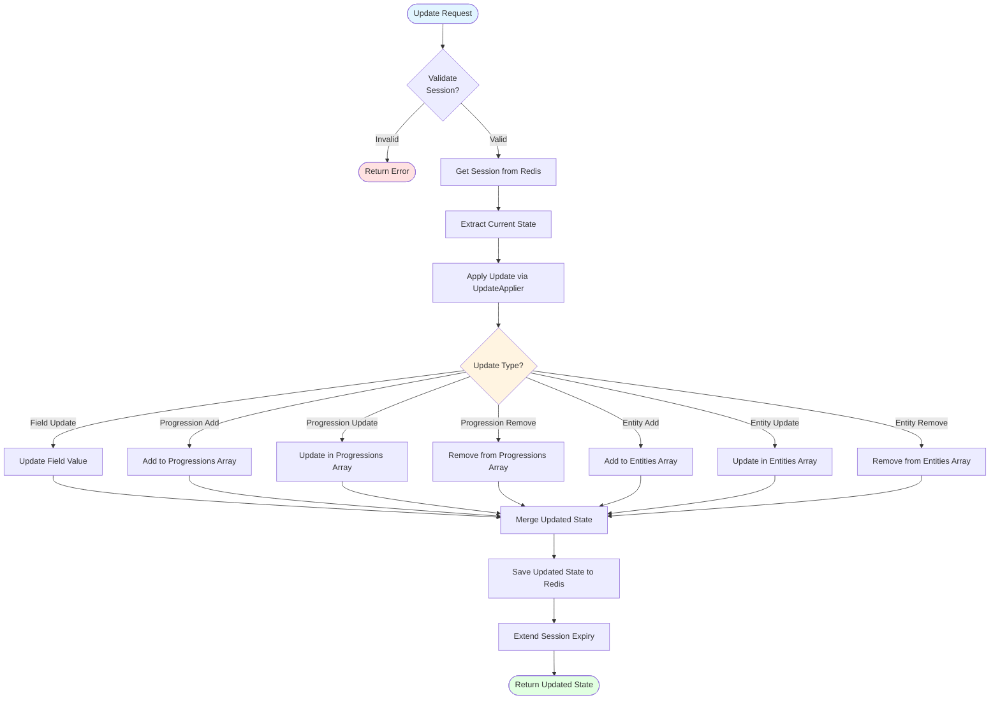

# Session and State Management - Backend Implementation

## Overview

The backend session and state management system provides generic infrastructure for managing editing sessions across multiple entity types. This documentation covers the backend implementation details.

**Source Files**:
- `apps/backend/src/features/shared/session/GenericSessionService.ts`
- `apps/backend/src/features/shared/session/GenericSessionController.ts`
- `apps/backend/src/features/shared/session/GenericUpdateApplier.ts`
- `apps/backend/src/features/shared/session/types.ts`
- `apps/backend/src/features/shared/session/redisClient.ts`

## Generic Session Service

The `GenericSessionService` provides a type-safe, reusable implementation for session storage in Redis.

### Configuration

```typescript
interface SessionConfig<TEntityId extends number, TState> {
    entityType: 'class' | 'race' | 'character';
    buildSessionKey: (entityId: TEntityId, userId: number) => string;
}
```

**Redis Storage**: All entity types use Redis with key patterns like `session:{entityType}:{sessionKey}`. This provides high-performance in-memory storage with automatic expiration via Redis TTL.

### Key Methods

#### `getSession(entityId, userId)`

Retrieves an active session for an entity and user. Only returns sessions that have not expired. Redis TTL automatically handles expiration.

**Example**:
```typescript
const session = await service.getSession(123, 456);
if (session) {
    console.log('Active session:', session.state);
}
```

#### `createSession(entityId, userId, state)`

Creates a new editing session. If an existing session exists, it is deleted first.

**Example**:
```typescript
const session = await service.createSession(classId, userId, initialState);
```

#### `updateSession(sessionKey, state)`

Updates an existing session with new state and extends expiration time.

**Example**:
```typescript
await service.updateSession(sessionKey, updatedState);
```

### Update Application Flow

The update application process follows this flow:



## Generic Session Controller

The `GenericSessionController` provides generic request handlers for session operations.

### Configuration

```typescript
interface SessionControllerConfig<TEntityId, TState, TUpdate, TEntity> {
    entityService: { getById: (id: TEntityId) => Promise<TEntity | null> };
    sessionService: GenericSessionService<TEntityId, TState>;
    buildInitialState: (entity: TEntity) => TState;
    updateApplierConfig: UpdateApplierConfig<TState, TUpdate>;
    saveService: { saveSessionToMySQL: (entityId: TEntityId, state: TState) => Promise<void> };
    getEntityIdFromParams: (params: { [key: string]: string | number }) => TEntityId | null;
    getSessionIdFromParams: (params: { [key: string]: string | number }) => string | null;
}
```

### Controller Functions

#### `initializeSession(req, res, next, config)`

Initializes or resumes a session. Returns existing session if available, or creates new one.

#### `getSessionState(req, res, next, config)`

Retrieves current session state by session ID.

#### `applyUpdate(req, res, next, config)`

Applies an update to the session state.

#### `saveSession(req, res, next, config)`

Saves session to MySQL and deletes from Redis.

#### `cancelSession(req, res, next, config)`

Deletes session without saving.

## Generic Update Applier

The `GenericUpdateApplier` provides a strategy-based approach for applying updates to state.

### Configuration

```typescript
interface UpdateApplierConfig<TState, TUpdate> {
    applyFieldUpdate: (state: TState, field: string, value: unknown) => TState;
    isFieldUpdate: (update: TUpdate) => boolean;
    extractFieldUpdate: (update: TUpdate) => { field: string; value: unknown } | null;
    isProgressionUpdate: (update: TUpdate) => boolean;
    applyProgressionUpdate: (state: TState, update: TUpdate) => TState;
    isEntityUpdate: (update: TUpdate) => boolean;
    applyEntityUpdate: (state: TState, update: TUpdate) => TState;
    isSpecialUpdate: (update: TUpdate) => boolean;
    applySpecialUpdate: (state: TState, update: TUpdate) => TState;
}
```

### Update Types

The generic applier handles four categories of updates:

1. **Field Updates**: Simple field value changes (e.g., `UPDATE_CLASS_FIELD`)
2. **Progression Updates**: Feature progression operations (ADD/UPDATE/REMOVE)
3. **Entity Updates**: Feature entity operations (ADD/UPDATE/REMOVE)
4. **Special Updates**: Entity-specific updates (e.g., `SET_SPELLCASTING_PROGRESSION`)

## Configuration Patterns

### Class Configuration

```typescript
// Session Service
const classSessionService = new GenericSessionService<number, ClassEditState>({
    entityType: 'class',
    buildSessionKey: (classId, userId) => `${classId}:${userId}`
});

// Update Applier Config
export const classUpdateApplierConfig: UpdateApplierConfig<ClassEditState, ClassUpdate> = {
    // ... strategy functions
};

// Controller Config
const classSessionControllerConfig: SessionControllerConfig<number, ClassEditState, ClassUpdate, DnDClass> = {
    entityService: { getById: classService.getClassById },
    sessionService: classSessionService,
    buildInitialState: (cls) => ({ /* ... */ }),
    updateApplierConfig: classUpdateApplierConfig,
    saveService: { saveSessionToMySQL: classSaveService.saveSessionToMySQL },
    getEntityIdFromParams: (params) => parseInt(params.classId),
    getSessionIdFromParams: (params) => params.sessionId
};
```

### Race Configuration

Similar to Class, with Race-specific types and configurations.

### Character Configuration

Character uses a similar pattern but has unique requirements:
- Stores both `characterState` and `resolvedResult` in session
- Uses complex resolution logic that is preserved
- Update applier handles Character-specific update types

## Database Schema

### Redis Session Storage

All entity types (class, race, character) use Redis for session storage with consistent key patterns. Sessions are stored as JSON strings with automatic expiration via Redis TTL.

### Key Patterns

- **By session key**: `session:{entityType}:{sessionKey}` (e.g., `session:class:1:100`)
- **By session ID**: `session:{entityType}:id:{sessionId}` (e.g., `session:class:id:550e8400-e29b-41d4-a716-446655440000`)
- **Index**: `session:{entityType}:index:{sessionKey}` → `{sessionId}` (for reverse lookup)

### Data Structure

Sessions are stored as JSON strings. For class/race sessions:
```json
{
    "id": "uuid-v4",
    "entityId": 123,
    "userId": 456,
    "sessionKey": "123:456",
    "state": { /* entity-specific state */ },
    "createdAt": 1234567890,
    "updatedAt": 1234567890,
    "expiresAt": 1234567890
}
```

For character sessions, includes `resolvedResult`:
```json
{
    "id": "uuid-v4",
    "characterId": 123,
    "userId": 456,
    "sessionKey": "123:456",
    "characterState": { /* character edit state */ },
    "resolvedResult": { /* resolved character result */ },
    "createdAt": 1234567890,
    "updatedAt": 1234567890,
    "expiresAt": 1234567890
}
```

**Key Features**:
- **Redis Storage**: High-performance in-memory storage
- **Automatic Expiration**: Redis TTL automatically removes expired sessions (no manual cleanup needed)
- **Entity Type Discriminator**: Key prefixes organize sessions by entity type
- **Multiple Lookups**: Sessions can be retrieved by session key or session ID
- **TTL Management**: Sessions expire after configurable TTL (default: 30 minutes), extended on each update

**Benefits**:
- High-performance in-memory storage
- Automatic expiration via Redis TTL (no cleanup intervals needed)
- Scalable across multiple backend instances
- Easier to add new entity types (just use new key prefix)
- Consistent structure across all entity types

**Configuration**:
Redis connection is configured via environment variables:
- `REDIS_HOST` (default: localhost)
- `REDIS_PORT` (default: 6379)
- `REDIS_PASSWORD` (optional, if Redis is password-protected)
- `SESSION_EXPIRATION_MINUTES` (default: 30)

## Source Files

- **Generic Session Service**: `apps/backend/src/features/shared/session/GenericSessionService.ts`
- **Generic Session Controller**: `apps/backend/src/features/shared/session/GenericSessionController.ts`
- **Generic Update Applier**: `apps/backend/src/features/shared/session/GenericUpdateApplier.ts`
- **Redis Client**: `apps/backend/src/features/shared/session/redisClient.ts`
- **Types**: `apps/backend/src/features/shared/session/types.ts`
- **Class Implementation**: `apps/backend/src/features/classResolution/`
- **Race Implementation**: `apps/backend/src/features/raceResolution/`
- **Character Implementation**: `apps/backend/src/features/characterResolution/`
