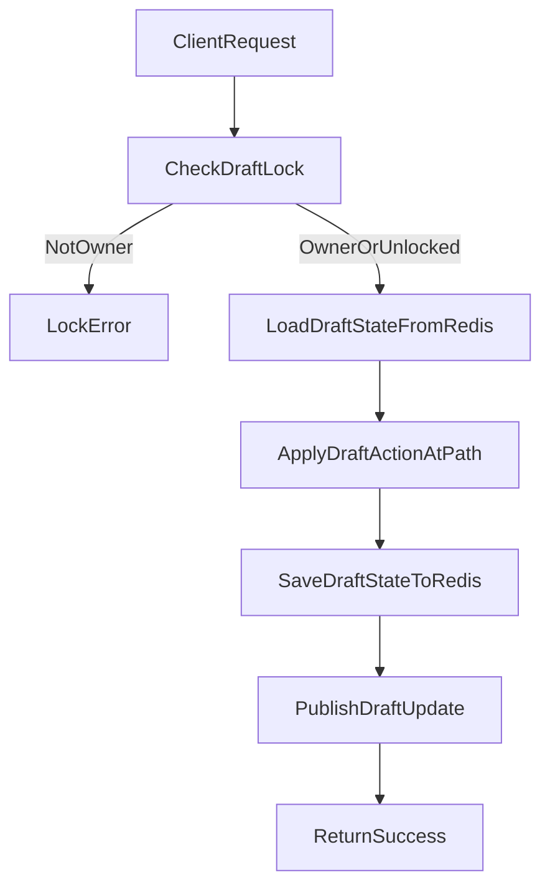

# Session and State Management - Backend Implementation

## Overview

The backend uses a **draft state** system to support multi-step editing for multiple entity types (Class, Race, Feature, Character). Draft state is stored in Redis, protected by per-draft locks, and persisted to MySQL when the user saves.

This document describes the current backend implementation and replaces older, action-based “update applier” documentation.

## Source files (current)

- **Draft API routes**: `apps/backend/src/features/shared/draftState/draftRoutes.ts`
- **Draft controllers**: `apps/backend/src/features/shared/draftState/draftController.ts`
- **Draft registry** (draft-type → validation + save strategy): `apps/backend/src/features/shared/draftState/draftRegistry.ts`
- **Draft registry types** (`DraftConfig`, schema contract): `apps/backend/src/features/shared/draftState/types.ts`
- **Draft validation utils** (Zod-error structural guard): `apps/backend/src/features/shared/draftState/zodErrorUtils.ts`
- **Redis draft state**: `apps/backend/src/features/shared/draftState/DraftStateService.ts`
- **Redis draft locks**: `apps/backend/src/features/shared/draftState/DraftLockService.ts`
- **Path-based updates**: `apps/backend/src/features/shared/draftState/StateUpdateService.ts`
- **Draft pub/sub** (real-time + character resolution events): `apps/backend/src/features/shared/draftState/DraftStatePubSub.ts`

## Core concepts

### Draft reference (DraftType + id)

Every draft operation identifies the target draft using:

- `draftType`: numeric enum value (e.g. Class, Race, Feature, Character)
- `id`: the entity id being edited (or a backend-minted negative id for new drafts)

### Locks

All draft mutations require that the draft is either unlocked or locked by the current user. Locking is handled by `DraftLockService` and enforced by controllers/services before writing updated state.

### Path-based updates (update-value API)

The request body is validated by `UpdateStateValueSchema` in `packages/shared/schema/src/state.ts`.

- `draftType`: numeric enum (Class, Race, Feature, Character, etc.)
- `id`: draft entity id (or negative id for new drafts)
- `path`: dot-notation path (e.g. `name`, `entities.byId.123.type`, `entities.byId.123.formulaParams.maxValue`)
- `value`: **must be a scalar** — one of `string`, `number`, `boolean`, or `null`
- `action`: optional `DraftAction` (Update, Remove, Add); default is Update

**Critical — value is scalar-only.** The schema allows only `string | number | boolean | null`. **Do not send objects or arrays as `value`.** If you send an object (e.g. a whole `formulaParams` object), the request will fail validation and the update will not be applied. To update nested structures, send **one request per leaf field** with a scalar value. For example, to update feature entity formula params, send separate updates for `entities.byId.<id>.formulaParams.formulaId`, `entities.byId.<id>.formulaParams.maxValue`, `entities.byId.<id>.formulaParams.baseValue`, `entities.byId.<id>.formulaParams.formulaStartLevel`, etc., each with a number or null. The backend will create or merge into the intermediate `formulaParams` object as needed. Correct pattern: see `apps/frontend/src/components/feature-system/FeatureEditForm/FeatureEditForm.tsx` (entity sync, formulaParams per-field updates).

The implementation applies the change via `applyDraftActionAtPath` and persists the updated draft back to Redis.

### Redis client adapter and TTL refresh

Draft state, draft locks, and user sessions all use a shared Redis client adapter:

- `apps/backend/src/features/shared/session/redisClient.ts` – creates the underlying `redis` client (standalone or cluster) and wraps it in a narrow `RedisSessionClient` interface
- `apps/backend/src/features/shared/session/types.ts` – defines `RedisSessionClient` with only the operations required by backend session/draft services (`get`, `setEx`, `del`, `expire`, `keys`, `flushAll`, `quit`)

TTL behavior is implemented using Redis `EXPIRE` and `SETEX`:

- **SETEX on write**: draft state, draft locks, and sessions are written using `setEx` with a 30‑minute TTL
- **EXPIRE on read**: `DraftStateService.getState`, `DraftLockService.checkLock`, and `UserSessionService.getUserSession` call `expire` via the `RedisSessionClient` adapter to “touch” keys and extend their TTL while they are actively used

This adapter-based design ensures:

- A single place to configure standalone vs. cluster Redis clients
- Centralized error logging for Redis operations
- A consistent TTL strategy across state, locks, and sessions without exposing the full Redis client surface area to feature code

## Update flow

## Save flow (persist to MySQL)

Saving uses the draft registry (`draftRegistry.ts`) to select:

- A **validation schema** (from `@shared/schema`)
- A **save service** (per draft type)
- Optional **post-update hooks** (e.g. character resolution publishing)

For character draft validation, the registry uses `CharacterEditStateSchema` from `packages/shared/schema/src/character.ts`.

For example:

- **Class** save uses `apps/backend/src/features/classDraft/classSaveService.ts` (transforms draft state → request and calls `classService.updateClass/createClass`).
- **Race** save uses `apps/backend/src/features/raceDraft/raceSaveService.ts` (transforms draft state → request and calls `raceService.updateRace/createRace`).

Character drafts publish resolution results via the `draftRegistry.ts` hook and also persist to MySQL via:

- `apps/backend/src/features/characterDraft/characterSaveService.ts`
