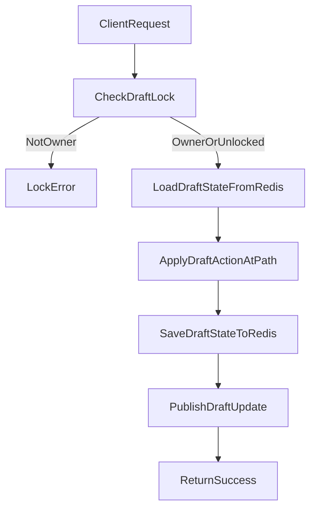

# Session and State Management - Backend Implementation

## Overview

The backend uses a **draft state** system to support multi-step editing for multiple entity types (Class, Race, Feature, Character). Draft state is stored in Redis, protected by per-draft locks, and persisted to MySQL when the user saves.

This document describes the current backend implementation and replaces older, action-based “update applier” documentation.

## Source files (current)

- **Draft API routes**: `apps/backend/src/features/shared/draftState/draftRoutes.ts`
- **Draft controllers**: `apps/backend/src/features/shared/draftState/draftController.ts`
- **Draft registry** (draft-type → validation + save strategy): `apps/backend/src/features/shared/draftState/draftRegistry.ts`
- **Draft registry types** (`DraftConfig`, schema contract): `apps/backend/src/features/shared/draftState/types.ts`
- **Draft validation utils** (Zod-error structural guard): `apps/backend/src/features/shared/draftState/zodErrorUtils.ts`
- **Redis draft state**: `apps/backend/src/features/shared/draftState/DraftStateService.ts`
- **Redis draft locks**: `apps/backend/src/features/shared/draftState/DraftLockService.ts`
- **Path-based updates**: `apps/backend/src/features/shared/draftState/StateUpdateService.ts`
- **Draft pub/sub** (real-time + character resolution events): `apps/backend/src/features/shared/draftState/DraftStatePubSub.ts`

## Core concepts

### Draft reference (DraftType + id)

Every draft operation identifies the target draft using:

- `draftType`: numeric enum value (e.g. Class, Race, Feature, Character)
- `id`: the entity id being edited (or a backend-minted negative id for new drafts)

### Locks

All draft mutations require that the draft is either unlocked or locked by the current user. Locking is handled by `DraftLockService` and enforced by controllers/services before writing updated state.

### Path-based updates (single field mutation)

Instead of action unions like “UpdateClassField”, the backend updates draft JSON using a **path-based** operation:

- `path`: dot-notation path (e.g. `name`, `sourceBookInfo.0.pageNumber`, `entities.3.value`)
- `value`: JSON-serializable primitive (string/number/boolean/null)
- `action`: optional enum controlling how the path operation is applied (update/insert/remove)

The implementation applies the change via `applyDraftActionAtPath` and persists the updated draft back to Redis.

## Update flow

## Save flow (persist to MySQL)

Saving uses the draft registry (`draftRegistry.ts`) to select:

- A **validation schema** (from `@shared/schema`)
- A **save service** (per draft type)
- Optional **post-update hooks** (e.g. character resolution publishing)

For character draft validation, the registry uses `CharacterEditStateSchema` from `packages/shared/schema/src/character.ts`.

For example:

- **Class** save uses `apps/backend/src/features/classDraft/classSaveService.ts` (transforms draft state → request and calls `classService.updateClass/createClass`).
- **Race** save uses `apps/backend/src/features/raceDraft/raceSaveService.ts` (transforms draft state → request and calls `raceService.updateRace/createRace`).

Character drafts publish resolution results via the `draftRegistry.ts` hook and also persist to MySQL via:

- `apps/backend/src/features/characterDraft/characterSaveService.ts`
