# Session and State Management - Frontend Implementation

## Overview

The frontend session and state management system provides generic hooks and utilities for managing editing sessions across multiple entity types. This documentation covers the frontend implementation details.

**Source Files**:
- `apps/frontend/src/lib/hooks/useGenericResolution.ts`
- `apps/frontend/src/lib/hooks/useGenericEditState.ts`
- `apps/frontend/src/lib/hooks/useStateSync.ts`
- `apps/frontend/src/lib/hooks/types.ts`

## Generic Resolution Hook

The `useGenericResolution` hook provides a consistent interface for session management across all entity types.

### API Interface

```typescript
/**
 * API interface for resolution operations.
 * 
 * Provides a consistent interface for session operations across different entity types.
 * 
 * @template TEntityId - The entity ID type
 * @template TState - The session state type
 * @template TUpdate - The update operation type
 * @template TResolved - The resolved result type (may be same as TState or extended)
 */
interface ResolutionApi<TEntityId, TState, TUpdate, TResolved> {
    /**
     * Initialize or resume a session.
     * 
     * Should return existing session if available, or create new one.
     * 
     * @param entityId - The entity ID
     * @returns Promise resolving to session ID and state
     */
    initializeSession: (entityId: TEntityId) => Promise<{ sessionId: string; state: TState }>;

    /**
     * Get current session state.
     * 
     * @param entityId - The entity ID
     * @param sessionId - The session ID
     * @returns Promise resolving to session state
     */
    getSessionState: (entityId: TEntityId, sessionId: string) => Promise<{ state: TState }>;

    /**
     * Apply an update to the session.
     * 
     * @param entityId - The entity ID
     * @param sessionId - The session ID
     * @param update - The update operation
     * @returns Promise resolving to updated state
     */
    applyUpdate: (entityId: TEntityId, sessionId: string, update: TUpdate) => Promise<{ state: TState }>;

    /**
     * Save session to database.
     * 
     * @param entityId - The entity ID
     * @param sessionId - The session ID
     * @returns Promise resolving when save is complete
     */
    saveSession: (entityId: TEntityId, sessionId: string) => Promise<void>;

    /**
     * Cancel session without saving.
     * 
     * @param entityId - The entity ID
     * @param sessionId - The session ID
     * @returns Promise resolving when cancel is complete
     */
    cancelSession: (entityId: TEntityId, sessionId: string) => Promise<void>;
}
```

### Hook Result

```typescript
/**
 * Result type for generic resolution hook.
 * 
 * @template TState - The session state type
 * @template TUpdate - The update operation type
 */
interface ResolutionHookResult<TState, TUpdate> {
    /** Current session ID (null if no active session) */
    sessionId: string | null;
    /** Current session state (null if not loaded) */
    state: TState | null;
    /** Loading state for async operations */
    isLoading: boolean;
    /** Error state for failed operations */
    error: string | null;
    /** Apply an update to the session */
    applyUpdate: (update: TUpdate) => Promise<TState | null>;
    /** Save session to database */
    saveSession: () => Promise<void>;
    /** Cancel session without saving */
    cancelSession: () => Promise<void>;
    /** Refresh session state from backend */
    refreshState: () => Promise<void>;
}
```

### Usage Example

```typescript
const resolution = useGenericResolution(classId, {
    initializeSession: ClassResolutionApi.initializeSession,
    getSessionState: ClassResolutionApi.getSessionState,
    applyUpdate: ClassResolutionApi.applyUpdate,
    saveSession: ClassResolutionApi.saveSession,
    cancelSession: ClassResolutionApi.cancelSession
});

// Apply update
await resolution.applyUpdate({
    draftType: DraftType.Class,
    id: classId,
    path: 'name',
    value: 'New Name'
});

// Save session
await resolution.saveSession();
```

## Generic Edit State Hook

The `useGenericEditState` hook provides a consistent, type-safe pattern for managing edit state across different entity types.

### API Interface

```typescript
/**
 * Configuration for generic edit state hook.
 * 
 * @template TState - The state type
 * @template TUpdate - The update operation type (discriminated union)
 */
interface EditStateConfig<TState, TUpdate> {
    /** Initial state value */
    initialState: TState;
    /** Reducer function that applies updates to state */
    reducer: (state: TState, update: TUpdate) => TState;
}
```

### Hook Result

```typescript
interface EditStateResult<TState, TUpdate> {
    /** Current state */
    state: TState;
    /** Function to update state */
    updateState: (update: TUpdate) => void;
}
```

### Usage Example

```typescript
import { useGenericEditState } from '@/lib/hooks/useGenericEditState';
import { ClassEditStateUpdateType } from './types';

const { state, updateState } = useGenericEditState({
    initialState: {
        classId: null,
        name: '',
        // ... other fields
    },
    reducer: (state, update) => {
        switch (update.type) {
            case ClassEditStateUpdateType.SET_NAME:
                return { ...state, name: update.payload.name };
            // ... other cases
            default:
                return state;
        }
    }
});

// Update state
updateState({ type: ClassEditStateUpdateType.SET_NAME, payload: { name: 'New Name' } });
```

### Entity-Specific Wrappers

Entity-specific hooks (e.g., `useClassEditState`, `useRaceEditState`) are thin wrappers around `useGenericEditState` that provide entity-specific configuration:

```typescript
export function useClassEditState(initialState?: Partial<ClassEditState>) {
    return useGenericEditState<ClassEditState, ClassEditStateUpdate>({
        initialState: {
            classId: null,
            name: '',
            // ... defaults
        },
        reducer: (state, update) => {
            // Class-specific reducer logic
        }
    }, initialState);
}
```

**JSDoc**:
```typescript
/**
 * Generic React hook for managing entity edit state.
 * 
 * Provides a consistent, type-safe pattern for managing edit state
 * across different entity types (Character, Class, Race). Uses a
 * reducer pattern to handle state updates in a predictable way.
 * 
 * @template TState - The state type
 * @template TUpdate - The update operation type
 * 
 * @param config - Configuration object with initial state and reducer
 * @param initialStateOverride - Optional initial state override
 * 
 * @returns Object containing current state and update function
 * 
 * @example
 * const { state, updateState } = useGenericEditState({
 *   initialState: { count: 0 },
 *   reducer: (state, update) => {
 *     if (update.type === 'INCREMENT') {
 *       return { ...state, count: state.count + 1 };
 *     }
 *     return state;
 *   }
 * });
 */
function useGenericEditState<TState, TUpdate>(
    config: EditStateConfig<TState, TUpdate>,
    initialStateOverride?: Partial<TState>
): { state: TState; updateState: (update: TUpdate) => void };
```

## State Sync Utilities

The state sync utilities provide hooks for automatically syncing state changes to the backend.

### `useFieldSync`

Syncs individual field changes to backend session.

**Usage**:
```typescript
useFieldSync(
    state.name,
    resolution.sessionId,
    resolution.applyUpdate,
    {
        getEntityId: () => state.classId,
        buildUpdate: (field, value) => ({
            draftType: DraftType.Class,
            id: state.classId,
            path: field,
            value
        }),
        shouldSync: (prev, curr) => prev !== curr
    }
);
```

**JSDoc**:
```typescript
/**
 * Hook for syncing individual field changes to backend session.
 * 
 * Automatically detects when a specific field in state changes and syncs it
 * to the backend session via applyUpdate. Uses refs to track previous values
 * and avoid syncing on initial mount.
 * 
 * @template TState - The session state type
 * @template TUpdate - The update operation type
 * 
 * @param fieldValue - Current value of the field to sync
 * @param sessionId - Current session ID (null if not initialized)
 * @param applyUpdate - Function to apply update to session
 * @param config - Sync configuration
 * 
 * @example
 * useFieldSync(
 *   state.name,
 *   resolution.sessionId,
 *   resolution.applyUpdate,
 *   {
 *     getEntityId: () => state.classId,
 *     buildUpdate: (field, value) => ({
 *       draftType: DraftType.Class,
 *       id: state.classId,
 *       path: field,
 *       value
 *     }),
 *     shouldSync: (prev, curr) => prev !== curr
 *   }
 * );
 */
function useFieldSync<TState, TUpdate>(
    fieldValue: unknown,
    sessionId: string | null,
    applyUpdate: (update: TUpdate) => Promise<void>,
    config: SyncConfig<TState, TUpdate>
): void;
```

### `useFieldsSync`

Syncs multiple field changes efficiently.

**Usage**:
```typescript
useFieldsSync(
    state,
    resolution.sessionId,
    resolution.applyUpdate,
    {
        getEntityId: () => state.classId,
        buildUpdate: (field, value) => ({
            draftType: DraftType.Class,
            id: state.classId,
            path: field,
            value
        }),
        shouldSync: (prev, curr) => true,
        fields: ['name', 'abbreviation', 'description']
    }
);
```

**JSDoc**:
```typescript
/**
 * Hook for syncing multiple field changes to backend session.
 * 
 * Tracks multiple fields and syncs them individually when they change.
 * More efficient than multiple useFieldSync calls as it batches comparisons.
 * 
 * @template TState - The session state type
 * @template TUpdate - The update operation type
 * 
 * @param state - Current state object
 * @param sessionId - Current session ID (null if not initialized)
 * @param applyUpdate - Function to apply update to session
 * @param config - Sync configuration with fields array
 * 
 * @example
 * useFieldsSync(
 *   state,
 *   resolution.sessionId,
 *   resolution.applyUpdate,
 *   {
 *     getEntityId: () => state.classId,
 *     buildUpdate: (field, value) => ({
 *       draftType: DraftType.Class,
 *       id: state.classId,
 *       path: field,
 *       value
 *     }),
 *     shouldSync: (prev, curr) => true,
 *     fields: ['name', 'abbreviation', 'description']
 *   }
 * );
 */
function useFieldsSync<TState, TUpdate>(
    state: TState,
    sessionId: string | null,
    applyUpdate: (update: TUpdate) => Promise<void>,
    config: SyncConfig<TState, TUpdate> & { fields: string[] }
): void;
```

### `useArraySync`

Syncs array changes (like feature progressions).

**Usage**:
```typescript
import { ClassUpdateType } from '@shared/static-data';

useArraySync(
    state.featureProgressions,
    resolution.sessionId,
    resolution.applyUpdate,
    {
        getEntityId: () => state.classId,
        buildUpdate: (field, value) => ({ 
            type: ClassUpdateType.AddProgression, 
            payload: { progression: value } 
        }),
        shouldSync: (prev, curr) => JSON.stringify(prev) !== JSON.stringify(curr)
    }
);
```

**JSDoc**:
```typescript
/**
 * Hook for syncing array changes to backend session.
 * 
 * Detects changes in arrays (like featureProgressions) and syncs them.
 * Uses JSON serialization for comparison to detect additions, removals, and updates.
 * 
 * **Note**: This is a simplified version. Full implementation would need to
 * detect specific array operations (add/remove/update) and build appropriate updates.
 * 
 * @template TState - The session state type
 * @template TUpdate - The update operation type
 * 
 * @param arrayValue - Current array value
 * @param sessionId - Current session ID (null if not initialized)
 * @param applyUpdate - Function to apply update to session
 * @param config - Sync configuration
 * 
 * @example
 * useArraySync(
 *   state.featureProgressions,
 *   resolution.sessionId,
 *   resolution.applyUpdate,
 *   {
 *     getEntityId: () => state.classId,
 *     buildUpdate: (field, value) => ({ 
 *       type: ClassUpdateType.AddProgression, 
 *       payload: { progression: value } 
 *     }),
 *     shouldSync: (prev, curr) => JSON.stringify(prev) !== JSON.stringify(curr)
 *   }
 * );
 */
function useArraySync<TState, TUpdate>(
    arrayValue: unknown[],
    sessionId: string | null,
    applyUpdate: (update: TUpdate) => Promise<void>,
    config: SyncConfig<TState, TUpdate>
): void;
```

## Component Integration

### Frontend State Management Flow

The frontend state management follows this flow:

```mermaid
graph LR
    subgraph Component["Edit Component"]
        UserInput[User Input]
        TabComponent[Tab Component]
    end
    
    subgraph State["State Management"]
        EditState[Edit State Hook<br/>useGenericEditState]
        LocalState[Local State]
    end
    
    subgraph Sync["Synchronization"]
        SyncUtils[Sync Utilities<br/>useStateSync]
        ChangeDetection[Change Detection]
        UpdateBuilder[Update Builder]
    end
    
    subgraph Session["Session Management"]
        ResolutionHook[Resolution Hook<br/>useGenericResolution]
        SessionState[Session State]
    end
    
    subgraph Backend["Backend"]
        API[Resolution API]
        SessionService[Session Service]
    end
    
    UserInput --> TabComponent
    TabComponent --> EditState
    EditState --> LocalState
    LocalState --> SyncUtils
    SyncUtils --> ChangeDetection
    ChangeDetection --> UpdateBuilder
    UpdateBuilder --> ResolutionHook
    ResolutionHook --> SessionState
    ResolutionHook --> API
    API --> SessionService
    SessionService -.->|State Update| SessionState
    SessionState -.->|Sync Back| ResolutionHook
    ResolutionHook -.->|Update State| EditState
    
    style UserInput fill:#e1f5ff
    style EditState fill:#fff4e1
    style ResolutionHook fill:#ffe1f5
    style SessionService fill:#e1ffe1
```



### Integration Pattern

1. **Component uses Edit State Hook**: Component calls `updateState()` to modify state
2. **Sync Utilities detect changes**: `useFieldsSync` or `useFieldSync` detect state changes
3. **Resolution Hook applies updates**: Sync utilities call `resolution.applyUpdate()`
4. **Backend updates session**: API updates session in Redis
5. **State flows back**: Updated state flows back through resolution hook

## State Management Patterns

### Standardized Sync Pattern

The standardized pattern for syncing state to backend:

1. **Tabs update state**: Tab components call `updateState()` to modify entity state
2. **Edit component syncs automatically**: `useEffect` hooks watch state changes and automatically call `resolution.applyUpdate()`
3. **Resolution session updates**: Backend resolution session is updated
4. **Resolved data flows back**: Resolved data flows back to tabs via `resolvedData` prop

### Benefits

- **Centralized sync logic**: All sync happens in Edit component, easier to maintain
- **Tabs are simpler**: Tabs don't need to know about resolution API
- **Automatic sync**: No risk of forgetting to sync - it's automatic
- **React-idiomatic**: Uses effects to react to state changes
- **Consistent**: All tabs work the same way

## Source Files

- **Generic Resolution Hook**: `apps/frontend/src/lib/hooks/useGenericResolution.ts`
- **Generic Edit State Hook**: `apps/frontend/src/lib/hooks/useGenericEditState.ts`
- **State Sync Utilities**: `apps/frontend/src/lib/hooks/useStateSync.ts`
- **Types**: `apps/frontend/src/lib/hooks/types.ts`
- **Class Implementation**: 
  - `apps/frontend/src/features/class/useClassResolution.ts`
  - `apps/frontend/src/features/class/useClassEditState.ts`
- **Race Implementation**: 
  - `apps/frontend/src/features/race/useRaceResolution.ts`
  - `apps/frontend/src/features/race/useRaceEditState.ts`
- **Character Implementation**: `apps/frontend/src/features/character/useCharacterResolution.ts`
