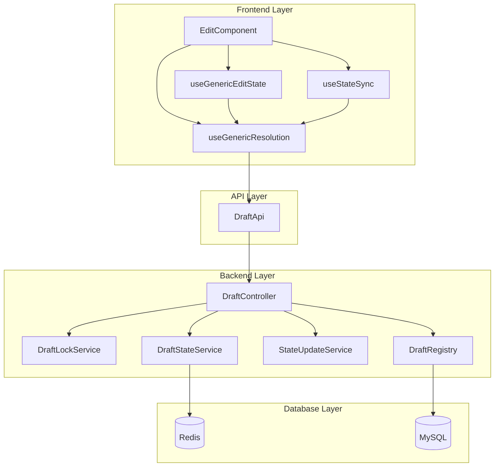
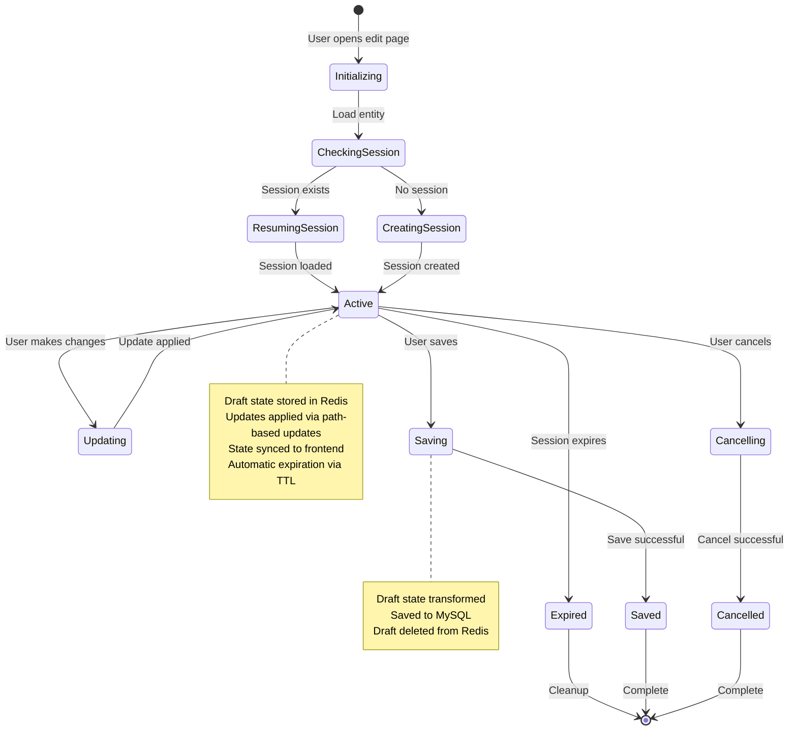
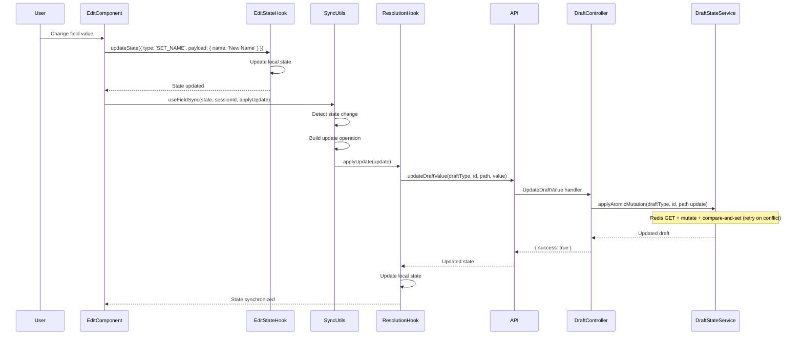

# Session and State Management System

## Overview

The session and state management system provides a generic architecture for managing **draft editing** across multiple entity types (Character, Class, Race, Feature). Drafts are stored in Redis, protected by per-draft locks, and persisted to MySQL on save.

**Source Files**:
- Backend: `apps/backend/src/features/shared/draftState/`
- Frontend: `apps/frontend/src/lib/hooks/`

## Architecture

The system follows a layered architecture with clear separation between generic infrastructure and entity-specific implementations:



## Core Concepts

### Session Lifecycle

Sessions follow a well-defined lifecycle from creation to completion:



### State Synchronization

The system uses a standardized pattern for synchronizing state changes from frontend to backend:



### Draft type system

The system is unified around `DraftType` (shared enum) and a small set of generic draft operations:

- **Start editing**: acquire lock and load/initialize draft state
- **Update value**: apply a path-based change to the Redis draft (atomic compare-and-set)
- **Save**: validate the Redis draft and persist to MySQL via a draft-type specific save service. Save does not merge browser collections over Redis.
- **Cancel**: release lock and stop editing (draft state may remain cached for a period)

The backend selects the correct validation and persistence strategy via the draft registry:

- `apps/backend/src/features/shared/draftState/draftRegistry.ts`

## Usage Patterns

### Backend Usage

#### Draft routes and controllers

All draft operations go through the shared draft routes in `apps/backend/src/features/shared/draftState/draftRoutes.ts`.

Draft persistence to MySQL is handled by the draft registry (`draftRegistry.ts`), which maps draft types to per-entity save services.

### Frontend Usage

#### Using Generic Resolution Hook

```typescript
import { useGenericResolution } from '@/lib/hooks/useGenericResolution';
import { ClassResolutionApi } from '@/services/api/ClassResolutionApi';
import type { ClassEditState, ClassUpdate } from '@shared/schema';

export function useClassResolution(classId: number | null) {
    return useGenericResolution<number, ClassEditState, ClassUpdate>(
        classId,
        {
            initializeSession: async (id) => {
                const result = await ClassResolutionApi.initializeSession(id);
                return { sessionId: result.sessionId, state: result.classState };
            },
            getSessionState: async (id, sessionId) => {
                const result = await ClassResolutionApi.getSessionState(id, sessionId);
                return { state: result.classState };
            },
            applyUpdate: async (id, sessionId, update) => {
                const result = await ClassResolutionApi.applyUpdate(id, sessionId, update);
                return { state: result.classState };
            },
            saveSession: ClassResolutionApi.saveSession,
            cancelSession: ClassResolutionApi.cancelSession
        }
    );
}
```

#### Using State Sync Utilities

```typescript
import { useFieldsSync } from '@/lib/hooks/useStateSync';

// In ClassEdit component
useFieldsSync(
    state,
    resolution.sessionId,
    resolution.applyUpdate,
    {
        getEntityId: () => state.classId,
        buildUpdate: (field, value) => ({
            draftType: DraftType.Class,
            id: state.classId,
            path: field,
            value
        }),
        shouldSync: (prev, curr) => true,
        fields: ['name', 'abbreviation', 'description']
    }
);
```

## Database Schema

### Redis draft storage

All draft types store draft JSON in Redis using a simple key scheme implemented by `DraftStateService`:

- **Draft state key**: `state:{draftType}:{id}`
- **Pub/sub channel**: `channel:state:{draftType}:{id}`

**Key Features**:
- **Redis Storage**: High-performance in-memory storage
- **Draft Type Discriminator**: DraftType numeric value is embedded in the key
- **Real-time propagation**: state updates can be published to watchers via Redis pub/sub
- **TTL Management**: draft state uses a long TTL and should be explicitly deleted when no longer needed

**Benefits**:
- High-performance in-memory storage
- Scalable across multiple backend instances
- Easy to add new draft types (register DraftType + draftRegistry entry)

**Configuration**:
Redis connection is configured via environment variables:
- `REDIS_HOST` (default: localhost)
- `REDIS_PORT` (default: 6379)
- `REDIS_PASSWORD` (optional, if Redis is password-protected)

## Migration Guide

### Backend Migration Steps

1. **Register draft type**:
   - Add a `DraftType` entry (shared enum) and register it in `draftRegistry.ts`.
2. **Add validation schema**:
   - Use a schema from `@shared/schema` to validate/normalize draft state.
3. **Add a save service**:
   - Implement draft → request transformation and persistence to MySQL.
4. **Use path-based updates**:
   - Use `UpdateDraftValue` (`PUT /drafts/update-value`) for incremental changes.

### Frontend Migration Steps

1. **Update Resolution Hook**:
   - Replace hook implementation with wrapper around `useGenericResolution`
   - Provide entity-specific API configuration
   - Map API responses to generic hook format

2. **Update Edit Component**:
   - Replace manual useEffect sync patterns with `useFieldsSync` or `useFieldSync`
   - Simplify state synchronization logic

## API Reference

### Backend

- [Draft state backend](../application-overview/session-state-management-backend.md)

### Frontend

- [Generic Resolution Hook](../application-overview/session-state-management-frontend.md#generic-resolution-hook)
- [State Sync Utilities](../application-overview/session-state-management-frontend.md#state-sync-utilities)

## Related Documentation

- [Backend Implementation Patterns](../application-overview/backend-implementation.md) - Common backend patterns
- [Frontend Patterns](../application-overview/frontend-patterns.md) - Common frontend patterns
- [Class System](../class-system/backend-implementation.md) - Class-specific implementation
- [Race System](../race-system/backend-implementation.md) - Race-specific implementation
- [Character System](../character-management/) - Character-specific implementation
