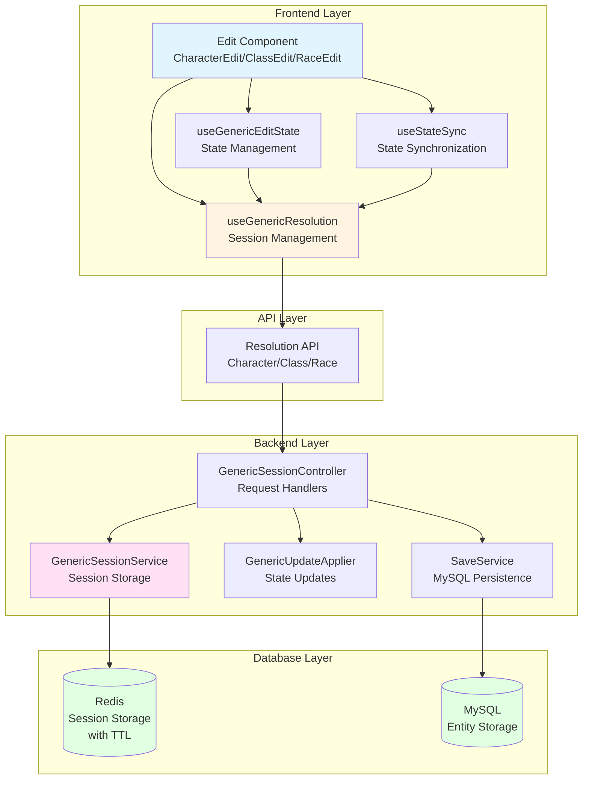
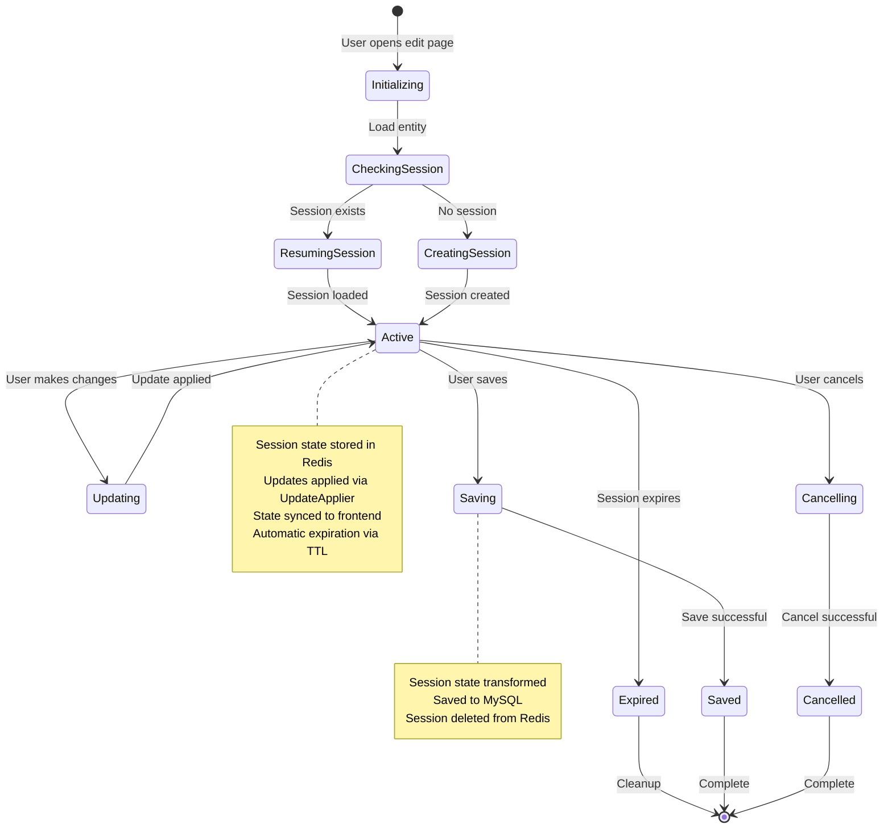
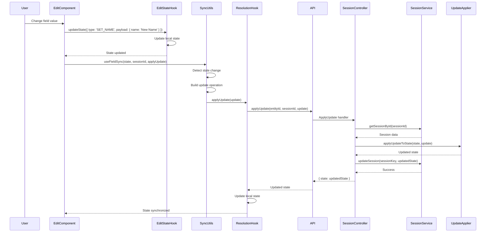
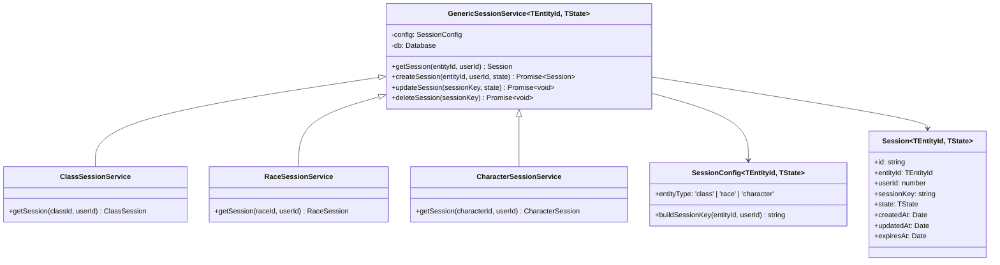

# Session and State Management System

## Overview

The session and state management system provides a generic, type-safe architecture for managing editing sessions across multiple entity types (Character, Class, Race). This system eliminates code duplication while maintaining type safety and system-specific functionality.

**Source Files**:
- Backend: `apps/backend/src/features/shared/session/`
- Frontend: `apps/frontend/src/lib/hooks/`

## Architecture

The system follows a layered architecture with clear separation between generic infrastructure and entity-specific implementations:



## Core Concepts

### Session Lifecycle

Sessions follow a well-defined lifecycle from creation to completion:



### State Synchronization

The system uses a standardized pattern for synchronizing state changes from frontend to backend:



### Generic Type System

The system uses TypeScript generics to provide type safety while sharing code:



## Usage Patterns

### Backend Usage

#### Creating a Session Service

```typescript
import { GenericSessionService } from '@/features/shared/session';
import { getClassSessionDatabase } from './sessionDatabase';
import type { ClassEditState } from './types';

const classSessionService = new GenericSessionService<number, ClassEditState>({
    entityType: 'class',
    buildSessionKey: (classId, userId) => `${classId}:${userId}`,
    db: getUnifiedSessionDatabase()
});
```

#### Creating an Update Applier Config

```typescript
import type { UpdateApplierConfig } from '@/features/shared/session';
import type { ClassEditState, ClassUpdate } from './types';

export const classUpdateApplierConfig: UpdateApplierConfig<ClassEditState, ClassUpdate> = {
    applyFieldUpdate: (state, field, value) => ({ ...state, [field]: value }),
    isFieldUpdate: (update) => update.type === 'UPDATE_CLASS_FIELD',
    extractFieldUpdate: (update) => 
        update.type === 'UPDATE_CLASS_FIELD' 
            ? { field: update.payload.field, value: update.payload.value }
            : null,
    // ... other strategies
};
```

#### Using Generic Controller

```typescript
import { initializeSession, getSessionState, applyUpdate, saveSession, cancelSession } from '@/features/shared/session';

const config: SessionControllerConfig<number, ClassEditState, ClassUpdate, DnDClass> = {
    entityService: { getById: classService.getClassById },
    sessionService: classSessionService,
    buildInitialState: (cls) => ({ /* build state from class */ }),
    updateApplierConfig: classUpdateApplierConfig,
    saveService: { saveSessionToMySQL: classSaveService.saveSessionToMySQL },
    getEntityIdFromParams: (params) => parseInt(params.classId),
    getSessionIdFromParams: (params) => params.sessionId
};

// In route handler
export async function InitializeClassSession(req, res, next) {
    await initializeSession(req, res, next, config);
}
```

### Frontend Usage

#### Using Generic Resolution Hook

```typescript
import { useGenericResolution } from '@/lib/hooks/useGenericResolution';
import { ClassResolutionApi } from '@/services/api/ClassResolutionApi';
import type { ClassEditState, ClassUpdate } from '@shared/schema';

export function useClassResolution(classId: number | null) {
    return useGenericResolution<number, ClassEditState, ClassUpdate>(
        classId,
        {
            initializeSession: async (id) => {
                const result = await ClassResolutionApi.initializeSession(id);
                return { sessionId: result.sessionId, state: result.classState };
            },
            getSessionState: async (id, sessionId) => {
                const result = await ClassResolutionApi.getSessionState(id, sessionId);
                return { state: result.classState };
            },
            applyUpdate: async (id, sessionId, update) => {
                const result = await ClassResolutionApi.applyUpdate(id, sessionId, update);
                return { state: result.classState };
            },
            saveSession: ClassResolutionApi.saveSession,
            cancelSession: ClassResolutionApi.cancelSession
        }
    );
}
```

#### Using State Sync Utilities

```typescript
import { useFieldsSync } from '@/lib/hooks/useStateSync';

// In ClassEdit component
useFieldsSync(
    state,
    resolution.sessionId,
    resolution.applyUpdate,
    {
        getEntityId: () => state.classId,
        buildUpdate: (field, value) => ({ 
            type: 'UPDATE_CLASS_FIELD', 
            payload: { field, value } 
        }),
        shouldSync: (prev, curr) => true,
        fields: ['name', 'abbreviation', 'description']
    }
);
```

## Database Schema

### Redis Session Storage

All entity types (class, race, character) use Redis for session storage with a consistent key pattern structure. Sessions are stored as JSON strings with automatic expiration via Redis TTL.

**Key Patterns**:
- By session key: `session:{entityType}:{sessionKey}` (e.g., `session:class:1:100`)
- By session ID: `session:{entityType}:id:{sessionId}` (e.g., `session:class:id:550e8400-e29b-41d4-a716-446655440000`)
- Index: `session:{entityType}:index:{sessionKey}` → `{sessionId}` (for reverse lookup)

**Data Structure**:
Sessions are stored as JSON strings with the following structure:
```json
{
    "id": "uuid-v4",
    "entityId": 123,
    "userId": 456,
    "sessionKey": "123:456",
    "state": { /* entity-specific state */ },
    "createdAt": 1234567890,
    "updatedAt": 1234567890,
    "expiresAt": 1234567890
}
```

For character sessions, the structure also includes `resolvedResult`:
```json
{
    "id": "uuid-v4",
    "characterId": 123,
    "userId": 456,
    "sessionKey": "123:456",
    "characterState": { /* character edit state */ },
    "resolvedResult": { /* resolved character result */ },
    "createdAt": 1234567890,
    "updatedAt": 1234567890,
    "expiresAt": 1234567890
}
```

**Key Features**:
- **Redis Storage**: High-performance in-memory storage
- **Automatic Expiration**: Redis TTL automatically removes expired sessions (no manual cleanup needed)
- **Entity Type Discriminator**: Key prefixes (`session:class:`, `session:race:`, `session:character:`) organize sessions by entity type
- **Multiple Lookups**: Sessions can be retrieved by session key or session ID
- **TTL Management**: Sessions expire after configurable TTL (default: 30 minutes), extended on each update

**Benefits**:
- High-performance in-memory storage
- Automatic expiration via Redis TTL (no cleanup intervals needed)
- Scalable across multiple backend instances
- Easy to add new entity types (just use new key prefix)
- Consistent structure across all entity types

**Configuration**:
Redis connection is configured via environment variables:
- `REDIS_HOST` (default: localhost)
- `REDIS_PORT` (default: 6379)
- `REDIS_PASSWORD` (optional, if Redis is password-protected)
- `SESSION_EXPIRATION_MINUTES` (default: 30)

## Migration Guide

### Backend Migration Steps

1. **Create Update Applier Config**:
   - Create `{entity}UpdateApplierConfig.ts` with strategy functions
   - Export config object

2. **Update Session Service**:
   - Replace service implementation with wrapper around `GenericSessionService`
   - Provide entity-specific configuration

3. **Update Controller**:
   - Create `SessionControllerConfig` with entity-specific dependencies
   - Replace controller functions with calls to generic controller functions
   - Add response transformation if needed (for different response field names)

4. **Update Update Applier**:
   - Replace implementation with call to `genericApplyUpdateToState`
   - Pass entity-specific config

### Frontend Migration Steps

1. **Update Resolution Hook**:
   - Replace hook implementation with wrapper around `useGenericResolution`
   - Provide entity-specific API configuration
   - Map API responses to generic hook format

2. **Update Edit Component**:
   - Replace manual useEffect sync patterns with `useFieldsSync` or `useFieldSync`
   - Simplify state synchronization logic

## API Reference

### Backend

- [Generic Session Service](../application-overview/session-state-management-backend.md#generic-session-service)
- [Generic Session Controller](../application-overview/session-state-management-backend.md#generic-session-controller)
- [Generic Update Applier](../application-overview/session-state-management-backend.md#generic-update-applier)

### Frontend

- [Generic Resolution Hook](../application-overview/session-state-management-frontend.md#generic-resolution-hook)
- [State Sync Utilities](../application-overview/session-state-management-frontend.md#state-sync-utilities)

## Related Documentation

- [Backend Implementation Patterns](../application-overview/backend-implementation.md) - Common backend patterns
- [Frontend Patterns](../application-overview/frontend-patterns.md) - Common frontend patterns
- [Class System](../class-system/backend-implementation.md) - Class-specific implementation
- [Race System](../race-system/backend-implementation.md) - Race-specific implementation
- [Character System](../character-management/) - Character-specific implementation
