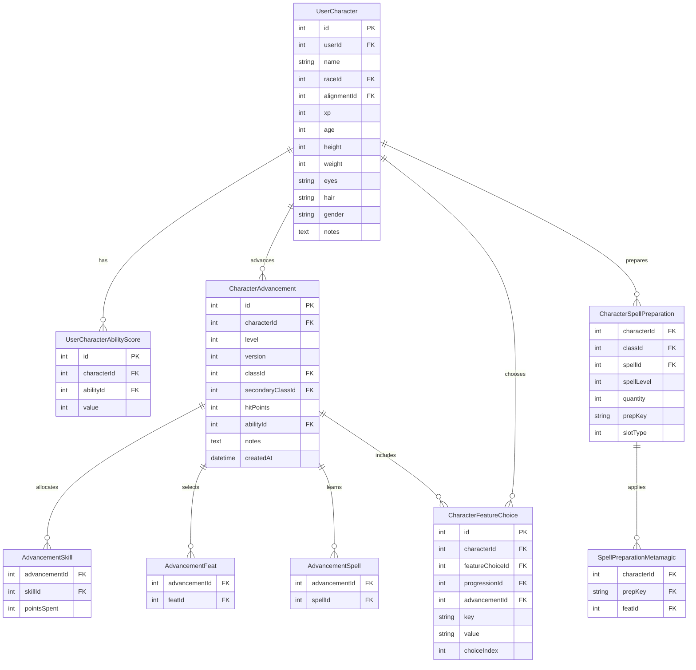

# Character Management Database Schema

*Complete documentation for the character management database schema, including all models, relationships, and constraints.*

## 📋 **Overview**

The character management database schema provides a comprehensive framework for defining characters, their characteristics, and relationships. The schema supports complex character interactions while maintaining data integrity through proper relationships and constraints.

The schema is designed to handle the complexity of D&D character management, including character creation, advancement, ability scores, spell preparation, and equipment management.

**Source File**: `prisma/schema.prisma` (Character-related models)

## 🏗️ **Core Models**

### **UserCharacter Model**

The core character definition containing basic information about characters, their characteristics, and mechanical properties.

**Purpose**: Defines the fundamental characteristics of characters, including their name, race, alignment, experience, and relationships to other systems.

**Key Fields**:
- **`id`**: Unique identifier for the character
- **`userId`**: Reference to the user who owns the character
- **`name`**: Human-readable character name
- **`raceId`**: Reference to the character's race
- **`alignmentId`**: Reference to the character's alignment
- **`xp`**: Character experience points
- **`age`**: Character age in years
- **`height`**: Character height in inches
- **`weight`**: Character weight in pounds
- **`eyes`**: Character eye color
- **`hair`**: Character hair color
- **`gender`**: Character gender
- **`notes`**: Character notes and background information

**Relationships**:
- **`user`**: Links to the user who owns the character
- **`race`**: Links to the character's race
- **`abilityScores`**: Links to character ability scores
- **`characterItems`**: Links to character equipment
- **`advancements`**: Links to character level advancements
- **`preparedSpells`**: Links to character spell preparation

**Usage**: Core character definitions that are referenced by all other character-related systems.

**Source File**: `prisma/schema.prisma` (UserCharacter model)

## 🔧 **Integration Models**

### **UserCharacterAbilityScore Model**

Defines character ability scores and their values.

**Purpose**: Links characters to their ability scores for character capability calculations.

**Key Fields**:
- **`id`**: Unique identifier for the ability score record
- **`characterId`**: Reference to the character
- **`abilityId`**: Reference to the specific ability (Strength, Dexterity, etc.)
- **`value`**: Numeric value of the ability score

**Relationships**:
- **`character`**: Links to the character

**Usage**: Provides ability score data for character capability calculations and derived statistics.

**Source File**: `prisma/schema.prisma` (UserCharacterAbilityScore model)

### **CharacterAdvancement Model**

Defines character level advancement and progression data.

**Purpose**: Links characters to their level advancement data for character progression tracking.

**Key Fields**:
- **`id`**: Unique identifier for the advancement record
- **`characterId`**: Reference to the character
- **`level`**: Character level for this advancement
- **`version`**: Version number for multiple advancements at the same level
- **`classId`**: Reference to the primary class for this advancement
- **`secondaryClassId`**: Reference to the secondary class for multiclass characters
- **`hitPoints`**: Hit points gained at this level
- **`abilityId`**: Reference to ability score improved at this level
- **`notes`**: Notes about this advancement
- **`createdAt`**: Timestamp when this advancement was created

**Relationships**:
- **`character`**: Links to the character
- **`class`**: Links to the primary class
- **`secondaryClass`**: Links to the secondary class
- **`skills`**: Links to skill advancement records
- **`feats`**: Links to feat advancement records
- **`spellsKnown`**: Links to spell advancement records
- **`featureChoices`**: Links to feature choice records

**Usage**: Provides advancement data for character level progression and feature tracking.

**Source File**: `prisma/schema.prisma` (CharacterAdvancement model)

### **AdvancementSkill Model**

Defines skill advancement for character levels.

**Purpose**: Links character advancements to skill point allocation.

**Key Fields**:
- **`advancementId`**: Reference to the character advancement
- **`skillId`**: Reference to the skill
- **`pointsSpent`**: Number of skill points spent on this skill

**Relationships**:
- **`advancement`**: Links to the character advancement
- **`skill`**: Links to the skill

**Usage**: Provides skill advancement data for character skill progression.

**Source File**: `prisma/schema.prisma` (AdvancementSkill model)

### **AdvancementFeat Model**

Defines feat advancement for character levels.

**Purpose**: Links character advancements to feat selection.

**Key Fields**:
- **`advancementId`**: Reference to the character advancement
- **`featId`**: Reference to the feat

**Relationships**:
- **`advancement`**: Links to the character advancement
- **`feat`**: Links to the feat

**Usage**: Provides feat advancement data for character feat progression.

**Source File**: `prisma/schema.prisma` (AdvancementFeat model)

### **AdvancementSpell Model**

Defines spell advancement for character levels.

**Purpose**: Links character advancements to spell learning.

**Key Fields**:
- **`advancementId`**: Reference to the character advancement
- **`spellId`**: Reference to the spell

**Relationships**:
- **`advancement`**: Links to the character advancement
- **`spell`**: Links to the spell

**Usage**: Provides spell advancement data for character spell progression.

**Source File**: `prisma/schema.prisma` (AdvancementSpell model)

### **CharacterFeatureChoice Model**

Defines character feature choices for character advancement.

**Purpose**: Links characters to their feature choices for character progression tracking.

**Key Fields**:
- **`id`**: Unique identifier for the feature choice record
- **`characterId`**: Reference to the character
- **`featureChoiceId`**: Reference to the feature choice
- **`progressionId`**: Reference to the feature progression
- **`advancementId`**: Reference to the character advancement
- **`key`**: Key for the feature choice
- **`value`**: Value selected for the feature choice
- **`choiceIndex`**: Index for the choice if multiple choices are available

**Relationships**:
- **`featureProgression`**: Links to the feature progression
- **`featureChoice`**: Links to the feature choice
- **`advancement`**: Links to the character advancement

**Usage**: Provides feature choice data for character feature progression tracking.

**Source File**: `prisma/schema.prisma` (CharacterFeatureChoice model)

### **CharacterSpellPreparation Model**

Defines character spell preparation and casting data.

**Purpose**: Links characters to their spell preparation for spellcasting management.

**Key Fields**:
- **`characterId`**: Reference to the character
- **`classId`**: Reference to the class whose spell slot was used
- **`spellId`**: Reference to the spell
- **`spellLevel`**: Actual spell level used (post-metamagic)
- **`quantity`**: Number of spells prepared
- **`prepKey`**: Unique identifier for this exact combination
- **`slotType`**: Type of spell slot used

**Relationships**:
- **`character`**: Links to the character
- **`class`**: Links to the class
- **`spell`**: Links to the spell
- **`metamagics`**: Links to metamagic feat applications

**Usage**: Provides spell preparation data for character spellcasting management.

**Source File**: `prisma/schema.prisma` (CharacterSpellPreparation model)

### **SpellPreparationMetamagic Model**

Defines metamagic feat applications to spell preparation.

**Purpose**: Links spell preparation to metamagic feat applications.

**Key Fields**:
- **`characterId`**: Reference to the character
- **`prepKey`**: Reference to the spell preparation
- **`featId`**: Reference to the metamagic feat

**Relationships**:
- **`feat`**: Links to the metamagic feat
- **`preparation`**: Links to the spell preparation

**Usage**: Provides metamagic data for character spell preparation.

**Source File**: `prisma/schema.prisma` (SpellPreparationMetamagic model)

## 🔗 **Cross-System Relationships**

### **Class System Integration**

The character management system integrates with the class system through character advancement:

**Class Progression**: Characters advance in classes through the advancement system
**Class Features**: Character feature choices integrate with class feature systems
**Spellcasting**: Character spell preparation integrates with class spellcasting
**Proficiency Management**: Character proficiencies integrate with class proficiency systems

**Integration Pattern**: The character system provides the framework for character class progression, with class features and abilities determining character capabilities.

**Related Documentation**: [Class System Database Schema](../class-system/database-schema.md)

### **Race System Integration**

The character management system integrates with the race system through character creation:

**Race Selection**: Characters are created with specific races
**Race Features**: Character features integrate with race feature systems
**Ability Modifiers**: Race ability modifiers integrate with character ability scores
**Proficiency Grants**: Race proficiency grants integrate with character proficiencies

**Integration Pattern**: The character system provides the framework for character race integration, with race features and abilities determining character capabilities.

**Related Documentation**: [Race System Database Schema](../race-system/database-schema.md)

### **Feature System Integration**

The character management system integrates with the feature system through character advancement:

**Feature Progression**: Character feature choices integrate with feature progression systems
**Feature Selection**: Character feature choices integrate with feature choice systems
**Feature Effects**: Character feature effects integrate with feature effect systems

**Integration Pattern**: The character system provides the framework for character feature integration, with feature choices and effects determining character capabilities.

**Related Documentation**: [Feature System Database Schema](../feature-system/database-schema.md)

### **Spell System Integration**

The character management system integrates with the spell system through character spell preparation:

**Spell Selection**: Character spell preparation integrates with spell selection systems
**Spell Casting**: Character spell casting integrates with spell casting systems
**Metamagic Integration**: Character metamagic integrates with spell metamagic systems

**Integration Pattern**: The character system provides the framework for character spell integration, with spell preparation and casting determining character capabilities.

**Related Documentation**: [Spell System Database Schema](../spell-system/database-schema.md)

### **Equipment System Integration**

The character management system integrates with the equipment system through character equipment:

**Equipment Selection**: Character equipment integrates with equipment selection systems
**Equipment Usage**: Character equipment usage integrates with equipment usage systems
**Equipment Effects**: Character equipment effects integrate with equipment effect systems

**Integration Pattern**: The character system provides the framework for character equipment integration, with equipment selection and usage determining character capabilities.

**Related Documentation**: [Equipment System Database Schema](../equipment-system/database-schema.md)

## 📊 **Database Relationships Diagram**

## 📊 **Data Integrity Constraints**

### **Primary Key Constraints**

**UserCharacter Model**: `id` field is the primary key with auto-increment
**UserCharacterAbilityScore Model**: `id` field is the primary key with auto-increment
**CharacterAdvancement Model**: `id` field is the primary key with auto-increment
**CharacterFeatureChoice Model**: `id` field is the primary key with auto-increment

### **Foreign Key Constraints**

**Character Relationships**: All foreign key relationships are properly defined with cascade options
**User Integration**: Character user relationships maintain referential integrity
**Race Integration**: Character race relationships maintain proper data consistency
**Alignment Integration**: Character alignment relationships maintain proper data consistency
**Class Integration**: Character class relationships maintain proper data consistency
**Ability Integration**: Character ability score relationships maintain proper data consistency

### **Unique Constraints**

**Character Advancement**: Unique constraint on `(characterId, level, version)` for multiple advancement versions
**Character Feature Choice**: Unique constraint on `(advancementId, progressionId, key)` for feature choice tracking
**Character Spell Preparation**: Primary key on `(characterId, prepKey)` for spell preparation tracking
**Spell Preparation Metamagic**: Primary key on `(characterId, prepKey, featId)` for metamagic tracking

### **Validation Constraints**

**Numeric Ranges**: Level values are constrained to valid ranges (1-100)
**Reference Validation**: All foreign key references must be valid
**String Lengths**: Name and description fields have appropriate length constraints
**Experience Points**: Experience points must be non-negative

## 🔧 **Performance Considerations**

### **Indexing Strategy**

**Primary Keys**: All primary keys are automatically indexed
**Foreign Keys**: All foreign key fields are indexed for efficient joins
**Lookup Fields**: Frequently queried fields like `name`, `userId`, and `raceId` are indexed
**Composite Indexes**: Composite indexes on frequently queried combinations
**Unique Constraints**: Unique constraints provide additional indexing benefits

### **Query Optimization**

**Eager Loading**: Related data is loaded efficiently using Prisma includes
**Selective Loading**: Only required fields are loaded for performance
**Pagination**: Large result sets are properly paginated
**Caching**: Frequently accessed data is cached appropriately

## 🔗 **Related Documentation**

- **[Validation Schemas](validation-schemas.md)** - Character management validation rules and schemas
- **[Static Data](static-data.md)** - Character management enums and types
- **[Backend Implementation](backend-implementation.md)** - Character management backend implementation
- **[Frontend Components](frontend-components.md)** - Character management frontend implementation
- **[Class System Database Schema](../class-system/database-schema.md)** - Class system database models
- **[Race System Database Schema](../race-system/database-schema.md)** - Race system database models
- **[Feature System Database Schema](../feature-system/database-schema.md)** - Feature system database models
- **[Spell System Database Schema](../spell-system/database-schema.md)** - Spell system database models
- **[Equipment System Database Schema](../equipment-system/database-schema.md)** - Equipment system database models
- **[Database Schema Patterns](../application-overview/database-schema.md)** - Shared database patterns and conventions
