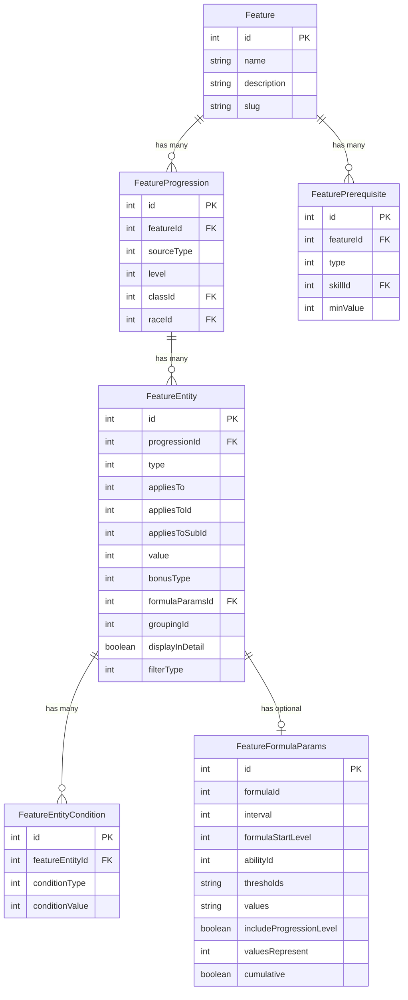

# Feature System Architecture Principles

## Overview

The Feature System is the core foundation of the D&D Tools application, implementing a flexible, reusable architecture for modeling game mechanics. Unlike the formatting system's logical separation of concerns, the feature system uses **functional separation** to model business logic while maintaining performance and extensibility.

## Core Architectural Principles

### **1. Reusability Through Separation of Concepts**

The system separates **generic concepts** from **specific implementations** to enable reuse across different game entities.

#### **Feature vs FeatureProgression Pattern**
```
Feature (Generic Concept)
├── Low-Light Vision (reusable concept)
├── Animal Companion (reusable concept)
└── Evasion (reusable concept)

FeatureProgression (Specific Implementation)
├── Elf Race: Low-Light Vision (60 ft range)
├── Dwarf Race: Low-Light Vision (120 ft range)
├── Druid Class: Animal Companion (level 1)
└── Rogue Class: Evasion (level 2)
```

**Architectural Benefits**:
- **Eliminates Redundancy**: One "Evasion" feature can be used by multiple classes
- **Enables Variation**: Same feature can have different progression patterns
- **Simplifies Maintenance**: Changes to feature descriptions update everywhere
- **Supports Extensibility**: New classes can reuse existing features

### **2. Functional Separation of Concerns**

The system separates concerns by **purpose** rather than by **logical layer**, focusing on business logic modeling.

#### **Component Responsibilities**
- **Features**: Generic concept descriptions (metadata only)
- **FeatureProgressions**: Specific implementations with level and context
- **FeatureEntities**: Unified model for all feature effects (modifiers, choices, special effects) with type-based differentiation
- **FeatureEntityConditions**: Conditional requirements for feature entities
- **FeaturePrerequisites**: Requirements and conditions

#### **Data Flow Architecture**
```
Database (Persistence Layer)
├── Prisma Schema (strict foreign key relationships)
├── Feature tables (generic concepts)
├── FeatureProgression tables (specific implementations)
└── FeatureEntity tables (unified effects with type differentiation)

Validation Layer
├── Zod Schemas (type safety and data quality)
├── HTTP request/response validation
└── Frontend form validation

Business Logic Layer
├── Static Data (enums, formulas, type definitions)
├── Backend Services (CRUD operations)
└── Frontend Components (data entry and visualization)

Character System (Future)
├── Character Creator (feature application)
├── Leveling Tool (progression calculation)
└── Character Sheet (display and calculation)
```

### **3. Performance-Driven Design**

The architecture prioritizes performance through strategic use of static data and minimal database complexity.

#### **Static Data Strategy**
- **Enum-Based Types**: Avoids database schema explosion
- **Frontend Caching**: Reduces API calls for static information
- **Type Safety**: Zod validation provides data quality without database joins
- **Extensibility**: Easy to add new types without schema changes

#### **Database Optimization**
- **Minimal Tables**: 54 tables vs potential 100+ with normalized enums
- **Reduced Joins**: Fewer complex queries for better performance
- **Strategic Denormalization**: Static data in frontend, dynamic data in database

## Component Architecture

### **Core Components and Relationships**



### **Component Responsibilities**

#### **Feature (Generic Concept)**
- **Purpose**: Reusable game mechanic descriptions
- **Data**: ID, name, description, prerequisites
- **Dependencies**: None (pure metadata)
- **Examples**: "Low-Light Vision", "Animal Companion", "Evasion"

#### **FeatureProgression (Specific Implementation)**
- **Purpose**: Links features to specific classes/races with context
- **Data**: Feature ID, source type, level, class/race ID
- **Dependencies**: References single Feature
- **Examples**: "Elf gets Low-Light Vision at level 1", "Rogue gets Evasion at level 2"

#### **FeatureEntity (Unified Effects)**
- **Purpose**: Unified model for all feature effects with type-based differentiation
- **Data**: Type, applies to, value, bonus type, conditions, formula parameters
- **Dependencies**: References FeatureProgression, optional FormulaParams, optional Conditions
- **Entity Types**: Bonus, Quantity, Replacement, Other, Proficiency, Choice, Allocation
- **Examples**: 
  - Bonus: "+2 to attack rolls", "+4 to Strength"
  - Quantity: "1d6 sneak attack damage", "30 ft movement speed"
  - Choice: "Choose a feat from Fighter bonus feat list"
  - Other: "Weapon familiarity", "Turn undead", "Wild shape forms"

#### **FeatureEntityCondition (Conditional Requirements)**
- **Purpose**: Conditional requirements for when feature entities apply
- **Data**: Condition type, condition value
- **Dependencies**: References FeatureEntity
- **Examples**: "Only applies to melee attacks", "Only applies to undead creatures"

#### **FeaturePrerequisite (Requirements)**
- **Purpose**: Conditions that must be met before feature is available
- **Data**: Prerequisite type, value, description
- **Dependencies**: References Feature (not FeatureProgression)
- **Examples**: "Minimum 4 ranks in Perform skill" (currently the only implemented prerequisite type)
- **Note**: Character level requirements are handled by FeatureProgression.level field

## Formula System Integration

### **Architectural Purpose**
Formulas automate common progression patterns, reducing data entry and enabling complex calculations.

#### **Formula Integration Points**
- **FeatureEntity**: Formulas can drive entity values and quantities
- **Character System**: Formulas will drive character calculations

#### **Formula Types**
- **EVERY_N_LEVELS**: Automated progression at intervals
- **CONDITIONAL_SCALING**: Level-based threshold changes
- **ATTRIBUTE_BASED**: Character attribute dependencies
- **LINEAR_SCALING**: Level-based multiplier (e.g., level × 2)

#### **Architectural Benefits**
- **Reduces Redundancy**: One formula replaces multiple manual entries
- **Enables Complexity**: Supports sophisticated progression patterns
- **Future-Ready**: Will drive character system calculations
- **Extensible**: New formula types can be added easily

## Integration Architecture

### **System Integration Pattern**

The Feature System serves as the **core foundation** for multiple game systems:

```
Feature System (Core Foundation)
├── Class System (collections of features)
├── Race System (collections of features)
├── Template System (collections of features)
├── Character System (feature application and calculation)
└── NPC/Monster System (feature application)

Character System Integration
├── Character Creator (applies features during creation)
├── Leveling Tool (calculates feature progression)
└── Character Sheet (displays calculated values)
```

### **Integration Principles**

#### **Generic and Flexible**
- **Single System**: All game mechanics use the same feature system
- **No Exceptions**: Even "special" cases like class skills use standard patterns
- **Source Agnostic**: Features can come from any source (class, race, template, etc.)

#### **Performance Optimized**
- **Static Data Caching**: Frontend caches static information
- **Minimal API Calls**: Reduces HTTP overhead
- **Efficient Queries**: Optimized database schema and queries

#### **Extensible Design**
- **Enum-Based Extension**: New types added via static data
- **Formula Extension**: New formulas can be added
- **Component Extension**: New component types can be added

## Error Handling and Validation Architecture

### **Multi-Layer Validation**

#### **Database Layer**
- **Prisma Schema**: Strict foreign key relationships
- **Referential Integrity**: Database-level constraint enforcement
- **Data Consistency**: Prevents orphaned records

#### **Validation Layer**
- **Zod Schemas**: Type safety and data quality
- **HTTP Validation**: Request/response validation
- **Frontend Validation**: Form-level validation

#### **Business Logic Layer**
- **Static Data Validation**: Enum value validation
- **Game Rule Validation**: Business rule enforcement
- **Admin-Only Operations**: Restricted feature modification

### **Error Handling Strategy**

#### **Backend Error Handling**
- **Middleware Layer**: Centralized error handling
- **Validation Errors**: Clear error messages for invalid data
- **Database Errors**: Graceful handling of constraint violations

#### **Frontend Error Handling**
- **React Components**: In-page error display
- **Log Panel**: Detailed error logging through the [Log Panel Component](../application-overview/log-panel.md)
- **Toast System**: User-friendly error notifications

## Performance Architecture

### **Performance Optimization Strategies**

#### **Static Data Caching**
- **Frontend Caching**: Static data stored in frontend
- **Reduced API Calls**: No need to fetch static data repeatedly
- **Fast Filtering**: Client-side filtering and transformation

#### **Database Optimization**
- **Minimal Tables**: Avoids schema explosion
- **Reduced Joins**: Fewer complex queries
- **Strategic Denormalization**: Balance between normalization and performance

#### **Query Optimization**
- **Efficient Joins**: Optimized database relationships
- **Indexing Strategy**: Proper database indexing
- **Query Patterns**: Consistent query patterns for caching

### **Scalability Considerations**

#### **Current Scale**
- **54 Database Tables**: Manageable complexity
- **Static Data Enums**: Extensible without schema changes
- **Frontend Caching**: Reduces server load

#### **Future Scale**
- **Character System**: Will add significant calculation load
- **NPC/Monster System**: Will add more feature usage
- **User-Generated Content**: May require additional validation

## Extensibility Architecture

### **Extension Mechanisms**

#### **Game Data Extensibility**
- **New Features**: Add new feature types via static data
- **New Formulas**: Add new formula types for progression
- **New Components**: Add new component types as needed

#### **System Extensibility**
- **New Game Systems**: Feature system can support new game mechanics
- **New Character Types**: System can handle new character types
- **New Rule Sets**: System can adapt to different rule systems

#### **Implementation Extensibility**
- **Enum Extension**: Add new enum values without schema changes
- **Component Extension**: Add new component types
- **Formula Extension**: Add new formula types

### **Extension Patterns**

#### **Adding New Entity Types**
1. **Add to Enum**: Add new value to `EntityType` enum
2. **Update UI**: Add to relevant UI forms
3. **Character System**: Implement character system interpretation
4. **Validation**: Add validation rules as needed

#### **Adding New Applies-To Types**
1. **Add to Enum**: Add new value to `EntityAppliesToType` enum
2. **Update Compatibility**: Add to entity type compatibility matrix
3. **Update UI**: Add to applies-to selection forms
4. **Character System**: Implement character system interpretation
5. **Validation**: Add validation rules as needed

## Future Architecture Considerations

### **Character System Integration**

#### **Calculation Engine**
- **Formula Evaluation**: Real-time formula calculation
- **Condition Evaluation**: Dynamic condition checking
- **Choice Resolution**: Player choice processing

#### **Performance Requirements**
- **Real-Time Calculation**: Fast character sheet updates
- **Caching Strategy**: Intelligent calculation caching
- **Optimization**: Efficient calculation algorithms

### **Advanced Features**

#### **Complex Interactions**
- **Feature Dependencies**: Complex feature relationships
- **Conditional Logic**: Advanced conditional processing
- **Dynamic Calculation**: Runtime calculation adjustments

#### **User Experience**
- **Real-Time Updates**: Immediate UI updates
- **Error Recovery**: Graceful error handling
- **Performance**: Fast response times

## Conclusion

The Feature System architecture prioritizes **reusability**, **performance**, and **extensibility** while maintaining **data integrity** and **type safety**. The system serves as the foundation for all game mechanics, providing a flexible and powerful platform for modeling complex D&D 3.5 rules while remaining performant and maintainable.

The architecture successfully balances the competing demands of:
- **Flexibility** vs **Performance**
- **Simplicity** vs **Power**
- **Extensibility** vs **Stability**
- **Type Safety** vs **Database Efficiency**

This creates a robust foundation for the character system and future game mechanics while maintaining excellent performance and developer experience.

## Related Documentation

- **[Usage Guidelines](./usage-guidelines.md)** - How to use the feature system
- **[Implementation Strategy](./implementation-strategy.md)** - How to implement new features
- **[Testing and Validation](./testing-validation.md)** - How to test feature implementations
- **[Error Handling](./error-handling.md)** - How to handle errors and edge cases
