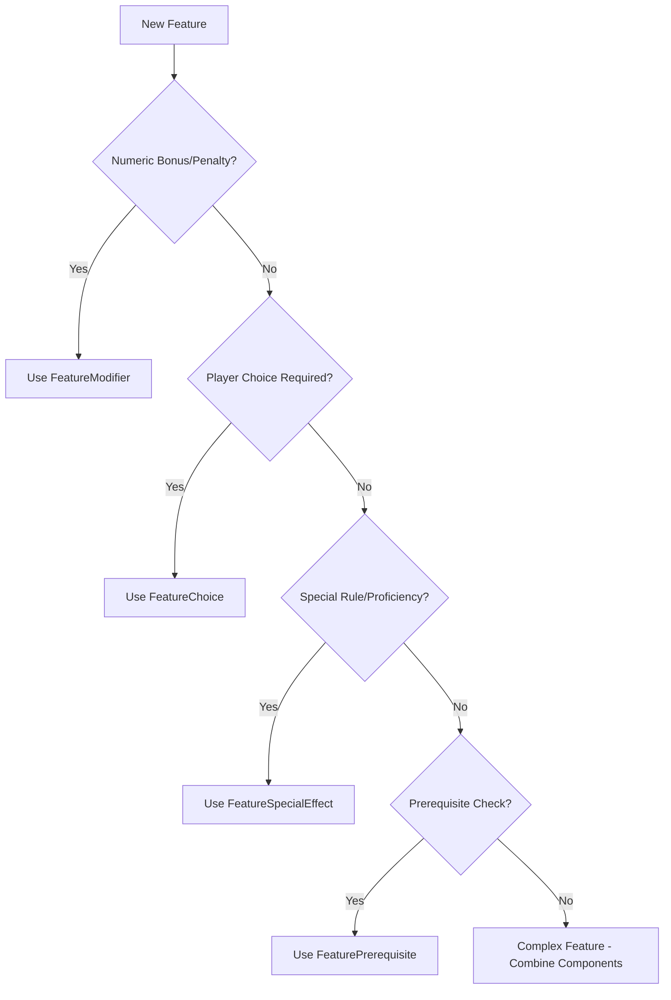

# Component Selection Guide

*When to use modifiers, choices, effects, and prerequisites in the feature system.*

## Quick Decision Tree

### When to Use Each Component



## Component Selection Matrix

| Feature Type | Primary Component | Secondary Components | Example |
|--------------|-------------------|---------------------|---------|
| **Ability Bonus** | FeatureModifier | Conditions | Barbarian Rage STR bonus |
| **Skill Bonus** | FeatureModifier | Prerequisites | Skill Focus feat |
| **Attack Bonus** | FeatureModifier | Conditions | Favored Enemy bonus |
| **Attack Penalty** | FeatureModifier | Formula | Monk Flurry of Blows penalty |
| **Extra Attacks** | FeatureModifier | Formula | Monk Flurry of Blows extra attacks |
| **Damage Bonus** | FeatureModifier | Choices + Conditions | Sneak Attack |
| **Class Skills** | FeatureModifier (Container) | - | Fighter class skills |
| **Languages** | FeatureModifier (Container) | Conditions + Choices | Elf languages |
| **Proficiency** | FeatureSpecialEffect | - | Weapon proficiency |
| **Player Selection** | FeatureChoice | Modifiers dependent on choice | Fighting Style |
| **Resource Grant** | FeatureModifier (Uses) | Special Effects | Turn Undead |
| **Transformation** | FeatureSpecialEffect | Multiple modifiers | Wild Shape |

## FeatureModifier Usage

### **When to Use Modifiers**
- **Numeric bonuses/penalties** to attributes, skills, saves, AC, attack, damage
- **Resource tracking** (uses per day, charges, etc.)
- **Quantity changes** (extra dice, additional actions, extra attacks)
- **Temporary effects** that modify numbers
- **Class skills** (special container pattern with `ModifierType.Other`)
- **Languages** (container pattern with `ModifierType.Other` and `FeatureAppliesToType.Language`)

### **Modifier Types**
```typescript
enum ModifierType {
    Bonus = 0,           // +2 to attack
    Quantity = 1,        // +1d6 damage, extra attacks, uses per day
    Replacement = 2,     // Replace existing values
    Other = 3            // Special cases, complex effects
}
```

### **Bonus Types (Stacking Rules)**
```typescript
enum FeatureBonusType {
    Dodge = 0,           // Stack with other dodge bonuses
    Circumstance = 1,    // Stack with everything
    Enhancement = 2,     // Don't stack with other enhancement
    Morale = 3,          // Don't stack with other morale
    Competence = 4,      // Don't stack with other competence
    Alchemical = 5,      // Don't stack with other alchemical
    Armor = 6,           // Don't stack with other armor
    Deflection = 7,      // Don't stack with other deflection
    Insight = 8,         // Don't stack with other insight
    Luck = 9,            // Don't stack with other luck
    NaturalArmor = 10,   // Don't stack with other natural armor
    Profane = 11,        // Don't stack with other profane
    Racial = 12,         // Don't stack with other racial
    Resistance = 13,     // Don't stack with other resistance
    Sacred = 14,         // Don't stack with other sacred
    Shield = 15,         // Don't stack with other shield
    Size = 16,           // Don't stack with other size
    Other = 17           // Custom stacking rules
}
```

### **Modifier Examples**

For complete modifier examples including:
- **Simple ability bonuses** (racial traits)
- **Conditional modifiers** (rage, flurry of blows)
- **Formula-based scaling** (level-dependent bonuses)
- **Resource tracking** (uses per day)
- **Container patterns** (class skills, languages)

See **[examples.md](./examples.md)** for comprehensive implementation details.

## FeatureChoice Usage

### **When to Use Choices**
- **Player selections** (feats, weapons, enemies, schools)
- **Multiple options** from a list
- **Allocation decisions** (skill points, bonuses)
- **Complex selections** with dependencies

### **Choice Behaviors**
```typescript
enum ChoiceBehavior {
    Single = 'single',         // Choose one option
    Multiple = 'multiple',     // Choose several options
    Allocation = 'allocation'  // Distribute points/bonuses
}
```

### **Choice Examples**
```typescript
// Single feat selection
{
    choiceType: ChoiceType.Feat,
    choiceBehavior: ChoiceBehavior.Single,
    appliesToType: FeatureAppliesToType.Feat,
    label: "Choose a fighter bonus feat"
}

// Multiple weapon proficiencies
{
    choiceType: ChoiceType.Feature,
    choiceBehavior: ChoiceBehavior.Multiple,
    appliesToType: FeatureAppliesToType.Item,
    label: "Choose two weapon proficiencies",
    pickCount: 2
}

// Skill point allocation
{
    choiceType: ChoiceType.Feature,
    choiceBehavior: ChoiceBehavior.Allocation,
    appliesToType: FeatureAppliesToType.Skill,
    label: "Allocate 4 skill points",
    pickCount: 4
}
```

## FeatureSpecialEffect Usage

### **When to Use Special Effects**
- **Non-numeric abilities** (proficiencies, immunities, special senses)
- **Complex rules** that don't fit modifiers
- **Transformations** and special states
- **Unique abilities** with custom logic

### **Effect Types**
```typescript
enum FeatureSpecialEffectType {
    Proficiency = 'proficiency',     // Weapon/armor proficiency
    Immunity = 'immunity',           // Immunity to effects
    Vision = 'vision',               // Special vision modes
    Other = 'other'                  // Custom effects
}
```

### **Special Effect Examples**
```typescript
// Weapon proficiency
{
    effectType: FeatureSpecialEffectType.Proficiency,
    featId: WEAPON_ID.LONGSWORD,
    description: "Proficient with longsword"
}

// Immunity
{
    effectType: FeatureSpecialEffectType.Immunity,
    key: "sleep_immunity",
    value: "immune_to_sleep_spells",
    description: "Immune to magical sleep effects"
}

// Special vision
{
    effectType: FeatureSpecialEffectType.Vision,
    key: "darkvision",
    value: "see_60ft_in_darkness",
    description: "Can see 60 feet in total darkness"
}
```

## Formula System Integration

### **When to Use Formulas**
- **Level-based scaling** (bonuses that increase with level)
- **Conditional values** (different values at different levels)
- **Resource patterns** (uses per day that scale with level)
- **Attribute-dependent** calculations (bonuses based on ability scores)

### **Formula Examples**

For complete formula examples and implementation details, see **[formula-system.md](./formula-system.md)**.

**Common Formula Types**:
- **Linear Scaling**: Features that scale linearly with level
- **Every N Levels**: Features that increase at specific intervals
- **Conditional Scaling**: Features with level-based thresholds
- **Attribute-Based**: Features dependent on ability scores
- **Value Plus Level**: Features with fixed value plus level
- **Level Times Value**: Features that multiply level by a value

**Formula Integration Pattern**:
```typescript
{
    type: ModifierType.Bonus,
    appliesTo: ModifierAppliesToType.Attribute,
    value: 2, // Base value
    bonusType: FeatureBonusType.Morale,
    formulaParamsId: 123 // Links to FeatureFormulaParams
}
```

## Common Anti-Patterns

### **❌ Don't Use Modifiers For**
- Non-numeric abilities (use Special Effects)
- Player choices (use Choices)
- Complex rules (use Special Effects)

**Exception**: Class skills use `ModifierType.Other` with `value: 0` as a special container pattern. Languages use similar patterns with `FeatureAppliesToType.Language`. See **[class-skills.md](class-skills.md)** and **[languages.md](languages.md)** for details.

### **❌ Don't Use Choices For**
- Simple numeric bonuses (use Modifiers)
- Automatic abilities (use Special Effects)
- Prerequisites (use Prerequisites)

### **❌ Don't Use Special Effects For**
- Numeric bonuses (use Modifiers)
- Player selections (use Choices)
- Requirements (use Prerequisites)

## Decision Checklist

Before implementing a feature, ask:

1. **Is it a number?** → Use FeatureModifier
2. **Does the player choose?** → Use FeatureChoice
3. **Is it a special ability?** → Use FeatureSpecialEffect
4. **Is it a requirement?** → Use FeaturePrerequisite
5. **Is it a class skill?** → Use FeatureModifier (special container pattern)
6. **Is it a language?** → Use FeatureModifier (container pattern)
7. **Does it scale with level?** → Use FeatureModifier with Formula
8. **Is it complex?** → Combine multiple components

## Key Principles

1. **Use the right tool for the job**
2. **Keep components focused and single-purpose**
3. **Combine components for complex features**
4. **Follow D&D stacking rules for bonus types**
5. **Make choices clear and unambiguous**
6. **Document special effects thoroughly**
7. **Use formulas for level-based scaling**
8. **Use conditional scaling for complex progressions**

For complete examples, see **[examples.md](./examples.md)**.
