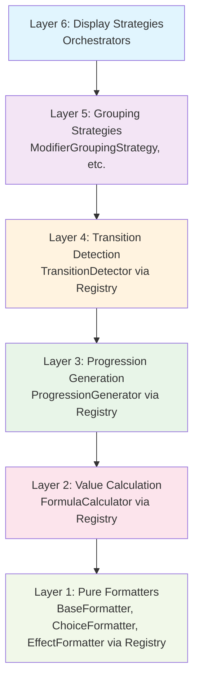
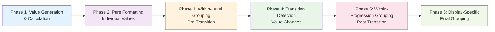
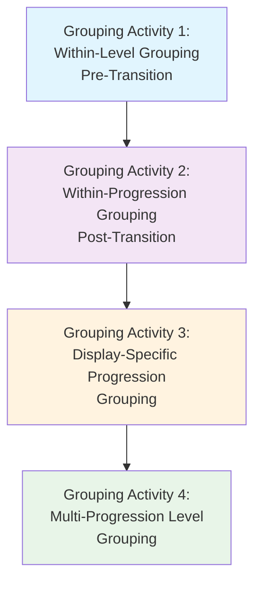

# Feature Formatting System Documentation

## Overview

The Feature Formatting System is a core component of the D&D Tools feature system that implements a **6-layer clean architecture** with **registry pattern** for formatting feature progressions, modifiers, choices, and effects. This system provides consistent, maintainable, and extensible formatting across all feature-related displays in the application.

The formatting system is used by multiple other systems in the D&D Tools project, including the [Class System](../class-system/README.md) and [Race System](../race-system/README.md), to display feature progressions in a consistent and user-friendly manner.

## Recent Major Refactoring

The formatting system underwent a **comprehensive refactoring** to improve type safety, reduce duplication, and implement proper architectural patterns:

### **Key Refactoring Achievements**

1. **Registry Pattern Implementation**: All calculators and formatters now use centralized registries for better extensibility
2. **Type Consolidation**: Eliminated duplicate interfaces and created a clean type hierarchy with base interfaces
3. **Architectural Consistency**: Ensured all components follow the same patterns and dependencies
4. **Code Quality Improvements**: Removed magic numbers, unused variables, and unnecessary wrapper functions
5. **Future Extensibility**: Set up architecture to support multiple calculator implementations

### **Architecture Improvements**

- **Calculator Registry**: Centralized management of all calculator types through the registry pattern
- **Type Hierarchy**: Base interfaces with proper extensions for common properties
- **Consolidated Types**: Merged duplicate interfaces into unified types
- **Enum Usage**: Replaced string literals with proper enums for type safety

## Architecture

The formatting system implements a **6-layer clean architecture** with **6 processing phases** and **4 distinct grouping activities**. This creates three organizational dimensions:

### **1. Abstraction Layers (Dependency Hierarchy)**
The system is organized into 6 layers based on **abstraction level and dependencies**:



**Layer Responsibilities:**
- **Layer 6**: Orchestration and display strategy management
- **Layer 5**: Grouping strategies for different entity types
- **Layer 4**: Transition detection and progression analysis (via registry)
- **Layer 3**: Progression value generation and formula expansion (via registry)
- **Layer 2**: Value calculation and breakdown generation (via registry)
- **Layer 1**: Pure formatting of individual values (via registry)

### **2. Processing Phases (Execution Order)**
The actual **execution order** follows a logical sequence based on data dependencies:



**Phase Details:**
- **Phase 1**: Generate calculated values for each level of each progression
- **Phase 2**: Format each calculated value using appropriate formatters
- **Phase 3**: Group entities by type within each level (pre-transition)
- **Phase 4**: Detect transitions in formatted values
- **Phase 5**: Group all entities for each transition level (post-transition)
- **Phase 6**: Apply display-specific final grouping logic

### **3. Grouping Activities (Data Organization)**
Four distinct grouping activities organize data at different stages:



**Grouping Activity Details:**

#### **Grouping Activity 1: Within-Level Grouping (Pre-Transition)**
- **Purpose**: Group entities of the same type within a single level
- **Scope**: Single level of single FeatureProgression
- **Delimiters**: 
  - FeatureModifiers: `', '` (within same ModifierType)
  - FeatureChoices: `' | '` (within same choice type)
  - FeatureEffects: `', '` (within same effect type)
- **Rules**: Never group different ModifierTypes together, never group FeatureModifiers with FeatureChoices

#### **Grouping Activity 2: Within-Progression Grouping (Post-Transition)**
- **Purpose**: Group all entities for each transition level within a single progression
- **Scope**: Single FeatureProgression across all transition levels
- **Delimiter**: `', '` (regardless of entity type)
- **Rules**: Concatenate all entity types for each transition level

#### **Grouping Activity 3: Display-Specific Progression Grouping**
- **Purpose**: Format progression transitions based on display type
- **DisplayType.Edit**: Prefix with `'Level X: '` and join with `'; '`
- **DisplayType.Detail**: Pass through unchanged
- **DisplayType.CharacterSheet**: Filter to current character level

#### **Grouping Activity 4: Multi-Progression Level Grouping**
- **Purpose**: Group multiple FeatureProgressions by level (Detail only)
- **Scope**: Multiple FeatureProgressions
- **Rules**: Union by level, preserving individual feature entries

### **Key Distinctions**
- **Layer Numbers (1-6)**: Represent **abstraction levels** and **dependency hierarchy**
- **Phase Numbers (1-6)**: Represent **execution order** and **data flow**
- **Grouping Activities (1-4)**: Represent **data organization** and **display formatting**

The processing flow (Phase 1→2→3→4→5→6) is different from the dependency hierarchy (Layer 6 depends on Layer 5, etc.) because **data preparation must happen before data processing**.

## Registry Pattern Architecture

### **Calculator Registry**

The system uses a centralized registry pattern to manage all calculator implementations. This provides several key benefits:

**Benefits:**
- **Extensibility**: Easy to add different implementations for different formula types
- **Consistency**: All calculator access follows the same pattern
- **Type Safety**: Proper TypeScript interfaces ensure type safety
- **Maintainability**: Centralized calculator management

The registry pattern enables future enhancements by allowing multiple implementations per calculator type, making it easy to add specialized calculators for specific use cases.

### **Calculator Types**

The registry supports multiple calculator types through the `CalculatorType` enum, which includes Formula, Choice, Progression, Transition, and Conditional calculators.

**Current Implementation:**
- **Formula Calculators**: Registered per `FormulaId` for different formula types
- **Progression Generators**: Default implementation registered with type `0`
- **Transition Detectors**: Default implementation registered with type `0`
- **Choice Calculators**: Reserved for future implementation
- **Conditional Value Detectors**: Reserved for future implementation

### **Future Extensibility**

The registry pattern enables future enhancements such as specialized progression generators for different formula types, specialized transition detectors for different entity types, and choice-based calculators for complex choice scenarios.

## Type System Architecture

### **Base Interface Hierarchy**

The system uses a clean type hierarchy with base interfaces that provide common properties for all related types. This approach eliminates duplication and ensures consistency across the type system.

**Consolidated Types:**
- **`GroupedLevelItem`**: Replaces multiple duplicate interfaces for grouped items with level information
- **`FormattedItemWithBreakdown`**: Replaces duplicate interfaces for formatted items with breakdown information
- **`BaseProcessingResult`**: Extends base formatted value for consistent structure

### **Type Safety Improvements**

The type system improvements include proper enum usage instead of magic numbers, consistent interfaces that follow the same pattern, and clear inheritance hierarchy with base interfaces.

## Key Principles

### **Dependency Inversion**
- High-level layers (6) depend on abstractions (interfaces)
- Low-level layers (1-5) implement abstractions
- Display Strategies orchestrate all phases through the 6-phase process
- **Registry Pattern**: All calculator access goes through centralized registries

### **Single Responsibility**
- Each layer has one clear, well-defined responsibility
- Each phase has one clear, well-defined execution step
- Pure formatters only format values
- Calculators only calculate values
- Display strategies only orchestrate the process
- **Registry Management**: Centralized calculator registration and lookup

### **Processing Flow Logic**
The system follows a logical processing sequence:
- **Phase 1**: Value generation and calculation must happen before formatting
- **Phase 2**: Pure formatting must happen before within-level grouping
- **Phase 3**: Within-level grouping must happen before transition detection
- **Phase 4**: Transition detection must happen before within-progression grouping
- **Phase 5**: Within-progression grouping must happen before display-specific grouping
- **Phase 6**: Display-specific final grouping creates the final result

### **Data Flow Visualization**
```mermaid
graph TD
    Input[Input: FeatureProgression[]] --> P1[Phase 1: Value Generation<br/>& Calculation via Registry]
    P1 --> P2[Phase 2: Pure Formatting<br/>Individual Values via Registry]
    P2 --> P3[Phase 3: Within-Level Grouping<br/>Pre-Transition]
    P3 --> P4[Phase 4: Transition Detection<br/>Value Changes via Registry]
    P4 --> P5[Phase 5: Within-Progression Grouping<br/>Post-Transition]
    P5 --> P6[Phase 6: Display-Specific<br/>Final Grouping]
    P6 --> Output[Output: DisplayResult<br/>or LevelEntry[]]
    
    style Input fill:#e8f5e8
    style Output fill:#e8f5e8
    style P1 fill:#e3f2fd
    style P2 fill:#f3e5f5
    style P3 fill:#fff3e0
    style P4 fill:#e8f5e8
    style P5 fill:#fce4ec
    style P6 fill:#f1f8e9
```

### **Formula Property-Based Routing**
The system intelligently routes formula calls based on formula properties:
- **`hasProgression: true`** → Generate progression values in Phase 1
- **`isCharacterDependent: true`** + no character data → Use `.getDisplayString()` in Phase 1
- **`isCharacterDependent: true`** + has character data → Use `.calculate()` in Phase 1
- **`isCharacterDependent: false`** → Always use `.calculate()` in Phase 1

### **Display Type Processing Patterns**

```mermaid
graph TD
    subgraph "DisplayType.Edit"
        E1[Single Progression] --> E2[Phase 1-6 Processing] --> E3[Level X: prefix<br/>; delimiter]
    end
    
    subgraph "DisplayType.Detail"
        D1[Multiple Progressions] --> D2[Phase 1-6 per Progression] --> D3[Group by Level] --> D4[Feature Items per Level]
    end
    
    subgraph "DisplayType.CharacterSheet"
        C1[Multiple Progressions] --> C2[Phase 1-6 per Progression] --> C3[Filter to Current Level] --> C4[Current Value Only]
    end
    
    style E1 fill:#e1f5fe
    style E3 fill:#e1f5fe
    style D1 fill:#f3e5f5
    style D4 fill:#f3e5f5
    style C1 fill:#fff3e0
    style C4 fill:#fff3e0
```


## Documentation Structure

### **Core Documentation**
- **[Usage Guidelines](./usage-guidelines.md)** - Comprehensive guidelines for agents and developers
- **[Final Implementation Summary](./final-implementation-summary.md)** - Complete implementation overview
- **[Refactoring Strategy](./refactoring-strategy.md)** - Architecture design decisions and patterns
- **[Architecture Decisions](./architecture-decisions.md)** - Key architectural decisions and future extensibility

### **Key Files**
- `frontend/src/lib/formatters/display-strategies.ts` - Display strategy implementations (Layer 6)
- `frontend/src/lib/formatters/calculator-registry.ts` - Calculator registration and lookup (Registry)
- `frontend/src/lib/formatters/formatter-registry.ts` - Formatter registration and lookup (Layer 1)
- `frontend/src/lib/formatters/types.ts` - Type definitions and interfaces
- `frontend/src/lib/formatters/pure-formatters.ts` - Pure formatter implementations (Layer 1)
- `frontend/src/lib/formatters/formula-utils.ts` - Shared formula parameter utilities
- `frontend/src/lib/formatters/grouping-strategies.ts` - Grouping strategy implementations
- `frontend/src/lib/formatters/progression-generators.ts` - Progression generation and transition detection
- `frontend/src/lib/formatters/calculators.ts` - Calculator implementations

### **Key Exports**
- `displayStrategyFactory` - Strategy creation factory (returns singletons)
- `calculatorRegistry` - Calculator registration system (for internal use)
- `formatterRegistry` - Formatter registration system (for internal use)

## Usage Patterns

For comprehensive usage patterns, examples, and guidelines, see **[usage-guidelines.md](./usage-guidelines.md)**.

### **Quick Start**
The formatting system provides a factory pattern for accessing display strategies. Each display type (Edit, Detail, CharacterSheet) has its own strategy that orchestrates the complete 6-phase formatting process.

### **Display Types**
- **`DisplayType.Edit`** - For feature editing interfaces (no character data needed)
- **`DisplayType.Detail`** - For feature detail displays (no character data needed)
- **`DisplayType.CharacterSheet`** - For character sheet displays (character data available)

## Integration with Feature System

The formatting system is tightly integrated with the feature system and used by multiple other systems:

- **Feature Progressions** - Formatted based on level and progression data
- **Feature Modifiers** - Formatted based on type, value, and conditions
- **Feature Choices** - Formatted based on choice type and behavior
- **Feature Effects** - Formatted based on effect type and parameters

### **Cross-System Integration**

The formatting system is used by:

- **[Class System](../class-system/README.md)** - For displaying class feature progressions
- **[Race System](../race-system/README.md)** - For displaying racial feature progressions
- **Feature System** - For displaying feature details and editing interfaces

Each system provides FeatureProgression data to the formatting system and receives formatted display results that can be rendered in their respective UI components.

## Recent Refactoring

The formatting system underwent a major refactoring to implement proper architectural patterns and improve maintainability.

**Key Changes**:
1. **Registry Pattern Implementation** - Centralized calculator management through registry pattern
2. **Type Consolidation** - Eliminated duplicate interfaces and created clean type hierarchy
3. **Architectural Consistency** - Ensured all components follow the same patterns
4. **Code Quality Improvements** - Removed magic numbers, unused variables, and unnecessary wrappers
5. **Future Extensibility** - Set up architecture to support multiple calculator implementations

**Current Status**:
- **Architecture**: Fully defined with registry pattern and clean type hierarchy
- **Documentation**: Complete with mermaid visualizations and detailed explanations
- **Implementation**: Production-ready with proper error handling and type safety

## Testing

For comprehensive testing guidelines and debugging patterns, see **[usage-guidelines.md](./usage-guidelines.md)**.

**Testing Approach**:
- **Unit Testing** - Test each layer independently
- **Integration Testing** - Test display strategy orchestration
- **Formula Testing** - Test formula property-based routing
- **Registry Testing** - Test calculator registration and lookup

## Contributing

For comprehensive contributing guidelines and anti-patterns to avoid, see **[usage-guidelines.md](./usage-guidelines.md)**.

**Key Principles**:
1. **Follow the 6-layer architecture** - Don't create layers above Display Strategies
2. **Follow the 6-phase processing flow** - Execute phases in correct order (1→2→3→4→5→6)
3. **Use the registry pattern** - Access calculators through registry
4. **Use the factory pattern** - Access strategies through factory
5. **Respect formula properties** - Use `isCharacterDependent` and `hasProgression` for routing
6. **Maintain separation of concerns** - Each layer should have single responsibility
7. **Follow type hierarchy** - Use base interfaces and proper extensions
8. **Understand the three dimensions**:
   - **Layer numbers (1-6)**: Represent dependency hierarchy and abstraction levels
   - **Phase numbers (1-6)**: Represent execution order and data flow
   - **Grouping Activities (1-4)**: Represent data organization and display formatting
9. **Follow grouping rules**:
   - **Within-Level**: Group same entity types only, use appropriate delimiters
   - **Within-Progression**: Group all entities per transition level with `', '` delimiter
   - **Display-Specific**: Apply display type formatting rules
   - **Multi-Progression**: Union by level for Detail display type only

## Related Documentation

- **[Usage Guidelines](./usage-guidelines.md)** - Comprehensive usage patterns and guidelines
- **[Final Implementation Summary](./final-implementation-summary.md)** - Current implementation status
- **[Refactoring Strategy](./refactoring-strategy.md)** - Design decisions and architecture rationale
- **[Architecture Decisions](./architecture-decisions.md)** - Key architectural decisions and future extensibility
- **[Feature System Overview](../README.md)** - Main feature system documentation
- **[Formula System](../formula-system.md)** - Formula system details
- **[Feature Progression Management](../feature-progression-management.md)** - Progression system details
- **[Class System](../class-system/README.md)** - Class system documentation
- **[Race System](../race-system/README.md)** - Race system documentation
