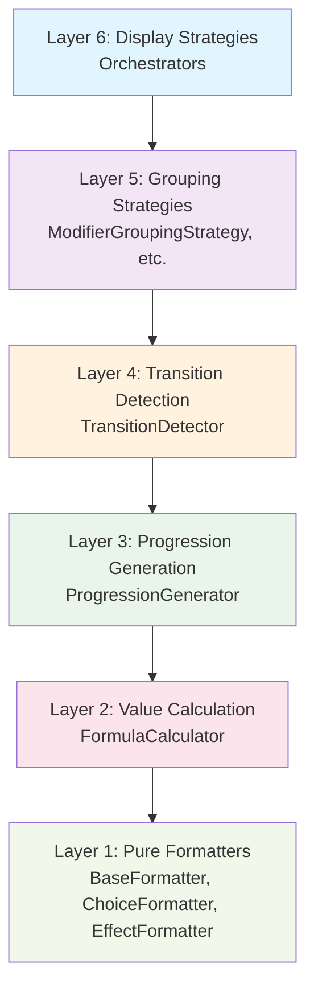
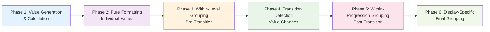
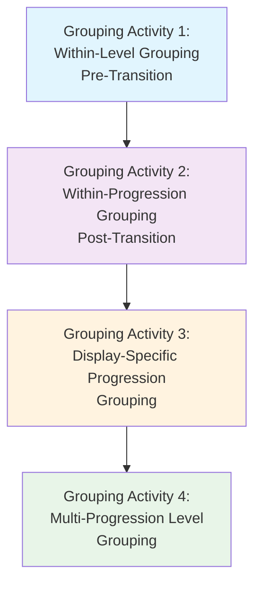

# Feature Formatting System Documentation

## Overview

The Feature Formatting System is a core component of the D&D Tools feature system that implements a 6-layer clean architecture for formatting feature progressions, modifiers, choices, and effects. This system provides consistent, maintainable, and extensible formatting across all feature-related displays in the application.

## Architecture

The formatting system implements a **6-layer clean architecture** with **6 processing phases** and **4 distinct grouping activities**. This creates three organizational dimensions:

### **1. Abstraction Layers (Dependency Hierarchy)**
The system is organized into 6 layers based on **abstraction level and dependencies**:



**Layer Responsibilities:**
- **Layer 6**: Orchestration and display strategy management
- **Layer 5**: Grouping strategies for different entity types
- **Layer 4**: Transition detection and progression analysis
- **Layer 3**: Progression value generation and formula expansion
- **Layer 2**: Value calculation and breakdown generation
- **Layer 1**: Pure formatting of individual values

### **2. Processing Phases (Execution Order)**
The actual **execution order** follows a logical sequence based on data dependencies:



**Phase Details:**
- **Phase 1**: Generate calculated values for each level of each progression
- **Phase 2**: Format each calculated value using appropriate formatters
- **Phase 3**: Group entities by type within each level (pre-transition)
- **Phase 4**: Detect transitions in formatted values
- **Phase 5**: Group all entities for each transition level (post-transition)
- **Phase 6**: Apply display-specific final grouping logic

### **3. Grouping Activities (Data Organization)**
Four distinct grouping activities organize data at different stages:



**Grouping Activity Details:**

#### **Grouping Activity 1: Within-Level Grouping (Pre-Transition)**
- **Purpose**: Group entities of the same type within a single level
- **Scope**: Single level of single FeatureProgression
- **Delimiters**: 
  - FeatureModifiers: `', '` (within same ModifierType)
  - FeatureChoices: `' | '` (within same choice type)
  - FeatureEffects: `', '` (within same effect type)
- **Rules**: Never group different ModifierTypes together, never group FeatureModifiers with FeatureChoices

#### **Grouping Activity 2: Within-Progression Grouping (Post-Transition)**
- **Purpose**: Group all entities for each transition level within a single progression
- **Scope**: Single FeatureProgression across all transition levels
- **Delimiter**: `', '` (regardless of entity type)
- **Rules**: Concatenate all entity types for each transition level

#### **Grouping Activity 3: Display-Specific Progression Grouping**
- **Purpose**: Format progression transitions based on display type
- **DisplayType.Edit**: Prefix with `'Level X: '` and join with `'; '`
- **DisplayType.Detail**: Pass through unchanged
- **DisplayType.CharacterSheet**: Filter to current character level

#### **Grouping Activity 4: Multi-Progression Level Grouping**
- **Purpose**: Group multiple FeatureProgressions by level (Detail only)
- **Scope**: Multiple FeatureProgressions
- **Rules**: Union by level, preserving individual feature entries

### **Key Distinctions**
- **Layer Numbers (1-6)**: Represent **abstraction levels** and **dependency hierarchy**
- **Phase Numbers (1-6)**: Represent **execution order** and **data flow**
- **Grouping Activities (1-4)**: Represent **data organization** and **display formatting**

The processing flow (Phase 1→2→3→4→5→6) is different from the dependency hierarchy (Layer 6 depends on Layer 5, etc.) because **data preparation must happen before data processing**.

## Key Principles

### **Dependency Inversion**
- High-level layers (6) depend on abstractions (interfaces)
- Low-level layers (1-5) implement abstractions
- Display Strategies orchestrate all phases through the 6-phase process

### **Single Responsibility**
- Each layer has one clear, well-defined responsibility
- Each phase has one clear, well-defined execution step
- Pure formatters only format values
- Calculators only calculate values
- Display strategies only orchestrate the process

### **Processing Flow Logic**
The system follows a logical processing sequence:
- **Phase 1**: Value generation and calculation must happen before formatting
- **Phase 2**: Pure formatting must happen before within-level grouping
- **Phase 3**: Within-level grouping must happen before transition detection
- **Phase 4**: Transition detection must happen before within-progression grouping
- **Phase 5**: Within-progression grouping must happen before display-specific grouping
- **Phase 6**: Display-specific final grouping creates the final result

### **Data Flow Visualization**
```mermaid
graph TD
    Input[Input: FeatureProgression[]] --> P1[Phase 1: Value Generation<br/>& Calculation]
    P1 --> P2[Phase 2: Pure Formatting<br/>Individual Values]
    P2 --> P3[Phase 3: Within-Level Grouping<br/>Pre-Transition]
    P3 --> P4[Phase 4: Transition Detection<br/>Value Changes]
    P4 --> P5[Phase 5: Within-Progression Grouping<br/>Post-Transition]
    P5 --> P6[Phase 6: Display-Specific<br/>Final Grouping]
    P6 --> Output[Output: DisplayResult<br/>or LevelEntry[]]
    
    style Input fill:#e8f5e8
    style Output fill:#e8f5e8
    style P1 fill:#e3f2fd
    style P2 fill:#f3e5f5
    style P3 fill:#fff3e0
    style P4 fill:#e8f5e8
    style P5 fill:#fce4ec
    style P6 fill:#f1f8e9
```

### **Formula Property-Based Routing**
The system intelligently routes formula calls based on formula properties:
- **`hasProgression: true`** → Generate progression values in Phase 1
- **`isCharacterDependent: true`** + no character data → Use `.getDisplayString()` in Phase 1
- **`isCharacterDependent: true`** + has character data → Use `.calculate()` in Phase 1
- **`isCharacterDependent: false`** → Always use `.calculate()` in Phase 1

### **Display Type Processing Patterns**

```mermaid
graph TD
    subgraph "DisplayType.Edit"
        E1[Single Progression] --> E2[Phase 1-6 Processing] --> E3[Level X: prefix<br/>; delimiter]
    end
    
    subgraph "DisplayType.Detail"
        D1[Multiple Progressions] --> D2[Phase 1-6 per Progression] --> D3[Group by Level] --> D4[Feature Items per Level]
    end
    
    subgraph "DisplayType.CharacterSheet"
        C1[Multiple Progressions] --> C2[Phase 1-6 per Progression] --> C3[Filter to Current Level] --> C4[Current Value Only]
    end
    
    style E1 fill:#e1f5fe
    style E3 fill:#e1f5fe
    style D1 fill:#f3e5f5
    style D4 fill:#f3e5f5
    style C1 fill:#fff3e0
    style C4 fill:#fff3e0
```


## Documentation Structure

### **Core Documentation**
- **[Usage Guidelines](./usage-guidelines.md)** - Comprehensive guidelines for agents and developers
- **[Final Implementation Summary](./final-implementation-summary.md)** - Complete implementation overview
- **[Refactoring Strategy](./refactoring-strategy.md)** - Architecture design decisions and patterns

### **Key Files**
- `frontend/src/lib/formatters/display-strategies.ts` - Display strategy implementations (Layer 6)
- `frontend/src/lib/formatters/formatter-registry.ts` - Formatter registration and lookup (Layer 1)
- `frontend/src/lib/formatters/types.ts` - Type definitions and interfaces
- `frontend/src/lib/formatters/pure-formatters.ts` - Pure formatter implementations (Layer 1)

### **Key Exports**
- `displayStrategyFactory` - Strategy creation factory (returns singletons)
- `formatterRegistry` - Formatter registration system (for internal use)

## Usage Patterns

For comprehensive usage patterns, examples, and guidelines, see **[usage-guidelines.md](./usage-guidelines.md)**.

### **Quick Start**
```typescript
import { displayStrategyFactory } from '@/lib/formatters';
import { DisplayType } from '@shared/static-data';

// Get appropriate strategy for your use case
const strategy = displayStrategyFactory.createStrategy(DisplayType.Edit);
const result = strategy.formatProgression(progression, context, metadata);
```

### **Display Types**
- **`DisplayType.Edit`** - For feature editing interfaces (no character data needed)
- **`DisplayType.Detail`** - For feature detail displays (no character data needed)
- **`DisplayType.CharacterSheet`** - For character sheet displays (character data available)

## Integration with Feature System

The formatting system is tightly integrated with the feature system:

- **Feature Progressions** - Formatted based on level and progression data
- **Feature Modifiers** - Formatted based on type, value, and conditions
- **Feature Choices** - Formatted based on choice type and behavior
- **Feature Effects** - Formatted based on effect type and parameters

## Recent Refactoring

The formatting system underwent a major refactoring to implement a clear 6-phase processing flow with 4 distinct grouping activities. For detailed implementation status and current issues, see **[final-implementation-summary.md](./final-implementation-summary.md)**.

**Key Changes**:
1. **Implemented 6-Phase Processing Flow** - Clear separation of value generation, formatting, grouping, and transition detection
2. **Defined 4 Grouping Activities** - Distinct grouping rules for different stages and display types
3. **Enhanced Display Strategies** - Made them true orchestrators of all phases with display-specific logic
4. **Fixed Formula Routing** - Implemented intelligent routing based on formula properties in Phase 1
5. **Clarified Architecture Dimensions** - Clear distinction between layers, phases, and grouping activities

**Current Status**:
- **Architecture**: Fully defined with clear 3-dimensional organization
- **Documentation**: Complete with mermaid visualizations and detailed explanations
- **Implementation**: Ready for development based on documented strategy

## Testing

For comprehensive testing guidelines and debugging patterns, see **[usage-guidelines.md](./usage-guidelines.md)**.

**Testing Approach**:
- **Unit Testing** - Test each layer independently
- **Integration Testing** - Test display strategy orchestration
- **Formula Testing** - Test formula property-based routing

## Contributing

For comprehensive contributing guidelines and anti-patterns to avoid, see **[usage-guidelines.md](./usage-guidelines.md)**.

**Key Principles**:
1. **Follow the 6-layer architecture** - Don't create layers above Display Strategies
2. **Follow the 6-phase processing flow** - Execute phases in correct order (1→2→3→4→5→6)
3. **Use the factory pattern** - Access strategies through `displayStrategyFactory`
4. **Respect formula properties** - Use `isCharacterDependent` and `hasProgression` for routing
5. **Maintain separation of concerns** - Each layer should have single responsibility
6. **Understand the three dimensions**:
   - **Layer numbers (1-6)**: Represent dependency hierarchy and abstraction levels
   - **Phase numbers (1-6)**: Represent execution order and data flow
   - **Grouping Activities (1-4)**: Represent data organization and display formatting
7. **Follow grouping rules**:
   - **Within-Level**: Group same entity types only, use appropriate delimiters
   - **Within-Progression**: Group all entities per transition level with `', '` delimiter
   - **Display-Specific**: Apply display type formatting rules
   - **Multi-Progression**: Union by level for Detail display type only

## Related Documentation

- **[Usage Guidelines](./usage-guidelines.md)** - Comprehensive usage patterns and guidelines
- **[Final Implementation Summary](./final-implementation-summary.md)** - Current implementation status
- **[Refactoring Strategy](./refactoring-strategy.md)** - Design decisions and architecture rationale
- **[Feature System Overview](../README.md)** - Main feature system documentation
- **[Formula System](../formula-system.md)** - Formula system details
- **[Feature Progression Management](../feature-progression-management.md)** - Progression system details
