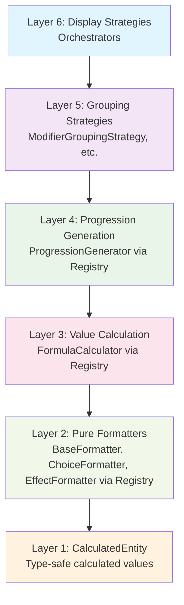
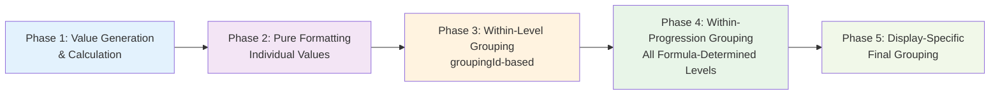
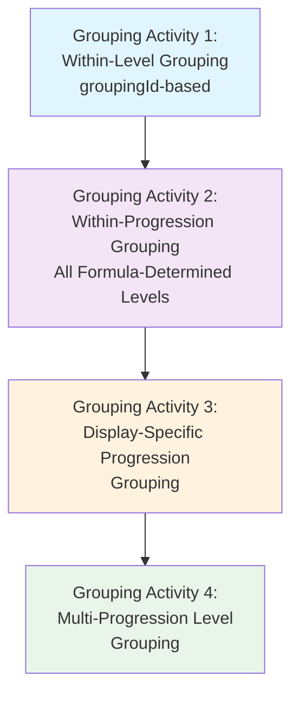

# Feature Formatting System Documentation

## Overview

The Feature Formatting System is a core component of the D&D Tools feature system that implements a **6-layer clean architecture** with **4-phase processing** and **registry pattern** for formatting feature progressions, modifiers, choices, and effects. This system provides consistent, maintainable, and extensible formatting across all feature-related displays in the application.

The formatting system is used by multiple other systems in the D&D Tools project, including the [Class System](../class-system/README.md) and [Race System](../race-system/README.md), to display feature progressions in a consistent and user-friendly manner.

## Recent Major Refactoring

The formatting system underwent a **comprehensive refactoring** to improve type safety, reduce duplication, and implement proper architectural patterns:

### **Key Refactoring Achievements**

1. **Registry Pattern Implementation**: All calculators and formatters now use centralized registries for better extensibility
2. **Type Consolidation**: Eliminated duplicate interfaces and created a clean type hierarchy with base interfaces
3. **Architectural Consistency**: Ensured all components follow the same patterns and dependencies
4. **Code Quality Improvements**: Removed magic numbers, unused variables, and unnecessary wrapper functions
5. **Future Extensibility**: Set up architecture to support multiple calculator implementations
6. **CalculatedEntity Architecture**: Introduced CalculatedEntity interface for honest type handling of calculated values
7. **Simplified Processing**: Removed transition detection phase entirely and simplified formatting logic to process all formula-determined levels

### **Architecture Improvements**

- **Calculator Registry**: Centralized management of all calculator types through the registry pattern
- **Type Hierarchy**: Base interfaces with proper extensions for common properties
- **Consolidated Types**: Merged duplicate interfaces into unified types
- **Enum Usage**: Replaced string literals with proper enums for type safety
- **CalculatedEntity Interface**: New interface that allows `value` to be `string | number | null` for honest type handling
- **Simplified Formatting**: Formatters now handle string values directly instead of parsing breakdown objects

## Recent GroupingId Integration

The formatting system has been updated to use **`groupingId`-based grouping** instead of the previous entity type-based grouping approach. This change improves the accuracy of feature grouping by using logical grouping identifiers rather than entity type classifications.

### **Key Integration Changes**

1. **GroupingId-Based Grouping**: Entities are now grouped by their `groupingId` value rather than by entity type and subtype
2. **Simplified Processing**: Removed transition detection entirely - all formula-determined levels are now processed directly
3. **Maintained Architecture**: All changes preserve the 6-layer architecture and 4-phase processing flow
4. **Enhanced Accuracy**: The new approach correctly handles complex feature scenarios like "Inspire Greatness" without false transitions

### **GroupingId Behavior**

- **`groupingId = 0`**: Represents ungrouped entities that are formatted individually
- **`groupingId > 0`**: Represents logically grouped entities that are formatted together as a unit
- **Default Value**: All entities have a `groupingId` that defaults to 0 if not explicitly set
- **No Validation Required**: The system assumes `groupingId` is always present and valid

## Architecture

The formatting system implements a **6-layer clean architecture** with **4 processing phases** and **4 distinct grouping activities**. This creates three organizational dimensions:

### **1. Abstraction Layers (Dependency Hierarchy)**
The system is organized into 6 layers based on **abstraction level and dependencies**:



**Layer Responsibilities:**
- **Layer 6**: Orchestration and display strategy management
- **Layer 5**: Grouping strategies for different entity types (now using groupingId)
- **Layer 4**: Progression value generation and formula expansion (via registry)
- **Layer 3**: Value calculation and breakdown generation (via registry)
- **Layer 2**: Pure formatting of individual values (via registry)
- **Layer 1**: CalculatedEntity type-safe calculated values with honest type handling

### **2. Processing Phases (Execution Order)**
The actual **execution order** follows a logical sequence based on data dependencies:



**Phase Details:**
- **Phase 1**: Generate calculated values for each level of each progression using CalculatedEntity
- **Phase 2**: Format each calculated value using appropriate formatters (handles string/number values)
- **Phase 3**: Group entities by `groupingId` within each level
- **Phase 4**: Group all entities for each formula-determined level (no transition filtering)
- **Phase 5**: Apply display-specific final grouping logic

### **3. Grouping Activities (Data Organization)**
Four distinct grouping activities organize data at different stages:



**Grouping Activity Details:**

- Applies to DisplayType.Edit and DisplayType.Detail only, there is no grouping for DisplayType.CharacterSheet

#### **Grouping Activity 1: Within-Level Grouping**
- **Purpose**: Group entities by `groupingId` within a single level
- **Scope**: Single level of single FeatureProgression
- **Grouping Logic**: 
  - Entities with `groupingId = 0` are formatted individually
  - Entities with `groupingId > 0` are grouped together and formatted as a unit
- **Delimiters**: 
  - FeatureModifiers: `', '` (within same ModifierType)
  - FeatureChoices: `' | '` (within same choice type)
  - Between different `groupingId` groups: `'; '` (semicolon and space)
- **Rules**: Grouping is now based purely on `groupingId` value, not entity type or subtype

#### **Grouping Activity 2: Within-Progression Grouping**
- **Purpose**: Group all entities for each formula-determined level within a single progression
- **Scope**: Single FeatureProgression across all formula-determined levels
- **Delimiter**: `', '` (regardless of entity type or groupingId)
- **Rules**: Concatenate all entity types for each formula-determined level (no transition filtering)

#### **Grouping Activity 3: DisplayType.Edit Progression Grouping**
- **Purpose**: Format progression levels based on display type
- **Scope**: Single FeatureProgression across all formula-determined levels
- **Delimiters**: Prefix each level with `'Level X: '` and then join *all* levels with `'; '`
- **Rules**: Concatenate the full set of levels for all entities on a single FeatureProgression

#### **Grouping Activity 4: DisplayType.Detail Multi-Progression Level Grouping**
- **Purpose**: Group multiple FeatureProgressions by level
- **Scope**: Multiple FeatureProgressions
- **Rules**: Union by level, preserving individual feature entries

### **Key Distinctions**
- **Layer Numbers (1-6)**: Represent **abstraction levels** and **dependency hierarchy**
- **Phase Numbers (1-5)**: Represent **execution order** and **data flow**
- **Grouping Activities (1-4)**: Represent **data organization** and **display formatting**

The processing flow (Phase 1→2→3→4→5) is different from the dependency hierarchy (Layer 6 depends on Layer 5, etc.) because **data preparation must happen before data processing**.

## GroupingId Integration Details

### **Core Principle**

The `groupingId` integration follows a **single core principle**: **replace only the Phase 3 grouping logic** while maintaining all other phases, delimiters, and display type behavior exactly as they were.

### **What Changed**

1. **Phase 3 Grouping**: Within-level grouping now uses `groupingId` instead of entity type/subtype
2. **Phase 4 Within-Progression Grouping**: Now processes all formula-determined levels without transition filtering
3. **Grouping Strategy**: `ModifierGroupingStrategy` now groups by `groupingId` instead of entity type

### **What Stayed the Same**

1. **All Delimiters**: Modifiers still use `', '`, choices still use `' | '`, effects still use `', '`
2. **DisplayType.Edit Behavior**: Still produces `Level X: prefix; Level Y: prefix` format
3. **DisplayType.Detail Behavior**: Still groups by level and shows feature items per level
4. **Phase 1-2**: Value generation and pure formatting unchanged
5. **Phase 5-6**: Within-progression and display-specific grouping unchanged

### **Implementation Benefits**

1. **Accurate Grouping**: Entities are now grouped logically rather than by arbitrary type classifications
2. **Simplified Processing**: All formula-determined levels are processed directly without transition filtering
3. **Admin Control**: Content administrators can control grouping through the `groupingId` field
4. **Maintained Architecture**: All architectural principles and phase separation remain intact

## Transition Detection Removal

The formatting system has been **significantly simplified** by removing the transition detection phase entirely. This change eliminates complex filtering logic and ensures that all formula-determined levels are processed and displayed consistently.

### **Why Transition Detection Was Removed**

1. **Architectural Violation**: Transition detection was creating special handling for Choice/Allocation entities, violating the principle that individual entity formatting should be consistent
2. **Complexity Reduction**: The filtering logic was complex and error-prone, leading to bugs where levels were incorrectly filtered out
3. **Formula-Determined Levels**: Since `getFormulaIntervalLevels()` already determines the correct levels to display, additional filtering was redundant
4. **Consistent Behavior**: All entity types now follow the same processing path without special cases

### **What Changed**

1. **Removed Phase 4**: Transition Detection phase has been completely removed
2. **Simplified ProgressionGroupingPhase**: Now processes ALL levels that have data instead of filtering by transitions
3. **Updated Phase Count**: System now has 4 phases instead of 5 phases
4. **Consistent Processing**: All formula-determined levels are now processed and displayed

### **What Stayed the Same**

1. **Formula Logic**: `getFormulaIntervalLevels()` continues to determine which levels should have values
2. **Display Formatting**: The final display format remains unchanged
3. **Grouping Logic**: Within-level and within-progression grouping continues to work as before
4. **Architecture**: All other architectural principles remain intact

## CalculatedEntity Architecture

### **Core Principle**

The `CalculatedEntity` architecture follows a **single core principle**: **honest type handling** for calculated values by allowing the `value` field to be `string | number | null` instead of forcing all values to be numbers.

### **What Changed**

1. **CalculatedEntity Interface**: New interface that extends `FeatureEntity` but allows `value: string | number | null`
2. **Removed Transition Detection**: Phase 4 (Transition Detection) has been removed entirely
3. **Simplified Formatting**: Formatters now handle string values directly instead of parsing breakdown objects
4. **Updated Phase Flow**: Now 4 phases instead of 5 phases
5. **Honest Type Handling**: No more pretending that calculated values are always numbers

### **What Stayed the Same**

1. **All Delimiters**: Modifiers still use `', '`, choices still use `' | '`, effects still use `', '`
2. **DisplayType.Edit Behavior**: Still produces `Level X: prefix; Level Y: prefix` format
3. **DisplayType.Detail Behavior**: Still groups by level and shows feature items per level
4. **Phase 1-2**: Value generation and pure formatting unchanged (except for CalculatedEntity creation)
5. **Phase 3-5**: Grouping and display-specific logic unchanged

### **Implementation Benefits**

1. **Honest Architecture**: No more pretending that modified entities are real `FeatureEntity` objects
2. **Type Safety**: `CalculatedEntity.value` can be string, number, or null as needed
3. **Simplified Logic**: No more complex breakdown parsing for display strings
4. **Better Performance**: Direct value usage instead of complex breakdown parsing
5. **Maintainable Code**: Cleaner separation between calculation and formatting concerns

### **CalculatedEntity Interface**

```typescript
interface CalculatedEntity extends Omit<FeatureEntity, 'value'> {
    value: number | string | null;
    calculatedValue?: number | string | null; // Original calculated result
}
```

The `CalculatedEntity` interface allows:
- **String values**: For character-dependent formulas that return display strings like "3 + CHA"
- **Number values**: For simple numeric calculations
- **Null values**: For formulas that return no value for certain levels
- **Original value preservation**: The `calculatedValue` field preserves the original calculated result

## Registry Pattern Architecture

### **Calculator Registry**

The system uses a centralized registry pattern to manage all calculator implementations. This provides several key benefits:

**Benefits:**
- **Extensibility**: Easy to add different implementations for different formula types
- **Consistency**: All calculator access follows the same pattern
- **Type Safety**: Proper TypeScript interfaces ensure type safety
- **Maintainability**: Centralized calculator management

The registry pattern enables future enhancements by allowing multiple implementations per calculator type, making it easy to add specialized calculators for specific use cases.

### **Calculator Types**

The registry supports multiple calculator types through the `CalculatorType` enum, which includes Formula, Choice, Progression, Transition, and Conditional calculators.

**Current Implementation:**
- **Formula Calculators**: Registered per `FormulaId` for different formula types
- **Progression Generators**: Default implementation registered with type `0`
- **Transition Detectors**: Default implementation registered with type `0`
- **Choice Calculators**: Reserved for future implementation
- **Conditional Value Detectors**: Reserved for future implementation

### **Future Extensibility**

The registry pattern enables future enhancements such as specialized progression generators for different formula types, specialized transition detectors for different entity types, and choice-based calculators for complex choice scenarios.

## Type System Architecture

### **Base Interface Hierarchy**

The system uses a clean type hierarchy with base interfaces that provide common properties for all related types. This approach eliminates duplication and ensures consistency across the type system.

**Consolidated Types:**
- **`GroupedLevelItem`**: Replaces multiple duplicate interfaces for grouped items with level information
- **`FormattedItemWithBreakdown`**: Replaces duplicate interfaces for formatted items with breakdown information, now includes `groupingId`
- **`BaseProcessingResult`**: Extends base formatted value for consistent structure
- **`EntityGroupKey`**: Now includes `groupingId` for proper grouping identification

### **Type Safety Improvements**

The type system improvements include proper enum usage instead of magic numbers, consistent interfaces that follow the same pattern, and clear inheritance hierarchy with base interfaces. The `groupingId` field is now properly typed and integrated throughout the type system.

## Key Principles

### **Dependency Inversion**
- High-level layers (6) depend on abstractions (interfaces)
- Low-level layers (1-5) implement abstractions
- Display Strategies orchestrate all phases through the 6-phase process
- **Registry Pattern**: All calculator access goes through centralized registries

### **Single Responsibility**
- Each layer has one clear, well-defined responsibility
- Each phase has one clear, well-defined execution step
- Pure formatters only format values
- Calculators only calculate values
- Display strategies only orchestrate the process
- **Registry Management**: Centralized calculator registration and lookup

### **Processing Flow Logic**
The system follows a logical processing sequence:
- **Phase 1**: Value generation and calculation must happen before formatting (creates CalculatedEntity objects)
- **Phase 2**: Pure formatting must happen before within-level grouping (handles string/number values)
- **Phase 3**: Within-level grouping by `groupingId` must happen before within-progression grouping
- **Phase 4**: Within-progression grouping must happen before display-specific grouping
- **Phase 5**: Display-specific final grouping creates the final result

### **Data Flow Visualization**
```mermaid
graph TD
    Input[Input: FeatureProgression[]] --> P1[Phase 1: Value Generation<br/>& Calculation via Registry]
    P1 --> P2[Phase 2: Pure Formatting<br/>Individual Values via Registry]
    P2 --> P3[Phase 3: Within-Level Grouping<br/>Pre-Transition (groupingId-based)]
    P3 --> P4[Phase 4: Within-Progression Grouping<br/>Post-Transition]
    P4 --> P5[Phase 5: Display-Specific<br/>Final Grouping]
    P5 --> Output[Output: DisplayResult<br/>or LevelEntry[]]
    
    style Input fill:#e8f5e8
    style Output fill:#e8f5e8
    style P1 fill:#e3f2fd
    style P2 fill:#f3e5f5
    style P3 fill:#fff3e0
    style P4 fill:#e8f5e8
    style P5 fill:#f1f8e9
```

### **Formula Property-Based Routing**
The system intelligently routes formula calls based on formula properties:
- **`isCharacterDependent: true`** + no character data → Use `.getDisplayString()` in Phase 1
- **`isCharacterDependent: true`** + has character data → Use `.calculate()` in Phase 1
- **`isCharacterDependent: false`** → Always use `.calculate()` in Phase 1

### **Display Type Processing Patterns**

```mermaid
graph TD
    subgraph "DisplayType.Edit"
        E1[Single Progression] --> E2[Phase 1-6 Processing] --> E3[Level X: prefix<br/>; delimiter]
    end
    
    subgraph "DisplayType.Detail"
        D1[Multiple Progressions] --> D2[Phase 1-6 per Progression] --> D3[Group by Level] --> D4[Feature Items per Level]
    end
    
    subgraph "DisplayType.CharacterSheet"
        C1[Multiple Progressions] --> C2[Phase 1-6 per Progression] --> C3[Filter to Current Level] --> C4[Current Value Only]
    end
    
    style E1 fill:#e1f5fe
    style E3 fill:#e1f5fe
    style D1 fill:#f3e5f5
    style D4 fill:#f3e5f5
    style C1 fill:#fff3e0
    style C4 fill:#fff3e0
```


## Documentation Structure

### **Core Documentation**
- **[Usage Guidelines](./usage-guidelines.md)** - Comprehensive guidelines for agents and developers
- **[Final Implementation Summary](./final-implementation-summary.md)** - Complete implementation overview
- **[Refactoring Strategy](./refactoring-strategy.md)** - Architecture design decisions and patterns
- **[Architecture Decisions](./architecture-decisions.md)** - Key architectural decisions and future extensibility

### **Key Files**
- `frontend/src/lib/formatters/display-strategies.ts` - Display strategy implementations (Layer 6), updated for groupingId
- `frontend/src/lib/formatters/calculator-registry.ts` - Calculator registration and lookup (Registry)
- `frontend/src/lib/formatters/formatter-registry.ts` - Formatter registration and lookup (Layer 1)
- `frontend/src/lib/formatters/types.ts` - Type definitions and interfaces, updated for groupingId
- `frontend/src/lib/formatters/pure-formatters.ts` - Pure formatter implementations (Layer 1)
- `frontend/src/lib/formatters/formula-utils.ts` - Shared formula parameter utilities
- `frontend/src/lib/formatters/grouping-strategies.ts` - Grouping strategy implementations, updated for groupingId
- `frontend/src/lib/formatters/progression-generators.ts` - Progression generation
- `frontend/src/lib/formatters/calculators.ts` - Calculator implementations

### **Key Exports**
- `displayStrategyFactory` - Strategy creation factory (returns singletons)
- `calculatorRegistry` - Calculator registration system (for internal use)
- `formatterRegistry` - Formatter registration system (for internal use)

## Usage Patterns

For comprehensive usage patterns, examples, and guidelines, see **[usage-guidelines.md](./usage-guidelines.md)**.

### **Quick Start**
The formatting system provides a factory pattern for accessing display strategies. Each display type (Edit, Detail, CharacterSheet) has its own strategy that orchestrates the complete 6-phase formatting process.

### **Display Types**
- **`DisplayType.Edit`** - For feature editing interfaces (no character data needed)
- **`DisplayType.Detail`** - For feature detail displays (no character data needed)
- **`DisplayType.CharacterSheet`** - For character sheet displays (character data available)

## Integration with Feature System

The formatting system is tightly integrated with the feature system and used by multiple other systems:

- **Feature Progressions** - Formatted based on level and progression data
- **Feature Modifiers** - Formatted based on type, value, conditions, and groupingId
- **Feature Choices** - Formatted based on choice type, behavior, and groupingId
- **Feature Effects** - Formatted based on effect type, parameters, and groupingId

### **Cross-System Integration**

The formatting system is used by:

- **[Class System](../class-system/README.md)** - For displaying class feature progressions
- **[Race System](../race-system/README.md)** - For displaying racial feature progressions
- **Feature System** - For displaying feature details and editing interfaces

Each system provides FeatureProgression data to the formatting system and receives formatted display results that can be rendered in their respective UI components.

## Recent Refactoring

The formatting system underwent a major refactoring to implement proper architectural patterns and improve maintainability.

**Key Changes**:
1. **Registry Pattern Implementation** - Centralized calculator management through registry pattern
2. **Type Consolidation** - Eliminated duplicate interfaces and created clean type hierarchy
3. **Architectural Consistency** - Ensured all components follow the same patterns
4. **Code Quality Improvements** - Removed magic numbers, unused variables, and unnecessary wrappers
5. **Future Extensibility** - Set up architecture to support multiple calculator implementations
6. **GroupingId Integration** - Replaced entity type-based grouping with logical groupingId-based grouping
7. **CalculatedEntity Architecture** - Introduced honest type handling for calculated values
8. **Simplified Processing** - Removed transition detection phase and simplified formatting logic

**Current Status**:
- **Architecture**: Fully defined with registry pattern, clean type hierarchy, and CalculatedEntity architecture
- **Documentation**: Complete with mermaid visualizations and detailed explanations
- **Implementation**: Production-ready with proper error handling, type safety, groupingId integration, and CalculatedEntity support

## Testing

For comprehensive testing guidelines and debugging patterns, see **[usage-guidelines.md](./usage-guidelines.md)**.

**Testing Approach**:
- **Unit Testing** - Test each layer independently
- **Integration Testing** - Test display strategy orchestration
- **Formula Testing** - Test formula property-based routing
- **Registry Testing** - Test calculator registration and lookup
- **GroupingId Testing** - Test new groupingId-based grouping logic
- **CalculatedEntity Testing** - Test string/number/null value handling in formatters

## Contributing

For comprehensive contributing guidelines and anti-patterns to avoid, see **[usage-guidelines.md](./usage-guidelines.md)**.

**Key Principles**:
1. **Follow the 6-layer architecture** - Don't create layers above Display Strategies
2. **Follow the 5-phase processing flow** - Execute phases in correct order (1→2→3→4→5)
3. **Use the registry pattern** - Access calculators through registry
4. **Use the factory pattern** - Access strategies through factory
5. **Respect formula properties** - Use `isCharacterDependent` for routing
6. **Maintain separation of concerns** - Each layer should have single responsibility
7. **Follow type hierarchy** - Use base interfaces and proper extensions
8. **Use CalculatedEntity** - Always use CalculatedEntity for calculated values, never modify FeatureEntity directly
9. **Understand the three dimensions**:
   - **Layer numbers (1-6)**: Represent dependency hierarchy and abstraction levels
   - **Phase numbers (1-5)**: Represent execution order and data flow
   - **Grouping Activities (1-4)**: Represent data organization and display formatting
10. **Follow grouping rules**:
    - **Within-Level**: Group by `groupingId` only, use appropriate delimiters
    - **Within-Progression**: Group all entities per transition level with `', '` delimiter
    - **Display-Specific**: Apply display type formatting rules
    - **Multi-Progression**: Union by level for Detail display type only
11. **Respect groupingId integration**:
    - Use `groupingId` for all grouping operations in Phase 3
    - Maintain all existing delimiters and display type behavior
    - Only change the grouping logic, not the formatting or display behavior
12. **Handle CalculatedEntity values**:
    - Always check if `value` is string, number, or null before processing
    - Use string values directly in formatters when available
    - Fall back to number formatting when string values are not available

## Related Documentation

- **[Usage Guidelines](./usage-guidelines.md)** - Comprehensive usage patterns and guidelines
- **[Final Implementation Summary](./final-implementation-summary.md)** - Current implementation status
- **[Refactoring Strategy](./refactoring-strategy.md)** - Design decisions and architecture rationale
- **[Architecture Decisions](./architecture-decisions.md)** - Key architectural decisions and future extensibility
- **[Feature System Overview](../README.md)** - Main feature system documentation
- **[Formula System](../formula-system.md)** - Formula system details
- **[Feature Progression Management](../feature-progression-management.md)** - Progression system details
- **[Class System](../class-system/README.md)** - Class system documentation
- **[Race System](../race-system/README.md)** - Race system documentation
