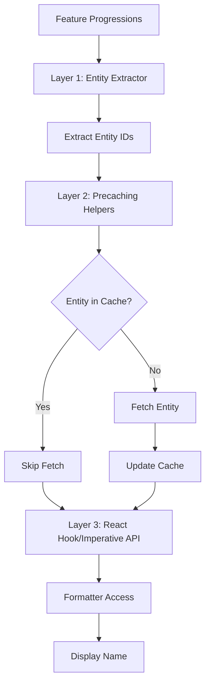
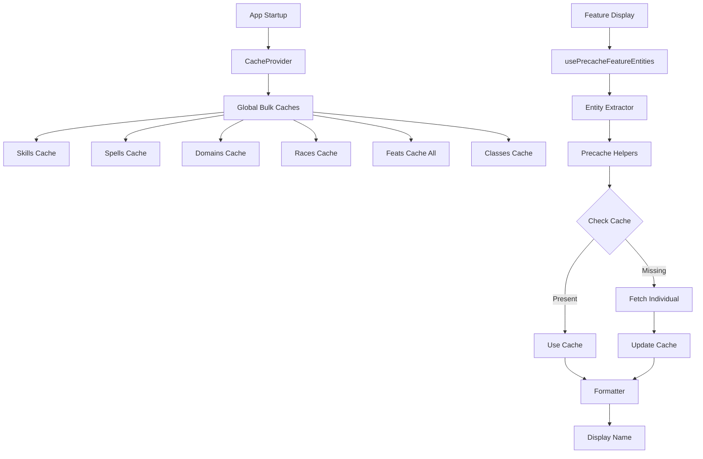
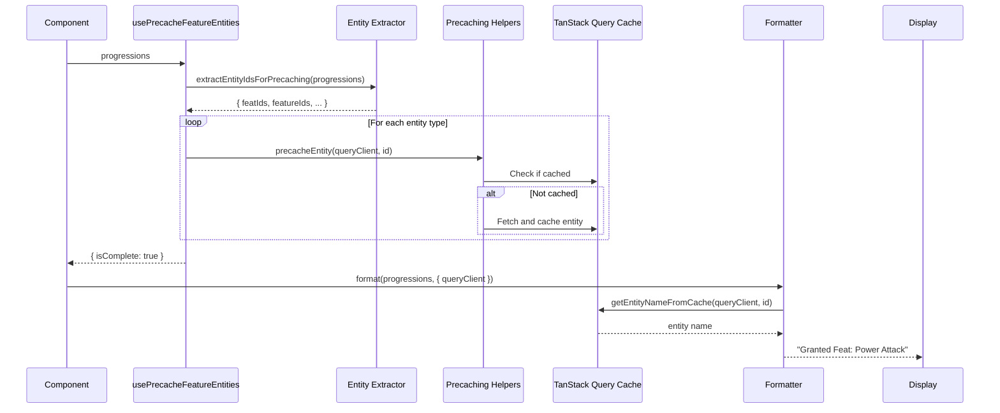

# Entity Precaching System

*Comprehensive documentation for the entity precaching system that ensures entity names are available in cache when formatters need them.*

## 📋 **Overview**

The entity precaching system solves the problem of "name not found" errors when formatters attempt to display entity names (feats, features, spells, domains, classes, skills, races) that are referenced in feature progressions but not yet loaded into the TanStack Query cache.

### **Problem Statement**

When feature progressions reference entities by ID (e.g., "Granted Feat: 243"), formatters need to look up the entity name from the cache. If the entity isn't cached, formatters display fallback text like "243 (feat name not found)" instead of the actual name.

### **Solution Architecture**

The precaching system provides a three-layer architecture that:
1. **Extracts** all entity IDs from feature progressions
2. **Precaches** missing entities before formatting
3. **Ensures** names are available when formatters access the cache

This system integrates seamlessly with the formatting system and provides both React hook and imperative APIs for different use cases.

## 🏗️ **Architecture**

### **Three-Layer Precaching System**

The precaching system consists of three layers that work together to ensure entity data is available:



#### **Layer 1: Entity Extraction**

**Source File**: [`apps/frontend/src/lib/formatters/utils/entity-extractor.ts`](../../../../apps/frontend/src/lib/formatters/utils/entity-extractor.ts)

The entity extractor analyzes feature progressions and extracts all entity IDs that need precaching:

- **Entity IDs from Feature Entities**: Extracts IDs from `FeatureEntity.appliesToId` based on `EntityAppliesToType`
- **Entity IDs from Prerequisites**: Extracts IDs from `FeaturePrerequisite.appliesToId` based on `FeaturePrerequisiteType`
- **Returns Sets**: Returns `Set<number>` for each entity type to avoid duplicates

**Supported Entity Types**:
- Feats (`EntityAppliesToType.Feat`)
- Features (`EntityAppliesToType.Feature`)
- Spells (`EntityAppliesToType.Spell`)
- Domains (`EntityAppliesToType.Domain`)
- Classes (`FeaturePrerequisiteType.ClassLevel`)
- Skills (`EntityAppliesToType.Skill`, `FeaturePrerequisiteType.SkillRanks`)
- Races (`EntityAppliesToType.Race`)

**Function Signature**:
```typescript
export function extractEntityIdsForPrecaching(
    progressions: FeatureProgression[]
): {
    featIds: Set<number>;
    featureIds: Set<number>;
    spellIds: Set<number>;
    domainIds: Set<number>;
    classIds: Set<number>;
    skillIds: Set<number>;
    raceIds: Set<number>;
}
```

#### **Layer 2: Precaching Helpers**

**Source File**: [`apps/frontend/src/lib/formatters/utils/precache-helpers.ts`](../../../../apps/frontend/src/lib/formatters/utils/precache-helpers.ts)

Individual helper functions for each entity type that check the cache and fetch data if needed:

- **Cache-Aware**: Checks multiple cache formats before fetching
- **Efficient**: Only fetches if entity is not already cached
- **Error Handling**: Gracefully handles fetch failures without breaking formatting
- **Multiple Cache Formats**: Supports individual, bulk, and legacy cache formats

**Helper Functions**:
- `precacheFeat(queryClient, featId)` - Precaches individual feats
- `precacheFeature(queryClient, featureId)` - Precaches individual features
- `precacheSpell(queryClient, spellId)` - Fetches spells cache if needed
- `precacheDomain(queryClient, domainId)` - Fetches domains cache if needed
- `precacheClass(queryClient, classId)` - Precaches individual classes
- `precacheSkill(queryClient, skillId)` - Fetches skills cache if needed
- `precacheRace(queryClient, raceId)` - Fetches races cache if needed

**Cache Strategy**:
- **Individual Entities** (feats, features, classes): Fetches individual items via query hooks
- **Bulk Caches** (skills, spells, domains, races): Fetches entire cache if not loaded
- **Multiple Formats**: Checks individual cache, bulk cache, and legacy formats

#### **Layer 3: React Hook and Imperative API**

**Source Files**:
- [`apps/frontend/src/lib/formatters/hooks/usePrecacheFeatureEntities.ts`](../../../../apps/frontend/src/lib/formatters/hooks/usePrecacheFeatureEntities.ts) - React hook
- [`apps/frontend/src/lib/formatters/displayStrategyBase.ts`](../../../../apps/frontend/src/lib/formatters/displayStrategyBase.ts) - Static method

**React Hook**: `usePrecacheFeatureEntities`
- Orchestrates entity extraction and precaching
- Provides loading state management (`isPrecaching`, `isComplete`)
- Handles errors gracefully
- Returns state for conditional rendering

**Imperative API**: `DisplayStrategyBase.precacheEntities`
- Static method for imperative precaching
- Useful for non-React contexts or advanced use cases
- Returns Promise that resolves when precaching completes

## 🔄 **Cache Architecture**

### **Two-Level Caching Strategy**

The application uses a two-level caching strategy:



#### **Level 1: Global Cache (CacheProvider)**

**Source File**: [`apps/frontend/src/providers/CacheProvider.tsx`](../../../../apps/frontend/src/providers/CacheProvider.tsx)

The `CacheProvider` loads bulk caches at application startup:

- **Bulk Caches**: Skills, spells, domains, races, feats (all), classes
- **Infinite Stale Time**: Static data cached indefinitely
- **Authentication-Aware**: Only loads when user is authenticated
- **App-Wide**: Available to all components via TanStack Query

**Cached Entities**:
- Skills: All skills via `/skills/cache`
- Spells: All spells via `/spells/cache`
- Domains: All domains via `/domains/cache`
- Races: All races via `/races/cache`
- Feats: All feats via `/feats/cache?queryType=all`
- Classes: All classes via `/classes/cache`

#### **Level 2: Entity-Specific Precaching**

Entity-specific precaching loads individual entities as needed:

- **Individual Items**: Feats, features, classes (fetched by ID)
- **Triggered by Display**: Activated when feature progressions are displayed
- **On-Demand**: Only fetches entities that aren't already cached
- **Efficient**: Checks cache before fetching to avoid unnecessary requests

**Precaching Triggers**:
- Component renders with feature progressions
- Display strategy formats progressions
- User navigates to detail/edit pages

### **Cache Key Priorities**

Cache helpers check multiple cache formats in priority order:

**For Feats**:
1. Individual feat cache: `['feats', 'item', featId]`
2. Full feats list cache: `['feats', 'full']`
3. Legacy cache format: `['feats-cache', { queryType: 'all' }]`

**For Classes**:
1. Individual class cache: `['classes', 'item', classId]`
2. Classes cache: `['classes-cache']`

**For Bulk Entities** (Skills, Spells, Domains, Races):
1. Bulk cache: `['{entity}-cache']`

**Why Multiple Formats?**
- **Backward Compatibility**: Legacy cache formats still supported
- **Flexibility**: Different query patterns may use different cache keys
- **Performance**: Check fastest cache first (individual → bulk → legacy)

## 📊 **Data Flow**

The complete data flow from feature progressions to displayed names:



## 🎯 **Usage Patterns**

### **Pattern 1: React Hook in Components**

The most common pattern is using the React hook in components that display feature progressions:

```tsx
import { usePrecacheFeatureEntities } from '@/lib/formatters/hooks/usePrecacheFeatureEntities';
import { displayStrategyFactory } from '@/lib/formatters';

function ClassDisplay({ cls }: { cls: DnDClass }) {
    const queryClient = useQueryClient();

    // Warm names in the background. Do not block the page on isComplete —
    // bulk caches already hold most names, and a missing ID must not hostage the view.
    usePrecacheFeatureEntities(cls.features || []);

    const strategy = displayStrategyFactory.createStrategy(DisplayType.Detail);
    const result = strategy.format(cls.features || [], { queryClient });

    return <div>{/* Render formatted features */}</div>;
}
```

**Key Points**:
- Call the hook with the features that will be formatted
- Do not gate the whole page on `isPrecaching` or `isComplete`
- Formatters fall back when a name is not yet in cache
- Pass `queryClient` to the display strategy when it needs cache access

### **Pattern 2: Imperative Precaching**

For non-React contexts or advanced use cases, use the static method:

```typescript
import { DisplayStrategyBase } from '@/lib/formatters';
import { displayStrategyFactory } from '@/lib/formatters';

async function formatProgressions(progressions: FeatureProgression[], queryClient: QueryClient) {
    // Precache entities imperatively
    await DisplayStrategyBase.precacheEntities(progressions, queryClient);
    
    // Format after precaching completes
    const strategy = displayStrategyFactory.createStrategy(DisplayType.Detail);
    const result = strategy.format(progressions, { queryClient });
    
    return result;
}
```

**Key Points**:
- Use `await` to ensure precaching completes
- Call before formatting
- Works in any async context

### **Pattern 3: Integration with Display Strategies**

Display strategies can precache entities before formatting:

```typescript
// Inside DisplayStrategyBase.format()
async function format(progressions: FeatureProgression[], context?: DisplayContext) {
    if (context?.queryClient) {
        // Precache entities before formatting
        await DisplayStrategyBase.precacheEntities(progressions, context.queryClient);
    }
    
    // Continue with formatting...
}
```

**Note**: This pattern is optional since components typically handle precaching.

## 📦 **Entity Types and Cache Strategies**

### **Feats**

**Cache Strategy**: Individual items + bulk cache
- **Individual**: `['feats', 'item', featId]` - Fetched via `FeatQueryHooks.getFeatByIdQueryFn`
- **Bulk**: `['feats', 'full']` - Full list of feats
- **Legacy**: `['feats-cache', { queryType: 'all' }]` - Legacy format

**Precaching**: Fetches individual feat if not in any cache format

### **Features**

**Cache Strategy**: Individual items only
- **Individual**: `['features', 'item', featureId]` - Fetched via `FeatureQueryHooks.getFeatureById`

**Precaching**: Fetches individual feature if not cached

### **Spells**

**Cache Strategy**: Bulk cache only
- **Bulk**: `['spells-cache']` - All spells loaded at app startup

**Precaching**: Fetches entire spells cache if not loaded

### **Domains**

**Cache Strategy**: Bulk cache only
- **Bulk**: `['domains-cache']` - All domains loaded at app startup

**Precaching**: Fetches entire domains cache if not loaded

### **Classes**

**Cache Strategy**: Individual items + bulk cache
- **Individual**: `['classes', 'item', classId]` - Fetched via `ClassQueryHooks.getClassByIdQueryFn`
- **Bulk**: `['classes-cache']` - All classes loaded at app startup

**Precaching**: Fetches individual class if not in any cache format

### **Skills**

**Cache Strategy**: Bulk cache only
- **Bulk**: `['skills-cache']` - All skills loaded at app startup

**Precaching**: Fetches entire skills cache if not loaded

### **Races**

**Cache Strategy**: Bulk cache only
- **Bulk**: `['races-cache']` - All races loaded at app startup

**Precaching**: Fetches entire races cache if not loaded

## 🔧 **Error Handling**

The precaching system handles errors gracefully:

### **Fetch Failures**

If an entity fetch fails:
- **Logs Warning**: Console warning with entity ID and error
- **Continues Processing**: Other entities still precached
- **Allows Formatting**: Formatting continues with fallback text if name not found

```typescript
try {
    await queryClient.fetchQuery({ /* ... */ });
} catch (error) {
    console.warn(`Failed to precache feat ${featId}:`, error);
    // Don't throw - allow formatting to continue with fallback
}
```

### **Missing Cache Data**

If cache data is missing after fetch:
- **Debug Log**: `console.debug` for unusual cases
- **No Error**: System continues normally
- **Fallback**: Formatters display fallback text

### **React Hook Errors**

The React hook handles errors:
- **Error State**: Sets `error` state for component handling
- **Completion**: Marks `isComplete: true` even on error to allow rendering
- **User Experience**: Components can show error messages or continue with fallbacks

## 🔗 **Integration with Formatting System**

### **Synchronous Cache Access**

Formatters use synchronous cache helpers to read entity names:

**Source File**: [`apps/frontend/src/lib/formatters/utils/cache-helpers.ts`](../../../../apps/frontend/src/lib/formatters/utils/cache-helpers.ts)

**Helper Functions**:
- `getFeatNameFromCache(queryClient, featId)` - Gets feat name from cache
- `getFeatureNameFromCache(queryClient, featureId)` - Gets feature name from cache
- `getSpellNameFromCache(queryClient, spellId)` - Gets spell name from cache
- `getDomainNameFromCache(queryClient, domainId)` - Gets domain name from cache
- `getClassNameFromCache(queryClient, classId)` - Gets class name from cache
- `getSkillNameFromCache(queryClient, skillId)` - Gets skill name from cache
- `getRaceNameFromCache(queryClient, raceId)` - Gets race name from cache

**Usage in Formatters**:
```typescript
export class FeatFormatter implements BaseFormatter {
    format(modifier: CalculatedEntity, context?: DisplayContext): string {
        const featId = modifier.appliesToId;
        if (featId) {
            const cachedName = getFeatNameFromCache(context?.queryClient, featId);
            if (cachedName) {
                return cachedName;
            }
        }
        return `${featId || modifier.value} (feat name not found)`;
    }
}
```

### **Character Sheet and PDF Feat Names**

Selected feats are stored as IDs (`advancement.feats[].featId` or a choice `appliesToId`), not names. `CharacterSheetDisplayStrategy.formatFeats()` in [`characterSheetDisplayStrategy.ts`](../../../../apps/frontend/src/lib/formatters/characterSheetDisplayStrategy.ts) resolves those names before the PDF or Features tab consume the formatted list.

Resolution order:
1. **Granted feat map** — names from resolved feature entities where `appliesTo` is `Feat` (auto-granted feats)
2. **`getFeatNameFromCache(featId)`** — selected and choice feats (level-up picks such as Two-Weapon Fighting)
3. **Placeholder** — `Feat ${featId}` only if the cache miss persists

The PDF in [`characterPdfService.ts`](../../../../apps/frontend/src/features/character/characterPdfService.ts) prints `feat.featName` from this formatted result. It does not look up feat names again. `CacheProvider` preloads `['feats-cache']` on app start so the cache is normally warm when a sheet is exported.

The Features tab adds extra fallbacks (`getFeatById` / `getFeatSummaryById`) on top of `feat.featName`. The formatter cache lookup is what keeps the PDF from showing `Feat 306` for ordinary selected feats.

### **Precaching Requirements**

**IMPORTANT**: Entities must be precached before formatting to ensure names are available.

**React Components**:
```tsx
const { isComplete } = usePrecacheFeatureEntities(progressions);
if (!isComplete) return <div>Loading...</div>;
// Now safe to format
```

**Imperative Usage**:
```typescript
await DisplayStrategyBase.precacheEntities(progressions, queryClient);
// Now safe to format
```

## 📚 **Source Files**

**Core Precaching Files**:
- [`apps/frontend/src/lib/formatters/utils/entity-extractor.ts`](../../../../apps/frontend/src/lib/formatters/utils/entity-extractor.ts) - Entity ID extraction
- [`apps/frontend/src/lib/formatters/utils/precache-helpers.ts`](../../../../apps/frontend/src/lib/formatters/utils/precache-helpers.ts) - Precaching functions
- [`apps/frontend/src/lib/formatters/hooks/usePrecacheFeatureEntities.ts`](../../../../apps/frontend/src/lib/formatters/hooks/usePrecacheFeatureEntities.ts) - React hook
- [`apps/frontend/src/lib/formatters/utils/cache-helpers.ts`](../../../../apps/frontend/src/lib/formatters/utils/cache-helpers.ts) - Synchronous cache access

**Integration Files**:
- [`apps/frontend/src/lib/formatters/displayStrategyBase.ts`](../../../../apps/frontend/src/lib/formatters/displayStrategyBase.ts) - Static precaching method
- [`apps/frontend/src/providers/CacheProvider.tsx`](../../../../apps/frontend/src/providers/CacheProvider.tsx) - Global cache provider
- [`apps/frontend/src/services/query/CacheQueryHooks.ts`](../../../../apps/frontend/src/services/query/CacheQueryHooks.ts) - Cache query hooks

**Query Hook Files**:
- [`apps/frontend/src/services/query/FeatQueryHooks.ts`](../../../../apps/frontend/src/services/query/FeatQueryHooks.ts) - Feat queries
- [`apps/frontend/src/services/query/FeatureQueryHooks.ts`](../../../../apps/frontend/src/services/query/FeatureQueryHooks.ts) - Feature queries
- [`apps/frontend/src/services/query/ClassQueryHooks.ts`](../../../../apps/frontend/src/services/query/ClassQueryHooks.ts) - Class queries

## 🎯 **Best Practices**

### **1. Always Precache Before Formatting**

```tsx
// ✅ CORRECT: Precache before formatting
const { isComplete } = usePrecacheFeatureEntities(progressions);
if (!isComplete) return <div>Loading...</div>;
const result = strategy.format(progressions, { queryClient });

// ❌ WRONG: Formatting without precaching
const result = strategy.format(progressions, { queryClient });
// May show "name not found" errors
```

### **2. Do Not Block the Page on Precache**

```tsx
// ✅ CORRECT: Wait only for the entity query, then render
const { data: features = [], isLoading } = useQuery(/* class/race features */);
usePrecacheFeatureEntities(features);
if (isLoading) {
    return <div>Loading...</div>;
}

// ❌ WRONG: Gate the whole page on precache
const { isPrecaching, isComplete } = usePrecacheFeatureEntities(features);
if (isPrecaching || !isComplete) {
    return <div>Loading features...</div>;
}
```

### **3. Handle Errors Gracefully**

```tsx
// ✅ CORRECT: Handle errors
const { isComplete, error } = usePrecacheFeatureEntities(progressions);
if (error) {
    console.error('Precaching error:', error);
    // Continue with fallback or show error message
}
if (!isComplete) return <div>Loading...</div>;
```

### **4. Use Appropriate Cache Strategy**

- **Bulk Entities** (skills, spells, domains, races): Rely on global cache, precaching fetches cache if needed
- **Individual Entities** (feats, features, classes): Precaching fetches individual items
- **Mixed**: Some entities (feats, classes) support both bulk and individual caches

## 🔗 **Related Documentation**

- [Formatting System Overview](./README.md) - Complete formatting system architecture
- [Usage Guidelines](./usage-guidelines.md) - How to use the formatting system with precaching
- [Adding Formatters](./adding-formatters.md) - Guide for adding new formatters (includes precaching requirements)
- [Performance Optimization](../application-overview/performance-optimization.md) - Caching strategies and performance patterns
- [Class System](../class-system/README.md) - Class system documentation (uses precaching)
- [Race System](../race-system/README.md) - Race system documentation (uses precaching)
