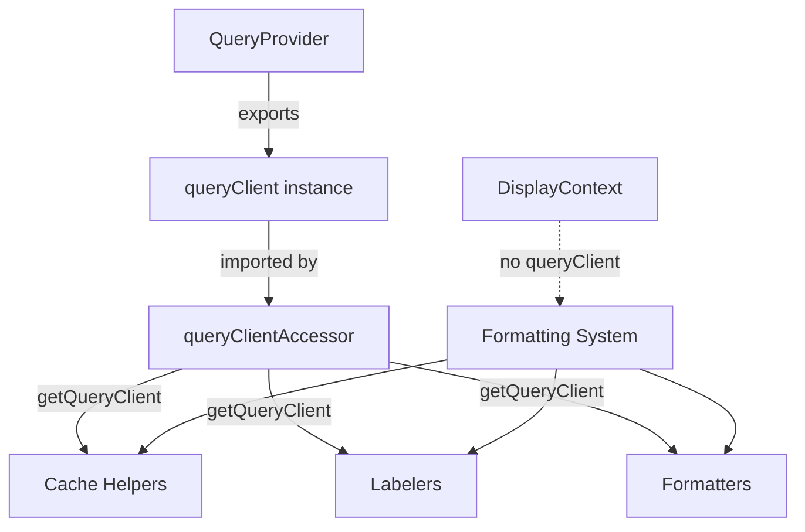

# QueryClient Accessor System

*Comprehensive documentation for the centralized QueryClient accessor that provides a single source of truth for accessing the QueryClient instance throughout the formatting system.*

## 📋 **Overview**

The QueryClient accessor system solves the problem of passing `queryClient` through many function calls (formatFeatureEntity, display strategies, labelers, cache helpers). This was error-prone and required every caller to remember to pass it. The formatting system needs queryClient to resolve entity names from cache, but it was easy to forget to pass it, resulting in "Unknown Skill" and similar issues.

### **Problem Statement**

When formatters, labelers, and cache helpers need to resolve entity names (feats, features, spells, domains, classes, skills, races) from the TanStack Query cache, they previously required `queryClient` to be passed as a parameter through every function call. This created several problems:

- **Error-prone**: Easy to forget to pass queryClient, resulting in "Unknown Skill" and similar fallback text
- **Boilerplate**: Every function signature needed to include an optional queryClient parameter
- **Inconsistent**: Some call sites passed it, others didn't, leading to inconsistent behavior
- **Maintenance burden**: Changes to queryClient access required updates across many files

### **Solution Architecture**

The accessor system provides a centralized approach that:
1. **Exports** the queryClient instance from QueryProvider as the single source of truth
2. **Provides** a getter function that formatters can import and use directly
3. **Eliminates** the need to pass queryClient through function parameters
4. **Ensures** formatters always have access to queryClient when needed

This system integrates seamlessly with the formatting system and eliminates the need for queryClient parameters throughout the codebase.

## 🏗️ **Architecture**

### **Centralized Access Pattern**

The QueryClient accessor uses a simple, centralized pattern:



#### **Layer 1: QueryProvider Export**

**Source File**: [`apps/frontend/src/providers/QueryProvider.tsx`](../../../../apps/frontend/src/providers/QueryProvider.tsx)

The QueryProvider creates and exports the queryClient instance:

- **Single Instance**: One queryClient instance created at module level
- **Exported**: Available as a named export for import by other modules
- **Configured**: Includes default options for staleTime, gcTime, retry, etc.

**Implementation**:
```typescript
export const queryClient = new QueryClient({
    defaultOptions: {
        queries: {
            staleTime: 5 * 60 * 1000, // 5 minutes
            gcTime: 10 * 60 * 1000, // 10 minutes
            retry: 3,
            refetchOnWindowFocus: false,
        },
        mutations: {
            retry: 1,
        },
    },
});
```

#### **Layer 2: QueryClient Accessor**

**Source File**: [`apps/frontend/src/lib/formatters/utils/queryClientAccessor.ts`](../../../../apps/frontend/src/lib/formatters/utils/queryClientAccessor.ts)

The accessor module provides a simple getter function:

- **Centralized Access**: Single function to get the queryClient instance
- **Simple API**: `getQueryClient()` returns the global instance
- **No Parameters**: No need to pass queryClient around

**Implementation**:
```typescript
import { queryClient } from '@/providers/QueryProvider';

export function getQueryClient() {
    return queryClient;
}
```

#### **Layer 3: Formatter Usage**

Formatters, labelers, and cache helpers import and use the accessor:

- **Cache Helpers**: Import `getQueryClient()` and use it internally
- **Labelers**: Import `getQueryClient()` when needed for skill name resolution
- **Formatters**: Import cache helpers that use the accessor internally

**Example - Cache Helper**:
```typescript
import { getQueryClient } from './queryClientAccessor';

export function getSkillNameFromCache(skillId: number | null | undefined): string | null {
    if (!skillId) {
        return null;
    }

    const queryClient = getQueryClient();

    try {
        const skillsData = queryClient.getQueryData<SkillCacheResponse>(['skills-cache']);
        if (skillsData?.results) {
            const skill = skillsData.results.find(s => s.id === skillId);
            return skill?.name || null;
        }
    } catch {
        // Ignore errors, return null
    }

    return null;
}
```

## 📦 **Integration Points**

### **Cache Helpers**

All cache helper functions in `cache-helpers.ts` use the centralized accessor:

- `getFeatNameFromCache(featId)` - No queryClient parameter
- `getFeatureNameFromCache(featureId)` - No queryClient parameter
- `getSpellNameFromCache(spellId)` - No queryClient parameter
- `getSkillNameFromCache(skillId)` - No queryClient parameter
- `getDomainNameFromCache(domainId)` - No queryClient parameter
- `getClassNameFromCache(classId)` - No queryClient parameter
- `getRaceNameFromCache(raceId)` - No queryClient parameter

### **Labelers**

Labelers that need skill name resolution use the accessor via cache helpers:

- `skillModifierLabeler` - Uses `getSkillNameFromCache()` internally
- `classSkillLabeler` - Uses `getSkillNameFromCache()` internally
- `getSkillNameWithSubtype` - Helper function that uses `getSkillNameFromCache()`

### **Formatters**

Formatters use cache helpers that internally use the accessor:

- `FeatureEntityFormatter` - Uses `getFeatNameFromCache()`, `getDomainNameFromCache()`, etc.
- `PrerequisiteFormatter` - Uses `getSkillNameFromCache()`, `getFeatNameFromCache()`, etc.
- `FeatFormatter` - Uses `getFeatNameFromCache()`
- `DomainFormatter` - Uses `getDomainNameFromCache()`
- `SpellFormatter` - Uses `getSpellNameFromCache()`

### **DisplayContext**

The `DisplayContext` interface no longer includes `queryClient`:

- **Removed**: `queryClient?: QueryClient` field
- **Simplified**: Fewer optional fields to manage
- **Consistent**: All formatters access queryClient the same way

## 🔄 **Migration from Parameter Passing**

### **Before (Parameter Passing)**

```typescript
// Cache helper required queryClient parameter
export function getSkillNameFromCache(
    queryClient: QueryClient | undefined,
    skillId: number | null | undefined
): string | null {
    if (!queryClient || !skillId) {
        return null;
    }
    // ... use queryClient
}

// Labeler required queryClient parameter
export function skillModifierLabeler(
    value: string,
    modifier: CalculatedEntity,
    queryClient: QueryClient
): string {
    const skillName = getSkillNameWithSubtype(queryClient, modifier.appliesToId);
    return `${skillName}: ${value}`;
}

// DisplayContext included queryClient
export interface DisplayContext {
    // ... other fields
    queryClient?: QueryClient;
}

// Call sites had to pass queryClient
const result = strategy.format(progressions, { queryClient });
```

### **After (Centralized Accessor)**

```typescript
// Cache helper uses accessor internally
export function getSkillNameFromCache(skillId: number | null | undefined): string | null {
    if (!skillId) {
        return null;
    }
    const queryClient = getQueryClient();
    // ... use queryClient
}

// Labeler no longer needs queryClient parameter
export function skillModifierLabeler(value: string, modifier: CalculatedEntity): string {
    const skillName = getSkillNameWithSubtype(modifier.appliesToId);
    return `${skillName}: ${value}`;
}

// DisplayContext no longer includes queryClient
export interface DisplayContext {
    // ... other fields (no queryClient)
}

// Call sites don't need to pass queryClient
const result = strategy.format(progressions);
```

## ✅ **Benefits**

### **Eliminates Boilerplate**

- **No Parameter Passing**: Functions don't need queryClient in their signatures
- **Simpler APIs**: Fewer parameters to manage and document
- **Cleaner Code**: Less clutter in function calls

### **Single Source of Truth**

- **One Instance**: QueryClient defined once in QueryProvider
- **Consistent Access**: All formatters use the same instance
- **Easy Updates**: Changes to queryClient configuration only need to be made in one place

### **Impossible to Forget**

- **Automatic Access**: Formatters always have access via the accessor
- **No Missing Parameters**: Can't forget to pass queryClient
- **Consistent Behavior**: All formatters work the same way

### **Type Safety**

- **TypeScript Support**: Full type safety maintained
- **No Optional Parameters**: Removed optional queryClient parameters reduce complexity
- **Clear Contracts**: Function signatures are clearer without optional queryClient

## 🔗 **Related Documentation**

- **[Entity Precaching System](./entity-precaching.md)** - How entities are precached before formatting
- **[Formatting System README](./README.md)** - Overview of the formatting system architecture
- **[Usage Guidelines](./usage-guidelines.md)** - Guidelines for using the formatting system
- **[Architecture Decisions](./architecture-decisions.md)** - Key architectural decisions including QueryClient accessor

## 📝 **Source Files**

### **Core Implementation**

- **QueryProvider**: [`apps/frontend/src/providers/QueryProvider.tsx`](../../../../apps/frontend/src/providers/QueryProvider.tsx)
- **Accessor Module**: [`apps/frontend/src/lib/formatters/utils/queryClientAccessor.ts`](../../../../apps/frontend/src/lib/formatters/utils/queryClientAccessor.ts)
- **Cache Helpers**: [`apps/frontend/src/lib/formatters/utils/cache-helpers.ts`](../../../../apps/frontend/src/lib/formatters/utils/cache-helpers.ts)
- **Labelers**: [`apps/frontend/src/lib/formatters/label-formatters.ts`](../../../../apps/frontend/src/lib/formatters/label-formatters.ts)
- **Formatters**: [`apps/frontend/src/lib/formatters/pure-formatters.ts`](../../../../apps/frontend/src/lib/formatters/pure-formatters.ts)
- **Types**: [`apps/frontend/src/lib/formatters/types.ts`](../../../../apps/frontend/src/lib/formatters/types.ts)

### **Integration Points**

- **Labeler Registry**: [`apps/frontend/src/lib/formatters/labeler-registry.ts`](../../../../apps/frontend/src/lib/formatters/labeler-registry.ts)
- **Formatting Phase**: [`apps/frontend/src/lib/formatters/phases/FormattingPhase.ts`](../../../../apps/frontend/src/lib/formatters/phases/FormattingPhase.ts)
- **Grouping Phase**: [`apps/frontend/src/lib/formatters/phases/GroupingPhase.ts`](../../../../apps/frontend/src/lib/formatters/phases/GroupingPhase.ts)
- **Display Strategy Base**: [`apps/frontend/src/lib/formatters/displayStrategyBase.ts`](../../../../apps/frontend/src/lib/formatters/displayStrategyBase.ts)

## 🎯 **Usage Examples**

### **Using Cache Helpers**

```typescript
import { getSkillNameFromCache } from '@/lib/formatters/utils/cache-helpers';

// No queryClient parameter needed
const skillName = getSkillNameFromCache(skillId);
if (skillName) {
    console.log(`Skill: ${skillName}`);
}
```

### **Using in Labelers**

```typescript
import { getSkillNameFromCache } from './utils/cache-helpers';

export function skillModifierLabeler(value: string, modifier: CalculatedEntity): string {
    if (modifier.appliesToId) {
        // getSkillNameFromCache uses the accessor internally
        const skillName = getSkillNameFromCache(modifier.appliesToId);
        return skillName ? `${skillName}: ${value}` : value;
    }
    return value;
}
```

### **Using in Formatters**

```typescript
import { getFeatNameFromCache } from './utils/cache-helpers';

export class FeatFormatter implements BaseFormatter {
    format(modifier: CalculatedEntity, context?: DisplayContext): string {
        const featId = modifier.appliesToId;
        if (featId) {
            // getFeatNameFromCache uses the accessor internally
            const cachedName = getFeatNameFromCache(featId);
            if (cachedName) {
                return cachedName;
            }
        }
        return `${featId || modifier.value} (feat name not found)`;
    }
}
```

## ⚠️ **Important Notes**

### **Precaching Still Required**

The QueryClient accessor provides access to the cache, but entities must still be precached before formatting. See [Entity Precaching System](./entity-precaching.md) for details.

### **Synchronous Access Only**

The accessor provides synchronous access to cached data. It does not trigger fetches. Use the precaching system to ensure data is available before formatting.

### **Single Instance**

The accessor always returns the same QueryClient instance created in QueryProvider. This ensures consistency across the entire application.

## Summary

The QueryClient accessor system provides a clean, centralized way to access the QueryClient instance throughout the formatting system. By eliminating the need to pass queryClient as a parameter, it reduces boilerplate, prevents errors, and ensures consistent behavior across all formatters, labelers, and cache helpers.
