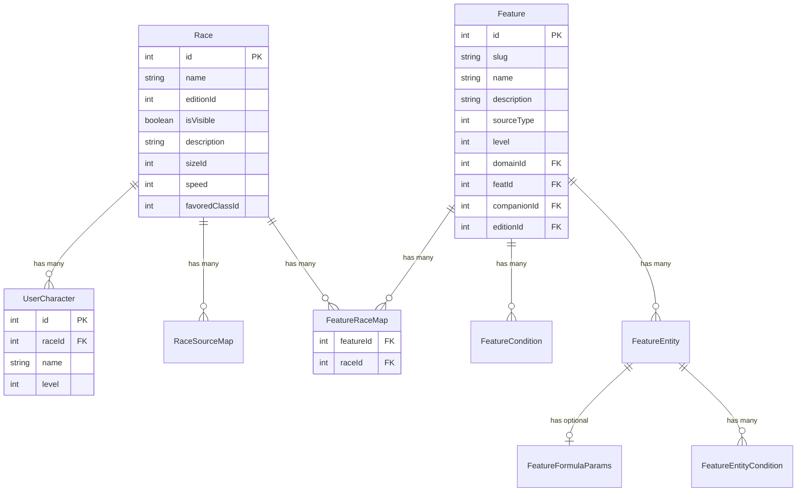

# Race System Architecture Principles

## Overview

The Race System serves as a foundational component for character identity and capabilities in D&D Tools. It acts as a **container and coordinator** for racial features, providing the basis for character creation through size categories, movement speeds, ability adjustments, languages, and unique racial abilities.

Unlike the class system's formula-driven progression or the feature system's complex business logic modeling, the race system focuses on **static, identity-based characteristics** that define a character's fundamental nature and provide the foundation for all other character systems.

## Core Architectural Principles

### **1. Identity-Foundation Pattern**

The race system follows an **identity-foundation pattern** where races act as containers for racial identity characteristics and coordinate the relationship between different racial aspects.

#### **Primary Responsibilities**
- **Identity Container**: Races hold collections of features that define racial identity
- **Foundation Coordinator**: Races coordinate identity-based characteristics across multiple systems
- **Size and Movement Foundation**: Races provide fundamental size and movement mechanics
- **Language Foundation**: Races establish language capabilities and acquisition patterns
- **Ability Foundation**: Races provide baseline ability score adjustments

#### **Delegation Pattern**
```
Race (Identity Container/Coordinator)
├── Feature System (Complex Racial Abilities)
├── Size System (Size Categories and Effects)
├── Movement System (Speed and Movement Mechanics)
├── Language System (Language Acquisition)
└── Ability System (Score Adjustments)
```

### **2. Static Identity Characteristics**

The system distinguishes between **static identity characteristics** (handled by the race system) and **complex feature modeling** (handled by the feature system).

#### **Static Characteristics (Race System)**
- **Size Categories**: Fundamental size classification (Fine to Colossal)
- **Movement Speed**: Base movement speed in feet
- **Favored Class**: Class that receives experience bonuses
- **Source Attribution**: Reference to source books and page numbers

#### **Complex Features (Feature System)**
- **Racial Features**: Unique abilities and capabilities
- **Ability Adjustments**: Racial ability score bonuses/penalties
- **Language Acquisition**: Automatic and bonus language systems
- **Special Abilities**: Unique racial traits and powers

**Architectural Rationale**: Identity characteristics are static, fundamental properties that define a race's nature. Complex features require flexible modeling that benefits from the feature system's sophisticated capabilities.

### **3. Feature Integration Architecture**

The race system integrates with the feature system through a **consumer-coordinator relationship**, similar to the class system but with identity-focused characteristics.

#### **Integration Pattern**
```
Race (Identity Coordinator)
├── Feature (Racial Features, via FeatureRaceMap)
│   ├── FeatureEntity (Racial Bonuses, Choices, Abilities)
│   └── FeatureCondition (Display Conditions)
└── Feature System (Business Logic Engine)
```

#### **Service Layer Abstraction**
The race system uses the **consolidated feature system service** for all feature operations:
- **FeatureSystemService**: Central service handling all feature operations
- **RaceService**: Consumer service that delegates to consolidated methods
- **Single Source of Truth**: All feature operations go through FeatureSystemService
- **Transaction Safety**: Consistent transaction patterns across all services

**Note**: `FeatureProgression` is maintained as a type alias for `FeatureWithRelationsSchema` for backward compatibility, but the database model is now unified as `Feature`.

### **4. Size and Movement System**

The race system provides the foundation for size-based mechanics and movement capabilities.

#### **Size Categories**
The system supports standard D&D size categories with specific mechanical implications:
- **Fine (1)**: Tiny creatures (1/8 inch or less)
- **Diminutive (2)**: Very small creatures (1/4 inch to 1/2 inch)
- **Tiny (3)**: Small creatures (1/2 inch to 1 foot)
- **Small (4)**: Small humanoids (2 to 4 feet)
- **Medium (5)**: Standard humanoids (4 to 8 feet)
- **Large (6)**: Large creatures (8 to 16 feet)
- **Huge (7)**: Very large creatures (16 to 32 feet)
- **Gargantuan (8)**: Massive creatures (32 to 64 feet)
- **Colossal (9)**: Enormous creatures (64 feet or larger)

#### **Movement Speed System**
Movement speeds are fundamental racial characteristics:
- **20 feet**: Slow races (Dwarves, Halflings)
- **30 feet**: Standard races (Humans, Elves, Half-elves)
- **40 feet**: Fast races (some Monstrous Humanoids)
- **50+ feet**: Very fast races (some Outsiders)

### **5. Language System Integration**

The race system provides the foundation for language acquisition through the feature system.

#### **Language Types**
**Automatic Languages**: Languages known by all members of a race
- **Implementation**: FeatureModifier with ModifierAppliesToType.AutomaticLanguage
- **Usage**: All characters of the race automatically know these languages
- **Examples**: Dwarves know Dwarven, Elves know Elven

**Bonus Languages**: Languages that can be chosen during character creation
- **Implementation**: FeatureModifier with ModifierAppliesToType.BonusLanguage
- **Usage**: Characters can select from these languages during creation
- **Examples**: Humans can choose from many bonus languages

#### **Language Service Integration**
The system uses **LanguageService** for language management:
- **Language Extraction**: Extracts automatic and bonus languages from feature progressions
- **Language Validation**: Validates language assignments and conflicts
- **Language Display**: Provides formatted language information for UI components

### **6. Ability Adjustment System**

The race system provides the foundation for racial ability score adjustments through the feature system.

#### **Ability Adjustment Pattern**
**Implementation**: FeatureEntity with EntityType.Base and EntityAppliesToType.Ability
- **Ability Identification**: Uses appliesToId to specify which ability is adjusted
- **Adjustment Value**: Uses value field for the bonus/penalty amount
- **Feature Pattern**: Uses normal features (e.g., "Elf Ability Adjustments") with EntityType.Base entities

#### **Ability Service Integration**
The system provides specialized UI components for ability adjustments:
- **AbilitiesTab**: Dedicated interface for managing racial ability adjustments
- **Real-time Validation**: Immediate feedback on ability adjustment changes
- **Visual Feedback**: Clear display of current ability adjustments

## Component Architecture

### **Core Components and Relationships**



### **Component Responsibilities**

#### **Race (Primary Identity Container)**
- **Dependencies**: None (foundation component)
- **Responsibilities**: 
  - Define core racial characteristics
  - Coordinate racial feature assignments
  - Establish size and movement foundation
  - Provide language and ability foundations
- **Examples**: Dwarf (small size, slow speed), Elf (medium size, standard speed)

#### **Feature (Feature Integration)**
- **Dependencies**: References Race via FeatureRaceMap
- **Responsibilities**:
  - Define features with level requirements and source tracking
  - Coordinate feature system integration
  - Manage racial feature scaling and progression
- **Examples**: "Dwarf Ability Adjustments" at level 1, "Elf Low-Light Vision" at level 1

#### **FeatureRaceMap (Many-to-Many Junction)**
- **Dependencies**: References Feature and Race
- **Responsibilities**:
  - Link features to races via many-to-many relationship
  - Enable feature sharing across multiple races
  - Support efficient variant race creation
- **Examples**: Shared "Ability Adjustments" feature across multiple races

#### **RaceSourceMap (Source Attribution)**
- **Dependencies**: References Race and SourceBook
- **Responsibilities**:
  - Track source book references for races
  - Provide page number references for quick lookup
  - Enable proper content attribution
- **Examples**: Dwarf race from Player's Handbook page 15

#### **UserCharacter (Character Integration)**
- **Dependencies**: References Race
- **Responsibilities**:
  - Link characters to their racial identity
  - Enable racial feature application
  - Provide foundation for character calculations
- **Examples**: Character "Thorin" with Dwarf race

## Integration Architecture

### **Feature System Integration**

The race system acts as a **coordinator** for the feature system:

#### **Integration Pattern**
```
Character (Consumer)
├── Race (Identity Coordinator)
│   └── Feature (Racial Features, via FeatureRaceMap)
└── Feature System (Business Logic Engine)
    ├── FeatureEntity (Calculations, Selections, Abilities)
    └── FeatureCondition (Display Conditions)
    └── FeatureSpecialEffect (Effects)
```

#### **Data Flow**
1. **Race Definition**: Races define feature assignments through Feature records linked via FeatureRaceMap
2. **Character Creation**: Characters select races
3. **Feature Calculation**: Feature system calculates applicable racial features
4. **Result Application**: Calculated features are applied to character statistics

### **Language System Integration**

The race system provides the foundation for language capabilities:

#### **Integration Pattern**
```
Race (Language Foundation)
├── Feature (Language Assignments, via FeatureRaceMap)
│   └── FeatureModifier (Language Grants)
└── Language System (Language Management)
    ├── Automatic Languages (Known by all)
    └── Bonus Languages (Chooseable)
```

#### **Data Flow**
1. **Race Selection**: Character selects a race
2. **Language Determination**: Race defines available languages
3. **Language Application**: Automatic languages are granted, bonus languages become options
4. **Character Languages**: Character gains automatic languages and can choose bonus languages

### **Size and Movement Integration**

The race system provides the foundation for size-based mechanics:

#### **Integration Pattern**
```
Race (Size Foundation)
├── Size Category (Mechanical Effects)
├── Movement Speed (Movement Capabilities)
└── Character System (Application)
    ├── Combat Modifiers (Size-based)
    ├── Movement Calculations (Speed-based)
    └── Equipment Restrictions (Size-based)
```

#### **Data Flow**
1. **Race Definition**: Race defines size category and movement speed
2. **Character Creation**: Character inherits racial size and speed
3. **Mechanical Application**: Size and speed affect combat, movement, and equipment
4. **Feature Modification**: Features can modify or override racial characteristics

## Design Decisions and Rationale

### **1. Static Identity Characteristics**

**Decision**: Keep size, speed, and favored class as static characteristics in the race system rather than modeling them through the feature system.

**Rationale**:
- **Performance**: Static characteristics are faster to access than feature lookups
- **Simplicity**: Identity characteristics are fundamental and don't change
- **Foundation**: These characteristics form the foundation that features can modify
- **Consistency**: Ensures consistent identity across all characters of the same race

### **2. Feature System Integration**

**Decision**: Use the consolidated feature system service for all racial feature operations.

**Rationale**:
- **Consistency**: Ensures consistent feature handling across all systems
- **Maintainability**: Single source of truth for feature operations
- **Transaction Safety**: Consistent transaction patterns across all services
- **Code Reuse**: Avoids duplicating feature system logic

### **3. Language System Design**

**Decision**: Implement languages through the feature system using specialized modifier types.

**Rationale**:
- **Flexibility**: Allows for complex language acquisition patterns
- **Consistency**: Uses existing feature system patterns
- **Extensibility**: Easy to add new language types or acquisition methods
- **Integration**: Seamless integration with character creation process

### **4. Size Category System**

**Decision**: Use numeric size categories rather than string-based categories.

**Rationale**:
- **Performance**: Numeric comparisons are faster than string comparisons
- **Consistency**: Aligns with D&D 3.5 size category system
- **Extensibility**: Easy to add new size categories
- **Integration**: Works well with combat and equipment systems

## Extension Points and Future Considerations

### **1. Monster Race Support**

The system is designed to support monster races:
- **Level Adjustments**: Monster races with level adjustments
- **Size Variations**: Non-standard size categories
- **Special Abilities**: Unique monster racial abilities
- **Prerequisites**: Special requirements for monster races

### **2. Race Variants and Subraces**

The system can be extended to support:
- **Race Variants**: Different versions of the same race
- **Subraces**: Specialized racial divisions
- **Regional Variants**: Geographic-based racial variations
- **Cultural Variants**: Culture-based racial differences

### **3. Advanced Language Systems**

Future enhancements may include:
- **Language Families**: Grouped language systems
- **Language Progression**: Learning languages over time
- **Language Restrictions**: Limited language access
- **Custom Languages**: User-defined languages

### **4. Size-Based Mechanics**

Future enhancements may include:
- **Size Modifiers**: Automatic size-based bonuses/penalties
- **Equipment Scaling**: Size-based equipment restrictions
- **Movement Variations**: Size-based movement modifications
- **Combat Adjustments**: Size-based combat mechanics

## Error Handling and Validation

### **Current Approach**

The race system currently has **minimal error handling** for game logic:
- **Configuration Errors**: No validation of conflicting racial features
- **Size Validation**: Basic size category validation
- **Data Integrity**: Basic database constraints and validation

### **Future Considerations**

Error handling will be implemented in the character system:
- **Feature Conflicts**: Character system will detect and report racial feature conflicts
- **Size Compatibility**: Character system will validate size-based restrictions
- **User Feedback**: Appropriate error messages for configuration issues

## Performance Considerations

### **Current Performance Strategy**

- **Static Characteristics**: Fast access to size, speed, and favored class
- **Feature Integration**: Efficient feature system integration
- **Language Caching**: Cached language information for quick access

### **Scalability Considerations**

- **Large Race Collections**: System designed to handle hundreds of races
- **Complex Relationships**: Efficient handling of race-feature relationships
- **Frequent Access**: Optimized for frequent race data access during character creation

## Summary

The Race System follows an **identity-foundation pattern** that emphasizes:
- **Static identity characteristics** for performance and consistency
- **Clear separation of concerns** between race system and feature system
- **Flexible feature integration** for complex racial abilities
- **Consolidated service architecture** for consistent operations
- **Multi-edition support** through data separation

The system is designed to be **performant**, **maintainable**, and **extensible** while providing a solid foundation for character identity and racial capabilities in the D&D Tools application.
